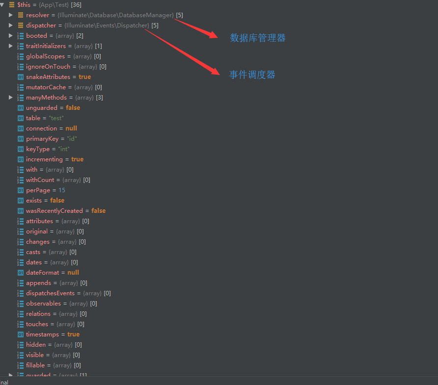

### Model模型鸡类【基类】 
```php  
namespace Illuminate\Database\Eloquent;

use Exception;
use ArrayAccess;
use JsonSerializable;
use Illuminate\Support\Arr;
use Illuminate\Support\Str;
use Illuminate\Contracts\Support\Jsonable;
use Illuminate\Contracts\Support\Arrayable;
use Illuminate\Support\Traits\ForwardsCalls;
use Illuminate\Contracts\Routing\UrlRoutable;
use Illuminate\Contracts\Queue\QueueableEntity;
use Illuminate\Database\Eloquent\Relations\Pivot;
use Illuminate\Contracts\Queue\QueueableCollection;
use Illuminate\Support\Collection as BaseCollection;
use Illuminate\Database\ConnectionResolverInterface as Resolver;

abstract class Model implements ArrayAccess, Arrayable, Jsonable, JsonSerializable, QueueableEntity, UrlRoutable
{
    use Concerns\HasAttributes,
        Concerns\HasEvents,
        Concerns\HasGlobalScopes,
        Concerns\HasRelationships,
        Concerns\HasTimestamps,
        Concerns\HidesAttributes,
        Concerns\GuardsAttributes,
        ForwardsCalls;

    protected $connection;

    protected $table;

    
    protected $primaryKey = 'id';

    
    protected $keyType = 'int';

    public $incrementing = true;

   
    protected $with = [];

    
    protected $withCount = [];

    
    protected $perPage = 15;

    
    public $exists = false;

   
    public $wasRecentlyCreated = false;

    
    protected static $resolver;

    
    protected static $dispatcher;

    
    protected static $booted = [];

    
    protected static $traitInitializers = [];

    
    protected static $globalScopes = [];

    
    protected static $ignoreOnTouch = [];

    
    const CREATED_AT = 'created_at';

    
    const UPDATED_AT = 'updated_at';

    
    public function __construct(array $attributes = [])
    {
        $this->bootIfNotBooted();

        $this->initializeTraits();

        $this->syncOriginal();

        $this->fill($attributes);
    }  
    
    
    protected $attributes = [];

    
    protected $original = [];

    
    protected $changes = [];

    
    protected $casts = [];

    
    protected $dates = [];

    
    protected $dateFormat;

    
    protected $appends = [];

    
    public static $snakeAttributes = true;

    
    protected static $mutatorCache = [];

    
    protected $dispatchesEvents = [];

    
    protected $observables = [];
    
    
    protected $relations = [];

    
    protected $touches = [];

    
    public static $manyMethods = [
        'belongsToMany', 'morphToMany', 'morphedByMany',
    ];
    
     
    public $timestamps = true;
    
    
    protected $hidden = [];

    
    protected $visible = [];
    
    
    protected $fillable = [];

    
    protected $guarded = ['*'];

    
    protected static $unguarded = false;
```  

Model实例化时数据的存储情况  
