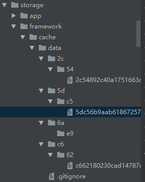
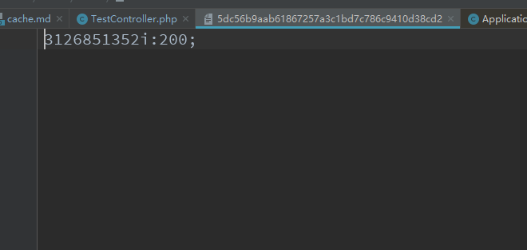
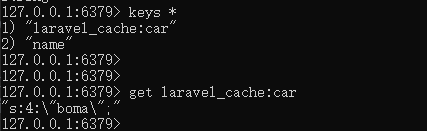
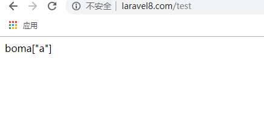

### Cache缓存  
[首页](../readme.md) [下一页：](view.md)  [上一页：模板引擎实现流程](view.md)   

- 缓存服务提供类的缓存服务注册  
   ```php  
   <?php
   
   namespace Illuminate\Cache;
   
   use Illuminate\Support\ServiceProvider;
   use Illuminate\Contracts\Support\DeferrableProvider;
   
   class CacheServiceProvider extends ServiceProvider implements DeferrableProvider
   {
       /**
        * Register the service provider.
        *
        * @return void
        */
       public function register()
       {
           $this->app->singleton('cache', function ($app) {
               return new CacheManager($app);
           });
   
           $this->app->singleton('cache.store', function ($app) {
               return $app['cache']->driver();
           });
   
           $this->app->singleton('memcached.connector', function () {
               return new MemcachedConnector;
           });
       }
   
       /**
        * Get the services provided by the provider.
        *
        * @return array
        */
       public function provides()
       {
           return [
               'cache', 'cache.store', 'memcached.connector',
           ];
       }
   }

   ```   
   
   它会把key,匿名函数注册【保存在Application bindings成员数组里】供你方便取出来用  
   
- 缓存使用时代码执行的流程  
    ` Cache::put("name","laravel",10)`  
    具体使用【你可以看手册】，我们会说明这方法低层的代码是怎么运行的，  
    ```php  
    namespace App\Http\Controllers\Admin;
    use Illuminate\Support\Facades\Cache;
    class TestController extends Controller
    {
        function index()
        {
            Cache::put("name","laravel",10);
            $data = Cache::get("name");
            echo $data;
            echo Cache::pull("name","test");
            return response()->json(['a']);
    
        }
    }
    ```  
    
    你没有看错，它是使用了伪装类【前面已对说过它的实现过程了】   
    Illuminate\Cache\CacheManager构造
    ```php  
    
    namespace Illuminate\Cache;
    
    use Closure;
    use Illuminate\Support\Arr;
    use InvalidArgumentException;
    use Aws\DynamoDb\DynamoDbClient;
    use Illuminate\Contracts\Cache\Store;
    use Illuminate\Contracts\Cache\Factory as FactoryContract;
    use Illuminate\Contracts\Events\Dispatcher as DispatcherContract;
    
    /**
     * @mixin \Illuminate\Contracts\Cache\Repository
     */
    class CacheManager implements FactoryContract
    {
        /**
         * The application instance.
         *
         * @var \Illuminate\Contracts\Foundation\Application
         */
        protected $app;
    
        /**
         * The array of resolved cache stores.
         *
         * @var array
         */
        protected $stores = [];
    
        /**
         * The registered custom driver creators.
         *
         * @var array
         */
        protected $customCreators = [];
    
        /**
         * Create a new Cache manager instance.
         *
         * @param  \Illuminate\Contracts\Foundation\Application  $app
         * @return void
         */
        public function __construct($app)
        {
            $this->app = $app;
        }
    ```  
    put()方法触发的魔术方法  
    ```php  
    public function __call($method, $parameters)
        {
        //return $this->store() 返回Illuminate\Cache\Repository缓存仓库实例
            return $this->store()->$method(...$parameters);
        }
        
    public function store($name = null)
        {
        //返回默认是file【修改config/cache可以得到自己想要的配置】
            $name = $name ?: $this->getDefaultDriver();
    
            return $this->stores[$name] = $this->get($name);
        }
    //获取默认的缓存配置项
    public function getDefaultDriver()
        {
        //默认是file文件缓存【具体看config/cache.php文件】
            return $this->app['config']['cache.default'];
        }
        
    protected function get($name)
        {
            return $this->stores[$name] ?? $this->resolve($name);
        }
        
    protected function resolve($name)
        {
        /**
        默认返回
        'file' => [
                    'driver' => 'file',
                    'path' => storage_path('framework/cache/data'),
                ]
        **/
            $config = $this->getConfig($name);
            //检测配置项是否正常
            if (is_null($config)) {
                throw new InvalidArgumentException("Cache store [{$name}] is not defined.");
            }
            //检测是否存在你自定义的缓存
            if (isset($this->customCreators[$config['driver']])) {
            //然后运行你定义的缓存服务【现在暂时没有用】
                return $this->callCustomCreator($config);
            } else {
            //拼装驱动方法 createFileDriver
                $driverMethod = 'create'.ucfirst($config['driver']).'Driver';
                 //运行指定的方法 
                 //所以根据配置参数不同【运行不同的驱动】
                if (method_exists($this, $driverMethod)) {
                    return $this->{$driverMethod}($config);
                } else {
                    throw new InvalidArgumentException("Driver [{$config['driver']}] is not supported.");
                }
            }
        }
    //默认得到file配置参数
    protected function getConfig($name)
        {
            return $this->app['config']["cache.stores.{$name}"];
        }
        
    //文件缓存驱动方法
    protected function createFileDriver(array $config)
        {
            return $this->repository(new FileStore($this->app['files'], $config['path']));
        }  
        
    //返回存储仓库
    public function repository(Store $store)
        {
        //Illuminate\Cache\Repository
            $repository = new Repository($store);
           //判断是否绑定了事件调度器
            if ($this->app->bound(DispatcherContract::class)) {
            //设置事件调度器
                $repository->setEventDispatcher(
                    $this->app[DispatcherContract::class]
                );
            }
    
            return $repository;
        }
    ```  
    
    Illuminate\Cache\FileStore文件存储构造  
    ```php  
    namespace Illuminate\Cache;
    
    use Exception;
    use Illuminate\Contracts\Cache\Store;
    use Illuminate\Filesystem\Filesystem;
    use Illuminate\Support\InteractsWithTime;
    
    class FileStore implements Store
    {
        use InteractsWithTime, RetrievesMultipleKeys;
    
        /**
         * The Illuminate Filesystem instance.
         *
         * @var \Illuminate\Filesystem\Filesystem
         */
        protected $files;
    
        /**
         * The file cache directory.
         *
         * @var string
         */
        protected $directory;
    
        /**
         * Create a new file cache store instance.
         *
         * @param  \Illuminate\Filesystem\Filesystem  $files
         * @param  string  $directory
         * @return void
         */
        public function __construct(Filesystem $files, $directory)
        {
        //文件系统实例
            $this->files = $files;
            //storage_path('framework/cache/data')缓存数据目录 
            $this->directory = $directory;
        }

    ```  
     Illuminate\Cache\Repository缓存库构造  
    ```php  
    namespace Illuminate\Cache;
    
    use Closure;
    use ArrayAccess;
    use DateTimeInterface;
    use BadMethodCallException;
    use Illuminate\Support\Carbon;
    use Illuminate\Cache\Events\CacheHit;
    use Illuminate\Contracts\Cache\Store;
    use Illuminate\Cache\Events\KeyWritten;
    use Illuminate\Cache\Events\CacheMissed;
    use Illuminate\Support\Traits\Macroable;
    use Illuminate\Cache\Events\KeyForgotten;
    use Illuminate\Support\InteractsWithTime;
    use Illuminate\Contracts\Events\Dispatcher;
    use Illuminate\Contracts\Cache\Repository as CacheContract;
    
    /**
     * @mixin \Illuminate\Contracts\Cache\Store
     */
    class Repository implements CacheContract, ArrayAccess
    {
        use InteractsWithTime;
        use Macroable {
            __call as macroCall;
        }
    
        /**
         * The cache store implementation.
         *
         * @var \Illuminate\Contracts\Cache\Store
         */
        protected $store;
    
        /**
         * The event dispatcher implementation.
         *
         * @var \Illuminate\Contracts\Events\Dispatcher
         */
        protected $events;
    
        /**
         * The default number of seconds to store items.
         *
         * @var int|null
         */
        protected $default = 3600;
    
        /**
         * Create a new cache repository instance.
         *
         * @param  \Illuminate\Contracts\Cache\Store  $store
         * @return void
         */
        public function __construct(Store $store)
        {
        //各种缓存【文件，数据库】   
            $this->store = $store;
        }
    ```  
    Repository缓存库会根据【config/cache.php】的配置会注入不同的缓存驱动】但是方法全统一 
    这种设计模式很灵活，根据配置就能注入不同的的驱动，但接口全兼容  
    Repository的put方法  
    ```php  
    //键,值，过期时间
    public function put($key, $value, $ttl = null)
        {
        //key是数组情况
            if (is_array($key)) {
                return $this->putMany($key, $value);
            }
            //没设置过期时间情况 
            if ($ttl === null) {
                return $this->forever($key, $value);
            }
            //得到过期时间
            $seconds = $this->getSeconds($ttl);
            //过期时间小于0直接删除【不是保存了】
            if ($seconds <= 0) {
                return $this->delete($key);
            }
            /**
             protected function itemKey($key)
                {
                    return $key;
                }
            **/
            //FileStore->put方法【默认驱动】  
            $result = $this->store->put($this->itemKey($key), $value, $seconds);
    
            if ($result) {
                $this->event(new KeyWritten($key, $value, $seconds));
            }
    
            return $result;
        }
        
    protected function getSeconds($ttl)
        {
            $duration = $this->parseDateInterval($ttl);
    
            if ($duration instanceof DateTimeInterface) {
                $duration = Carbon::now()->diffInRealSeconds($duration, false);
            }
    
            return (int) $duration > 0 ? $duration : 0;
        }
        
    protected function parseDateInterval($delay)
        {
        //https://www.php.net/manual/zh/class.dateinterval.php 
        //表示时间周期的类 
            if ($delay instanceof DateInterval) {
            //https://php.net/manual/en/datetime.add.php 添加过期时间  
            //前提是$dealy是DateInterval类型
            //Carbon包可以自行去看文档【或是php手册】
                $delay = Carbon::now()->add($delay);
            }
    
            return $delay;
        }
    ```  
    
    FileStore->put方法  
    ```php 
    public function put($key, $value, $seconds)
        {
        //$path = $this->path($key) 根据存储的key构成缓存文件名称返回
        //确认缓存目录是否存在
        //不同的key会生成不同的目录，不同的文件【所以大量使用缓存会生成大量的目录和文件】  
            $this->ensureCacheDirectoryExists($path = $this->path($key));
            //将数据写入临时文件
            $result = $this->files->put(
            //$this->expiration($seconds)返回时间戳+序列化的内容
                $path, $this->expiration($seconds).serialize($value), true
            );
    
            return $result !== false && $result > 0;
        }
        
    protected function expiration($seconds)
        {
            $time = $this->availableAt($seconds);
    
            return $seconds === 0 || $time > 9999999999 ? 9999999999 : $time;
        }
        
        
    protected function path($key)
        {
        //sha1 hash处理再分割成数组 
        /**
        Array
        (
            [0] => 5d
            [1] => c5
        )
        比如这样的，$key不同得到hash也不同
        **/
            $parts = array_slice(str_split($hash = sha1($key), 2), 0, 2);
            //构建目录【根据key构成文件名称】
            return $this->directory.'/'.implode('/', $parts).'/'.$hash;
        }
        
    //确认缓存目录存在，不存在则创建并设置权限
    protected function ensureCacheDirectoryExists($path)
        {
            if (! $this->files->exists(dirname($path))) {
                $this->files->makeDirectory(dirname($path), 0777, true, true);
            }
        }
    ```  
    `Cache::put("age",200,time()+3600);`   
    生成的临时文件内容如下  
    
      
    
    它会根据不同的key生成不同的目录及文件存储，存储格式是：时间戳：内容   
    
    如果大量的缓存【文件】就会生成大量的文件【如果是分布式架构不建议使用文件缓存】   
    
    Repository->putMany()方法  
    ```php  
    public function putMany(array $values, $ttl = null)
        {
            if ($ttl === null) {
                return $this->putManyForever($values);
            }
            //获取过期时间
            $seconds = $this->getSeconds($ttl);
    
            if ($seconds <= 0) {
                return $this->deleteMultiple(array_keys($values));
            }
    
            $result = $this->store->putMany($values, $seconds);
    
            if ($result) {
                foreach ($values as $key => $value) {
                    $this->event(new KeyWritten($key, $value, $seconds));
                }
            }
    
            return $result;
        } 
        
    FileStore->putMany()  
    public function putMany(array $values, $seconds)
        {
            $manyResult = null;
    
            foreach ($values as $key => $value) {
            //还是基于put方法来实现的
                $result = $this->put($key, $value, $seconds);
    
                $manyResult = is_null($manyResult) ? $result : $result && $manyResult;
            }
    
            return $manyResult ?: false;
        }
    ```    
    
    Repository->forever()方法   
    ```php  
    public function forever($key, $value)
        {
            $result = $this->store->forever($this->itemKey($key), $value);
    
            if ($result) {
                $this->event(new KeyWritten($key, $value));
            }
    
            return $result;
        }
    ```  
    
    FileStore->forever()  
    ```php  
     public function forever($key, $value)
        {
        //同样也是基于put方法
        //这个永久并不是真的永久还是给了时间戳的
        //只不过时间是：9999999999秒罢了
            return $this->put($key, $value, 0);
        }
    ```
    
    Repository->putManyForever()方法 【同样的基于put方法】    
    ```php  
    protected function putManyForever(array $values)
        {
            $result = true;
    
            foreach ($values as $key => $value) {
                if (! $this->forever($key, $value)) {
                    $result = false;
                }
            }
    
            return $result;
        }
        
    public function forever($key, $value)
        {
            $result = $this->store->forever($this->itemKey($key), $value);
    
            if ($result) {
                $this->event(new KeyWritten($key, $value));
            }
    
            return $result;
        }
    ```  
    
    Repository->set（）方法 【同样基于put方法】   
    ```php  
      public function set($key, $value, $ttl = null)
        {
            return $this->put($key, $value, $ttl);
        }
    ```  
    
    Repository->increment()方法 同样基于put方法 
    ```php  
     public function increment($key, $value = 1)
        {
            $raw = $this->getPayload($key);
    
            return tap(((int) $raw['data']) + $value, function ($newValue) use ($key, $raw) {
                $this->put($key, $newValue, $raw['time'] ?? 0);
            });
        }
    ```  
    
    Repository->remember()方法 有内容就返回内容，没有就运行匿名返回并保存再返回内容  
    ```php  
    public function remember($key, $ttl, Closure $callback)
        {
        //取回内容
            $value = $this->get($key);
            if (! is_null($value)) {
                return $value;
            }
            //同样基于put操作
            $this->put($key, $value = $callback(), $ttl);
    
            return $value;
        }
        
    public function get($key, $default = null)【根据key返回内容，没有则返回默认值】
        {
            if (is_array($key)) {
                return $this->many($key);
            }
            //根据key【读取缓存文件返回】值
            $value = $this->store->get($this->itemKey($key));
            //没有内容
            if (is_null($value)) {
                $this->event(new CacheMissed($key));
                //直接返回值【value方法请看前面的说明，前面说过了】
                $value = value($default);
            } else {
                $this->event(new CacheHit($key, $value));
            }
    
            return $value;
        }
    ```  
    
    FileStore->get()方法  
    ```php  
     public function get($key)【取出内容】根据key取出，过期了或是文件不存在直接返回空
        {
            return $this->getPayload($key)['data'] ?? null;
        }
        
     protected function getPayload($key)【返回内容和剩下的时间戳】
         {
         //获取缓存文件【同样根据key来获取】，因为前面的生成套路是一样的
             $path = $this->path($key);
    
             try {
                 $expire = substr(
                 //读取文件内容，并获取时间戳
                     $contents = $this->files->get($path, true), 0, 10
                 );
             } catch (Exception $e) {
             //return ['data' => null, 'time' => null]; 没有文件就返回空值
                 return $this->emptyPayload();
             }
            //当前时间戳是否超出取出的时间戳了
             if ($this->currentTime() >= $expire) {
             //过期了删除文件并返回空数组
                 $this->forget($key);
     
                 return $this->emptyPayload();
             }
     
             try {
             //反序列化内容
                 $data = unserialize(substr($contents, 10));
             } catch (Exception $e) {
             //序列化失败直接删除文件
                 $this->forget($key);
     
                 return $this->emptyPayload();
             }
            //当前剩下的时间戳
             $time = $expire - $this->currentTime();
            //返回内容和过期时间
             return compact('data', 'time');
         }
         
     //删除指定的文件
     public function forget($key)
         {
             if ($this->files->exists($file = $this->path($key))) {
                 return $this->files->delete($file);
             }
     
             return false;
         }
    ```  
    
    Repository->pull()方法  取出内容并删除
    ```php  
    public function pull($key, $default = null)
        {
        //取出内容，并删除
            return tap($this->get($key, $default), function () use ($key) {
                $this->forget($key);
            });
        }
    ```  
    
    Repository->delete()方法  
    ```php  
    public function delete($key)
        {//删除文件【文件驱动】  
            return $this->forget($key);
        }
    ```  
    
    Repository->clear()方法  【删除整个缓存目录的所有文件】  
    ```php  
    public function flush()
        {
            if (! $this->files->isDirectory($this->directory)) {
                return false;
            }
    
            foreach ($this->files->directories($this->directory) as $directory) {
                if (! $this->files->deleteDirectory($directory)) {
                    return false;
                }
            }
    
            return true;
        }
    ```  
    
    更多的方法请自行查看代码即可  
    
    流程概括：  
    1、得到缓存管理器并运行【cache()或是Cache::xxx方式取得，过程是什么自己看前面】    
    ``php  
    CacheManager->function __call($method, $parameters)
        {
            return $this->store()->$method(...$parameters);
        }
    ``  
    2、得到缓存仓库实例  
    ```php  
    CacheManager->function store($name = null)
        {
            $name = $name ?: $this->getDefaultDriver();
    
            return $this->stores[$name] = $this->get($name);
        }
        
    CacheManager->function resolve($name)
        {
            $config = $this->getConfig($name);
            //得到File,Memcache,Redis,Database,Array
            $driverMethod = 'create'.ucfirst($config['driver']).'Driver';
            return $this->{$driverMethod}($config);
            }
        }
        
    CacheManager->function repository(Store $store)
        {
        //$store[文件File,redis,memcache,database,array,apc]
            $repository = new Repository($store);
    
            if ($this->app->bound(DispatcherContract::class)) {
                $repository->setEventDispatcher(
                    $this->app[DispatcherContract::class]
                );
            }
    
            return $repository;
        }
    ```  
    
    3、基于缓存仓库使用  
    
    就三步就行了，缓存仓库Repository依赖于各种缓存驱动【注入】   
    
    所以你可以这样使用  
    ```php  
   
        $file = new FileStore(new Filesystem(),storage_path("framework/cache/data"));
        $repository = new Repository($file);
        //echo $repository->set("name","bbb");
        //echo $repository->get("name");
        echo $repository['name'];
        $repository['name'] = 'php是最吊的语言';

        echo $file->get("name");
    ```
    
- Redis缓存   
    ```php  
    CacheManager->function createRedisDriver(array $config)
        {
        //Illuminate\Redis\RedisManager
            $redis = $this->app['redis'];
            //cache
            $connection = $config['connection'] ?? 'default';
            //$this->getPrefix($config)得到缓存前缀【看config/cache.php缓存前缀配置项】 
            //$connection=cache
            return $this->repository(new RedisStore($redis, $this->getPrefix($config), $connection));
        }
    ```  
    
    Redis服务提供类注册  
    ```php  
    <?php
    
    namespace Illuminate\Redis;
    
    use Illuminate\Support\Arr;
    use Illuminate\Support\ServiceProvider;
    use Illuminate\Contracts\Support\DeferrableProvider;
    
    class RedisServiceProvider extends ServiceProvider implements DeferrableProvider
    {
        /**
         * Register the service provider.
         *
         * @return void
         */
        public function register()
        {
            $this->app->singleton('redis', function ($app) {
                $config = $app->make('config')->get('database.redis', []);
    
                return new RedisManager($app, Arr::pull($config, 'client', 'predis'), $config);
            });
    
            $this->app->bind('redis.connection', function ($app) {
                return $app['redis']->connection();
            });
        }
    
        /**
         * Get the services provided by the provider.
         *
         * @return array
         */
        public function provides()
        {
            return ['redis', 'redis.connection'];
        }
    }

    ```  
    
    RedisStore构造   
    ```php  
    namespace Illuminate\Cache;
    
    use Illuminate\Contracts\Cache\LockProvider;
    use Illuminate\Contracts\Redis\Factory as Redis;
    
    class RedisStore extends TaggableStore implements LockProvider
    {
        /**
         * The Redis factory implementation.
         *
         * @var \Illuminate\Contracts\Redis\Factory
         */
        protected $redis;
    
        /**
         * A string that should be prepended to keys.
         *
         * @var string
         */
        protected $prefix;
    
        /**
         * The Redis connection that should be used.
         *
         * @var string
         */
        protected $connection;
    
        /**
         * Create a new Redis store.
         *
         * @param  \Illuminate\Contracts\Redis\Factory  $redis
         * @param  string  $prefix
         * @param  string  $connection
         * @return void
         */
        public function __construct(Redis $redis, $prefix = '', $connection = 'default')
        {
            $this->redis = $redis;//Illuminate\Redis\RedisManager
            $this->setPrefix($prefix);//前缀
            $this->setConnection($connection);//cache
        }
        
    public function setPrefix($prefix)
        {
            $this->prefix = ! empty($prefix) ? $prefix.':' : '';
        }
        
    public function setConnection($connection)
        {
            $this->connection = $connection;
        }
    ```  
    
    RedisStore->put（）操作流程   
    ```php  
    public function put($key, $value, $seconds)
        {
        //redis->setex() 就这么调用的
            return (bool) $this->connection()->setex(
                $this->prefix.$key, (int) max(1, $seconds), $this->serialize($value)
            );
        }
        
    public function connection()
        {
        //Illuminate\Redis\RedisManager
            return $this->redis->connection($this->connection);
        }
    ```   
    
    Illuminate\Redis\RedisManager->connection方法  
    ```php  
    //$name=cache
    public function connection($name = null)
        {
            $name = $name ?: 'default';
    
            if (isset($this->connections[$name])) {
                return $this->connections[$name];
            }
            $this->connections[cache]=redis连接实例【
            //如果你直接使用框架的话，最好用composer安装predis/predis  
            //我不用它的扩展包了，直接用原生redis
            return $this->connections[$name] = $this->configure(
                $this->resolve($name), $name
            );
        }
        
    public function resolve($name = null)
        {
            $name = $name ?: 'default';
            /**
            'redis' => [
            
                    'client' => env('REDIS_CLIENT', 'predis'),
            
                    'options' => [
                        'cluster' => env('REDIS_CLUSTER', 'predis'),
                        'prefix' => Str::slug(env('APP_NAME', 'laravel'), '_').'_database_',
                    ],
            
                    'default' => [
                        'host' => env('REDIS_HOST', '127.0.0.1'),
                        'password' => env('REDIS_PASSWORD', null),
                        'port' => env('REDIS_PORT', 6379),
                        'database' => env('REDIS_DB', 0),
                    ],
            
                    'cache' => [
                        'host' => env('REDIS_HOST', '127.0.0.1'),
                        'password' => env('REDIS_PASSWORD', null),
                        'port' => env('REDIS_PORT', 6379),
                        'database' => env('REDIS_CACHE_DB', 1),
                    ],
            
                ]
            **/
            $options = $this->config['options'] ?? [];
            //运行此处
            if (isset($this->config[$name])) {
            //开始连接 
            //$this->connector() 得到驱动然后连接
                return $this->connector()->connect(
                //连接参数
                    $this->parseConnectionConfiguration($this->config[$name]),
                    $options
                );
            }
    
            if (isset($this->config['clusters'][$name])) {
                return $this->resolveCluster($name);
            }
    
            throw new InvalidArgumentException("Redis connection [{$name}] not configured.");
        }
        
    protected function connector()
        {
            switch ($this->driver) {//驱动类型  你得自己去安装这些客户端
                case 'predis':
                    return new Connectors\PredisConnector;
                case 'phpredis':
                    return new Connectors\PhpRedisConnector;
            }
        }
        
    Connectors\PredisConnector->connect(array $config, array $options)
        {
            $formattedOptions = array_merge(
                ['timeout' => 10.0], $options, Arr::pull($config, 'options', [])
            );
            
            //return new PredisConnection(new Client($config, $formattedOptions));
            $redis = new \Redis();
            $redis->connect("127.0.0.1",6379);
            $redis->auth("123456");
            //我直接用原生的客户端了
            return new PredisConnection($redis);
        }
    ```  
    
    redisManaager运行时参数  
      
    
    RedisStore->put结果  
    `Cache::put("car","boma");`   
        
    ` echo Cache::get("car");`  
          
    
    所以使用redis的时候，它是调用了RedisManager->connection()->connect()  
    RedisManager负责缓存数据库的连接并返回实例给我们来使用  
    
    数据库的使用套路也一样【基于数据库的数据库管理器返回对应的数据库连接MysqlConnection给你使用】  
    MysqlConnection->table()基于查询构建器的方法   
    
- 基于数组存储也简单