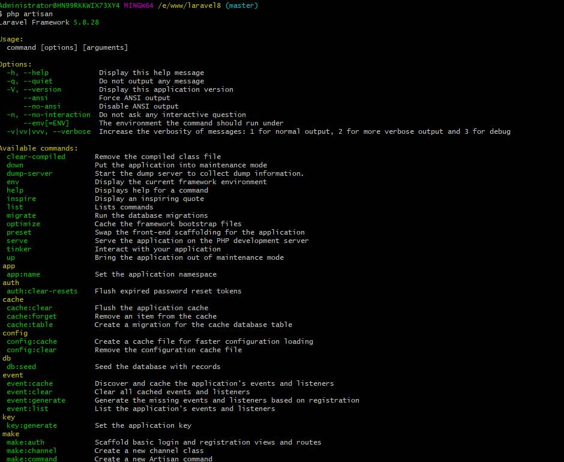

### 控制台Console流程注解  
[首页](../readme.md)      
本页面仅仅是console即cli模式，前面的章节全是web方式运行的【搞清楚】    
本应用它使用了Symfony的Console组件【你可以去看看】  
[Symfony console组件](http://www.symfonychina.com/doc/current/components/console.html)    
控制台输出结果  
 

- 运行命令  
   php artisan 它就运行了，下面我们来看它是怎么完成的   
   
   artisan文件源码内容  
   ```php  
   #!/usr/bin/env php
   <?php
   
   define('LARAVEL_START', microtime(true));
   
   require __DIR__.'/vendor/autoload.php';
   //和前面一样的流程
   $app = require_once __DIR__.'/bootstrap/app.php';
   //实例化App\Console\Kernel::class 【不清楚？看web的运行流程说明】
   $kernel = $app->make(Illuminate\Contracts\Console\Kernel::class);
   
   $status = $kernel->handle(
       $input = new Symfony\Component\Console\Input\ArgvInput,
       new Symfony\Component\Console\Output\ConsoleOutput
   );
   $kernel->terminate($input, $status);
   
   exit($status);

   ```  
   
   App\Console\Kernel构造  
   ```php  
   namespace Illuminate\Foundation\Console;
   
   use Closure;
   use Exception;
   use Throwable;
   use ReflectionClass;
   use Illuminate\Support\Arr;
   use Illuminate\Support\Str;
   use Illuminate\Console\Command;
   use Symfony\Component\Finder\Finder;
   use Illuminate\Console\Scheduling\Schedule;
   use Illuminate\Contracts\Events\Dispatcher;
   use Illuminate\Console\Application as Artisan;
   use Illuminate\Contracts\Debug\ExceptionHandler;
   use Illuminate\Contracts\Foundation\Application;
   use Illuminate\Contracts\Console\Kernel as KernelContract;
   use Symfony\Component\Debug\Exception\FatalThrowableError;
   
   class Kernel implements KernelContract
   {
       /**
        * The application implementation.
        *
        * @var \Illuminate\Contracts\Foundation\Application
        */
       protected $app;
   
       /**
        * The event dispatcher implementation.
        *
        * @var \Illuminate\Contracts\Events\Dispatcher
        */
       protected $events;
   
       /**
        * The Artisan application instance.
        *
        * @var \Illuminate\Console\Application
        */
       protected $artisan;
   
       /**
        * The Artisan commands provided by the application.
        *
        * @var array
        */
       protected $commands = [];
   
       /**
        * Indicates if the Closure commands have been loaded.
        *
        * @var bool
        */
       protected $commandsLoaded = false;
   
       /**
        * The bootstrap classes for the application.
        *
        * @var array
        */
       protected $bootstrappers = [
           \Illuminate\Foundation\Bootstrap\LoadEnvironmentVariables::class,
           \Illuminate\Foundation\Bootstrap\LoadConfiguration::class,
           \Illuminate\Foundation\Bootstrap\HandleExceptions::class,
           \Illuminate\Foundation\Bootstrap\RegisterFacades::class,
           \Illuminate\Foundation\Bootstrap\SetRequestForConsole::class,//生成新的Request请求实例并保存在容器中
           \Illuminate\Foundation\Bootstrap\RegisterProviders::class,
           \Illuminate\Foundation\Bootstrap\BootProviders::class,
       ];
   
       /**
        * Create a new console kernel instance.
        *
        * @param  \Illuminate\Contracts\Foundation\Application  $app
        * @param  \Illuminate\Contracts\Events\Dispatcher  $events
        * @return void
        */
       public function __construct(Application $app, Dispatcher $events)
       {
           if (! defined('ARTISAN_BINARY')) {
               define('ARTISAN_BINARY', 'artisan');
           }
            //Application容器
           $this->app = $app;
           //事件调度器
           $this->events = $events;
           //注册启动回调函数
           $this->app->booted(function () {
               $this->defineConsoleSchedule();
           });
       }
   ```  
   
   handle方法   
   ```php  
   public function handle($input, $output = null)
       {
           try {
               $this->bootstrap();
   
               return $this->getArtisan()->run($input, $output);
           } catch (Exception $e) {
               $this->reportException($e);
   
               $this->renderException($output, $e);
   
               return 1;
           } catch (Throwable $e) {
               $e = new FatalThrowableError($e);
   
               $this->reportException($e);
   
               $this->renderException($output, $e);
   
               return 1;
           }
       }
       
   public function bootstrap()
       {
           if (! $this->app->hasBeenBootstrapped()) {
           //套路和web流程一样
           //但是多了一个  \Illuminate\Foundation\Bootstrap\SetRequestForConsole::class,
           //我们单独来看看
               $this->app->bootstrapWith($this->bootstrappers());
           }
   
           $this->app->loadDeferredProviders();
   
           if (! $this->commandsLoaded) {
               $this->commands();
   
               $this->commandsLoaded = true;
           }
       }
       
   Application->hasBeenBootstrapped()
                    {
                    //protected $hasBeenBootstrapped = false;
                        return $this->hasBeenBootstrapped;
                    }
   ```  
   
   ArgvInput类 
   ```php  
   namespace Symfony\Component\Console\Input;
   use Symfony\Component\Console\Exception\RuntimeException;
   class ArgvInput extends Input
   {
       private $tokens;
       private $parsed;
       public function __construct(array $argv = null, InputDefinition $definition = null)
       {
           if (null === $argv) {
               $argv = $_SERVER['argv'];
           }
   
           // strip the application name
           //去掉文件名即artisan
           array_shift($argv);
           //存储输入的选项参数
           $this->tokens = $argv;
   
           parent::__construct($definition);
       }
   鸡类
   public function __construct(InputDefinition $definition = null)
       {
           if (null === $definition) {
           //定义输入
               $this->definition = new InputDefinition();
           } else {
               $this->bind($definition);
               $this->validate();
           }
       }
   InputDefinition类    
   class InputDefinition
   {
       private $arguments;
       private $requiredCount;
       private $hasAnArrayArgument = false;
       private $hasOptional;
       private $options;
       private $shortcuts;
   
       /**
        * @param array $definition An array of InputArgument and InputOption instance
        */
       public function __construct(array $definition = [])
       {
           $this->setDefinition($definition);
       }
   ```  
   
   ConsoleOut输出类  
   ```php  
   namespace Symfony\Component\Console\Output;
   use Symfony\Component\Console\Formatter\OutputFormatterInterface;
   class ConsoleOutput extends StreamOutput implements ConsoleOutputInterface
   {
       private $stderr;
       private $consoleSectionOutputs = [];
       public function __construct(int $verbosity = self::VERBOSITY_NORMAL, bool $decorated = null, OutputFormatterInterface $formatter = null)
       {
       //$this->openOutputStream() 返回标准输出流设备【即显示器】  
       //$verbosity=32
       //$decorated=null
       //$formatter=null
           parent::__construct($this->openOutputStream(), $verbosity, $decorated, $formatter);
   
           $actualDecorated = $this->isDecorated();
           //标准错误输出流【和上面的标准输出流一样的流程】   
           $this->stderr = new StreamOutput($this->openErrorStream(), $verbosity, $decorated, $this->getFormatter());
   
           if (null === $decorated) {
               $this->setDecorated($actualDecorated && $this->stderr->isDecorated());
           }
       }
       
       protected function hasStdoutSupport()
           {
           //不是OS400时返回false
               return false === $this->isRunningOS400();
           }
           
       //返回是属于OS400系统【IBM公司早期开发的系统】
       private function isRunningOS400()
           {
               $checks = [
               //php_uname('s')返回系统名称如Windows NT Linux 
               //getenv('OSTYPE') win返回WINNT linux下没有
                   \function_exists('php_uname') ? php_uname('s') : '',
                   getenv('OSTYPE'),
                   PHP_OS,//linux 返回Linux
               ];
                //win下就是Windows NT;WINNT 
               return false !== stripos(implode(';', $checks), 'OS400');
           }
       
       private function openOutputStream()【打开输出流设备】
           {
           //排除OS400系统
               if (!$this->hasStdoutSupport()) {
               //打开标准输出流 
               /**
               流的概念：流是一种数据 
               数据在文件和内存之间传输称为文件流，数据从文件复制到内存称为输入流，相反的是内存把数据保存到文件中称为输出流  
               数据在数据源和内存之间的传输称为数据流[DATA STREAM]，从数据源复制到内存称为输入流[INPUT STREAM]
               内存【程序】写入到数据源码的过程称为输出流【OUTPUT STREAM]】   
               
               我们常用的流用文件流【你打开一个文件就是】，网络，硬盘，键盘等它们也是，所以socket就是一个流  
               
               
               **/
                   return fopen('php://output', 'w');//打印标准输出流文件
               }
       
               return @fopen('php://stdout', 'w') ?: fopen('php://output', 'w');
           }
   }
       
   //输出流继承的鸡类
   class StreamOutput extends Output
   {
       private $stream;
        //$stream=$this->openOutputStream() 返回标准输出流设备【即显示器】  
        //$verbosity=32
        //$decorated=null
        //$formatter=null
       public function __construct($stream, int $verbosity = self::VERBOSITY_NORMAL, bool $decorated = null, OutputFormatterInterface $formatter = null)
       {
       //得到的流是个资源
           if (!\is_resource($stream) || 'stream' !== get_resource_type($stream)) {
               throw new InvalidArgumentException('The StreamOutput class needs a stream as its first argument.');
           }
           //保存输出流【显示器终端】
           $this->stream = $stream;
   
           if (null === $decorated) {
               $decorated = $this->hasColorSupport();
           }
            //$verbosity=32
            //$decorated=1
            $formatter=null
           parent::__construct($verbosity, $decorated, $formatter);
       }
       
       protected function hasColorSupport()
           {
           //在linux和win下它都没有东西
               if ('Hyper' === getenv('TERM_PROGRAM')) {
                   return true;
               }
       
               if (\DIRECTORY_SEPARATOR === '\\') {
               //sapi_windows_vt100_support($this->stream)) win7下它返回的是false
                   return (\function_exists('sapi_windows_vt100_support')
                       && @sapi_windows_vt100_support($this->stream))
                       || false !== getenv('ANSICON')//此条件满足
                       || 'ON' === getenv('ConEmuANSI')
                       || 'xterm' === getenv('TERM');
               }
                //判断是否是交互式终端
               if (\function_exists('stream_isatty')) {
                   return @stream_isatty($this->stream);
               }
                //posix判断
               if (\function_exists('posix_isatty')) {
                   return @posix_isatty($this->stream);
               }
               //得到这个流的信息
               $stat = @fstat($this->stream);
               // Check if formatted mode is S_IFCHR
               //检测该类是否是字符装置 
               //此处看不懂的可以看一下【本人注解的workerman源码】
               return $stat ? 0020000 === ($stat['mode'] & 0170000) : false;
           }
           
   
   }
   输出流继承的祖先
   namespace Symfony\Component\Console\Output;
   
   use Symfony\Component\Console\Formatter\OutputFormatter;
   use Symfony\Component\Console\Formatter\OutputFormatterInterface;
   

   abstract class Output implements OutputInterface
   {
       private $verbosity;
       private $formatter;
          //$verbosity=32
          //$decorated=1
          //$formatter=null
       public function __construct(?int $verbosity = self::VERBOSITY_NORMAL, bool $decorated = false, OutputFormatterInterface $formatter = null)
       {
           $this->verbosity = null === $verbosity ? self::VERBOSITY_NORMAL : $verbosity;
           $this->formatter = $formatter ?: new OutputFormatter();//输出格式化类
           $this->formatter->setDecorated($decorated);
       }
   ```  
   
   ```php  
   namespace Symfony\Component\Console\Formatter;
   
   use Symfony\Component\Console\Exception\InvalidArgumentException;
   
   /**
    * Formatter class for console output.
    *
    * @author Konstantin Kudryashov <ever.zet@gmail.com>
    * @author Roland Franssen <franssen.roland@gmail.com>
    */
   class OutputFormatter implements WrappableOutputFormatterInterface
   {
       private $decorated;
       private $styles = [];
       private $styleStack;

       public function __construct(bool $decorated = false, array $styles = [])
       {
           $this->decorated = $decorated;
   
           $this->setStyle('error', new OutputFormatterStyle('white', 'red'));
           $this->setStyle('info', new OutputFormatterStyle('green'));
           $this->setStyle('comment', new OutputFormatterStyle('yellow'));
           $this->setStyle('question', new OutputFormatterStyle('black', 'cyan'));
   
           foreach ($styles as $name => $style) {
               $this->setStyle($name, $style);
           }
   
           $this->styleStack = new OutputFormatterStyleStack();
       }

   ```
   [sapi_vt100](https://www.php.net/manual/zh/function.sapi-windows-vt100-support.php)
   [sapi_windows_vt100_support函数说明](php72.md)    
   VT100是一种终端控制码，用于控制终端显示不同的颜色【具体请百度】    
   
   App\Console\Kernel->bootstrap() 启动SetRequestForConsole【其它类和web端流程一样】  
   生成新的Request请求并注册到Application容器里   
   
   ```php  
   <?php
   
   namespace Illuminate\Foundation\Bootstrap;
   
   use Illuminate\Http\Request;
   use Illuminate\Contracts\Foundation\Application;
   
   class SetRequestForConsole
   {
       /**
        * Bootstrap the given application.
        *
        * @param  \Illuminate\Contracts\Foundation\Application  $app
        * @return void
        */
       public function bootstrap(Application $app)
       {
       //获取配置
           $uri = $app->make('config')->get('app.url', 'http://localhost');
            //根据uri解析并返回它的相关信息
            /**
            [
                scheme=http
                host=localhost
            ]
            **/
           $components = parse_url($uri);
   
           $server = $_SERVER;
           
           if (isset($components['path'])) {
               $server = array_merge($server, [
                   'SCRIPT_FILENAME' => $components['path'],
                   'SCRIPT_NAME' => $components['path'],
               ]);
           }
            //保存当前请求信息【Request实现流程和web端说过的一样】   
           $app->instance('request', Request::create(
               $uri, 'GET', [], [], [], $server
           ));
       }
   }

   ```  
   
   App\Console\Kernel->getArtisan()方法     
   ```php  
    protected function getArtisan()
       {
           if (is_null($this->artisan)) {
               return $this->artisan = (new Artisan($this->app, $this->events, $this->app->version()))
                                   ->resolveCommands($this->commands);
           }
   
           return $this->artisan;
       }
   ```  
   
   控制台应用Illuminate\Console\Application   
   ```php  
   namespace Illuminate\Console;
   
   use Closure;
   use Illuminate\Support\ProcessUtils;
   use Illuminate\Contracts\Events\Dispatcher;
   use Illuminate\Contracts\Container\Container;
   use Symfony\Component\Console\Input\ArgvInput;
   use Symfony\Component\Console\Input\ArrayInput;
   use Symfony\Component\Console\Input\InputOption;
   use Symfony\Component\Console\Input\StringInput;
   use Symfony\Component\Process\PhpExecutableFinder;
   use Symfony\Component\Console\Input\InputInterface;
   use Symfony\Component\Console\Output\ConsoleOutput;
   use Symfony\Component\Console\Output\BufferedOutput;
   use Symfony\Component\Console\Output\OutputInterface;
   use Symfony\Component\Console\Application as SymfonyApplication;
   use Symfony\Component\Console\Command\Command as SymfonyCommand;
   use Symfony\Component\Console\Exception\CommandNotFoundException;
   use Illuminate\Contracts\Console\Application as ApplicationContract;
   
   class Application extends SymfonyApplication implements ApplicationContract
   {
       /**
        * The Laravel application instance.
        *
        * @var \Illuminate\Contracts\Container\Container
        */
       protected $laravel;
   
       /**
        * The output from the previous command.
        *
        * @var \Symfony\Component\Console\Output\BufferedOutput
        */
       protected $lastOutput;
   
       /**
        * The console application bootstrappers.
        *
        * @var array
        */
       protected static $bootstrappers = [];
   
       /**
        * The Event Dispatcher.
        *
        * @var \Illuminate\Contracts\Events\Dispatcher
        */
       protected $events;
   
       /**
        * Create a new Artisan console application.
        *
        * @param  \Illuminate\Contracts\Container\Container  $laravel
        * @param  \Illuminate\Contracts\Events\Dispatcher  $events
        * @param  string  $version
        * @return void
        */
       public function __construct(Container $laravel, Dispatcher $events, $version)
       {
           parent::__construct('Laravel Framework', $version);
   
           $this->laravel = $laravel;//Application[laravel的容器]
           $this->events = $events;//事件调度器
           $this->setAutoExit(false);
           $this->setCatchExceptions(false);
   
           $this->events->dispatch(new Events\ArtisanStarting($this));
            //在看这里时【记得先看控制台命令服务提供类的运行】
           $this->bootstrap();
       }
       /***********************************命令添加**************************************/
       protected function bootstrap()【运行命令添加流程】
           {
               foreach (static::$bootstrappers as $bootstrapper) {
                   $bootstrapper($this);
               }
           }
       //$bootstrapper($this) 运行的resolveCommands方法
       public function resolveCommands($commands)
           {
               $commands = is_array($commands) ? $commands : func_get_args();
       
               foreach ($commands as $command) {
                   $this->resolve($command);
               }
       
               return $this;
           }
           
       public function resolve($command)
           {
           //实例化命令类
               return $this->add($this->laravel->make($command));
           }
           
       public function add(SymfonyCommand $command)
           {
               if ($command instanceof Command) {
                   $command->setLaravel($this->laravel);
               }
       
               return $this->addToParent($command);
           }
           
       protected function addToParent(SymfonyCommand $command)
           {
               return parent::add($command);
           }
           
       public function add(Command $command)
           {
               $this->init();
               //命令设置Console\Application
               $command->setApplication($this);
       
               if (!$command->isEnabled()) {
                   $command->setApplication(null);
       
                   return;
               }
                //命令的定义
               if (null === $command->getDefinition()) {
                   throw new LogicException(sprintf('Command class "%s" is not correctly initialized. You probably forgot to call the parent constructor.', \get_class($command)));
               }
                //命令的名称
               if (!$command->getName()) {
                   throw new LogicException(sprintf('The command defined in "%s" cannot have an empty name.', \get_class($command)));
               }
                //保存命令
               $this->commands[$command->getName()] = $command;
                //命令的别名
               foreach ($command->getAliases() as $alias) {
                   $this->commands[$alias] = $command;
               }
       
               return $command;
           }
       /***********************************命令添加**************************************/
       
       
       
       public function setAutoExit($boolean)
           {
               $this->autoExit = (bool) $boolean;
           }  
           
       public function setCatchExceptions($boolean)
           {
               $this->catchExceptions = (bool) $boolean;
           }

   }
       
   Symfony的基类Application【具体可以去看Symfony组件】  
   namespace Symfony\Component\Console;
   
   use Symfony\Component\Console\Command\Command;
   use Symfony\Component\Console\Command\HelpCommand;
   use Symfony\Component\Console\Command\ListCommand;
   use Symfony\Component\Console\CommandLoader\CommandLoaderInterface;
   use Symfony\Component\Console\Event\ConsoleCommandEvent;
   use Symfony\Component\Console\Event\ConsoleErrorEvent;
   use Symfony\Component\Console\Event\ConsoleTerminateEvent;
   use Symfony\Component\Console\Exception\CommandNotFoundException;
   use Symfony\Component\Console\Exception\ExceptionInterface;
   use Symfony\Component\Console\Exception\LogicException;
   use Symfony\Component\Console\Exception\NamespaceNotFoundException;
   use Symfony\Component\Console\Formatter\OutputFormatter;
   use Symfony\Component\Console\Helper\DebugFormatterHelper;
   use Symfony\Component\Console\Helper\FormatterHelper;
   use Symfony\Component\Console\Helper\Helper;
   use Symfony\Component\Console\Helper\HelperSet;
   use Symfony\Component\Console\Helper\ProcessHelper;
   use Symfony\Component\Console\Helper\QuestionHelper;
   use Symfony\Component\Console\Input\ArgvInput;
   use Symfony\Component\Console\Input\ArrayInput;
   use Symfony\Component\Console\Input\InputArgument;
   use Symfony\Component\Console\Input\InputAwareInterface;
   use Symfony\Component\Console\Input\InputDefinition;
   use Symfony\Component\Console\Input\InputInterface;
   use Symfony\Component\Console\Input\InputOption;
   use Symfony\Component\Console\Input\StreamableInputInterface;
   use Symfony\Component\Console\Output\ConsoleOutput;
   use Symfony\Component\Console\Output\ConsoleOutputInterface;
   use Symfony\Component\Console\Output\OutputInterface;
   use Symfony\Component\Console\Style\SymfonyStyle;
   use Symfony\Component\Debug\ErrorHandler;
   use Symfony\Component\Debug\Exception\FatalThrowableError;
   use Symfony\Component\EventDispatcher\EventDispatcherInterface;
   use Symfony\Component\EventDispatcher\LegacyEventDispatcherProxy;
   
   /**
    * An Application is the container for a collection of commands.
    *
    * It is the main entry point of a Console application.
    *
    * This class is optimized for a standard CLI environment.
    *
    * Usage:
    *
    *     $app = new Application('myapp', '1.0 (stable)');
    *     $app->add(new SimpleCommand());
    *     $app->run();
    *
    * @author Fabien Potencier <fabien@symfony.com>
    */
   class Application
   {
       private $commands = [];
       private $wantHelps = false;
       private $runningCommand;
       private $name;
       private $version;
       private $commandLoader;
       private $catchExceptions = true;
       private $autoExit = true;
       private $definition;
       private $helperSet;
       private $dispatcher;
       private $terminal;
       private $defaultCommand;
       private $singleCommand = false;
       private $initialized;
   
       /**
        * @param string $name    The name of the application
        * @param string $version The version of the application
        */
       public function __construct(string $name = 'UNKNOWN', string $version = 'UNKNOWN')
       {
           $this->name = $name;//应用名称
           $this->version = $version;//应用版本
           $this->terminal = new Terminal();//Symfony\Component\Console\Terminal实例
           $this->defaultCommand = 'list';//默认命令
       }
   ```    
   Illuminate\Console\Application extend Symfony\Component\Console\Application->resolveCommands()方法  
   
   ```php  
   $commands=[]
   public function resolveCommands($commands)
       {
       //刚开始是没有的
           $commands = is_array($commands) ? $commands : func_get_args();
   
           foreach ($commands as $command) {
               $this->resolve($command);
           }
   
           return $this;
       }
   ``` 
   
   
   
   Illuminate\Console\Application extend Symfony\Component\Console\Application->run(
   输入对象实例
   //Symfony\Component\Console\Input\ArgvInput 
   //Symfony\Component\Console\Input\Input
   //Symfony\Component\Console\Input\InputInterface
   //Symfony\Component\Console\Input\StreamableInputInterface
   
   输出对象实例
   //Symfony\Component\Console\Output\ConsoleOutput
   //Symfony\Component\Console\Output\StreamOutput
   //Symfony\Component\Console\Output\Output
   //Symfony\Component\Console\Output\OutputInterface
   
   )运行应用  
   
   ```php  
   public function run(InputInterface $input = null, OutputInterface $output = null)
       {
       //获取用户输入的命令名称  php artisan xxx
       //xxx命令  
           $commandName = $this->getCommandName(
               $input = $input ?: new ArgvInput
           );
            //事件调度【不看】
           $this->events->dispatch(
               new Events\CommandStarting(
                   $commandName, $input, $output = $output ?: new ConsoleOutput
               )
           );
            运行父类
           $exitCode = parent::run($input, $output);
   
           $this->events->dispatch(
               new Events\CommandFinished($commandName, $input, $output, $exitCode)
           );
   
           return $exitCode;
       }
   
   protected function getCommandName(InputInterface $input)
       {
           return $this->singleCommand ? $this->defaultCommand : $input->getFirstArgument();
       }
   
   运行Symfony\Application 
   public function run(InputInterface $input = null, OutputInterface $output = null)
       {//终端调度，列宽
           putenv('LINES='.$this->terminal->getHeight());
           putenv('COLUMNS='.$this->terminal->getWidth());
   
           if (null === $input) {
               $input = new ArgvInput();
           }
   
           if (null === $output) {
               $output = new ConsoleOutput();
           }
   
           $renderException = function ($e) use ($output) {
               if (!$e instanceof \Exception) {
                   $e = class_exists(FatalThrowableError::class) ? new FatalThrowableError($e) : new \ErrorException($e->getMessage(), $e->getCode(), E_ERROR, $e->getFile(), $e->getLine());
               }
               if ($output instanceof ConsoleOutputInterface) {
                   $this->renderException($e, $output->getErrorOutput());
               } else {
                   $this->renderException($e, $output);
               }
           };
           //设置异常处理函数
           if ($phpHandler = set_exception_handler($renderException)) {
               restore_exception_handler();
               if (!\is_array($phpHandler) || !$phpHandler[0] instanceof ErrorHandler) {
                   $debugHandler = true;
               } elseif ($debugHandler = $phpHandler[0]->setExceptionHandler($renderException)) {
                   $phpHandler[0]->setExceptionHandler($debugHandler);
               }
           }
            //IO配置
           $this->configureIO($input, $output);
   
           try {
               $exitCode = $this->doRun($input, $output);
           } catch (\Exception $e) {
               if (!$this->catchExceptions) {
                   throw $e;
               }
   
               $renderException($e);
   
               $exitCode = $e->getCode();
               if (is_numeric($exitCode)) {
                   $exitCode = (int) $exitCode;
                   if (0 === $exitCode) {
                       $exitCode = 1;
                   }
               } else {
                   $exitCode = 1;
               }
           } finally {
               // if the exception handler changed, keep it
               // otherwise, unregister $renderException
               if (!$phpHandler) {
                   if (set_exception_handler($renderException) === $renderException) {
                       restore_exception_handler();
                   }
                   restore_exception_handler();
               } elseif (!$debugHandler) {
                   $finalHandler = $phpHandler[0]->setExceptionHandler(null);
                   if ($finalHandler !== $renderException) {
                       $phpHandler[0]->setExceptionHandler($finalHandler);
                   }
               }
           }
   
           if ($this->autoExit) {
               if ($exitCode > 255) {
                   $exitCode = 255;
               }
   
               exit($exitCode);
           }
   
           return $exitCode;
       }
       
    public function doRun(InputInterface $input, OutputInterface $output)
       {
       //输入命令参数是否含有--version [php artisan --version]
           if (true === $input->hasParameterOption(['--version', '-V'], true)) {
               $output->writeln($this->getLongVersion());
   
               return 0;
           }
   
           try {
  
               $input->bind($this->getDefinition());
           } catch (ExceptionInterface $e) {
               // Errors must be ignored, full binding/validation happens later when the command is known.
           }
            //获取输入的命令【和刚才是一样的】
           $name = $this->getCommandName($input);
           if (true === $input->hasParameterOption(['--help', '-h'], true)) {
               if (!$name) {
                   $name = 'help';
                   $input = new ArrayInput(['command_name' => $this->defaultCommand]);
               } else {
                   $this->wantHelps = true;
               }
           }
            //没有输入任何命令的情况 
           if (!$name) {
               $name = $this->defaultCommand;//默认命令就是list
               $definition = $this->getDefinition();//Symfony\Component\Console\Input\InputDefinition实例
               $definition->setArguments(array_merge(//参数合并
                   $definition->getArguments(),
                   [
                       'command' => new InputArgument('command', InputArgument::OPTIONAL, $definition->getArgument('command')->getDescription(), $name),
                   ]
               ));
           }
   
           try {
               $this->runningCommand = null;
               // the command name MUST be the first element of the input
               //命令查找【此时记得看控制台的服务提供类注册的命令】
               $command = $this->find($name);
           } catch (\Throwable $e) {
               if (!($e instanceof CommandNotFoundException && !$e instanceof NamespaceNotFoundException) || 1 !== \count($alternatives = $e->getAlternatives()) || !$input->isInteractive()) {
                   if (null !== $this->dispatcher) {
                       $event = new ConsoleErrorEvent($input, $output, $e);
                       $this->dispatcher->dispatch($event, ConsoleEvents::ERROR);
   
                       if (0 === $event->getExitCode()) {
                           return 0;
                       }
   
                       $e = $event->getError();
                   }
   
                   throw $e;
               }
   
               $alternative = $alternatives[0];
   
               $style = new SymfonyStyle($input, $output);
               $style->block(sprintf("\nCommand \"%s\" is not defined.\n", $name), null, 'error');
               if (!$style->confirm(sprintf('Do you want to run "%s" instead? ', $alternative), false)) {
                   if (null !== $this->dispatcher) {
                       $event = new ConsoleErrorEvent($input, $output, $e);
                       $this->dispatcher->dispatch($event, ConsoleEvents::ERROR);
   
                       return $event->getExitCode();
                   }
   
                   return 1;
               }
   
               $command = $this->find($alternative);
           }
   
           $this->runningCommand = $command;
           //运行命令
           $exitCode = $this->doRunCommand($command, $input, $output);
           $this->runningCommand = null;
   
           return $exitCode;
       }
       
   protected function doRunCommand(Command $command, InputInterface $input, OutputInterface $output)
       {
           foreach ($command->getHelperSet() as $helper) {
               if ($helper instanceof InputAwareInterface) {
                   $helper->setInput($input);
               }
           }
   
           if (null === $this->dispatcher) {
               return $command->run($input, $output);
           }
   
           // bind before the console.command event, so the listeners have access to input options/arguments
           try {
               $command->mergeApplicationDefinition();
               $input->bind($command->getDefinition());
           } catch (ExceptionInterface $e) {
               // ignore invalid options/arguments for now, to allow the event listeners to customize the InputDefinition
           }
   
           $event = new ConsoleCommandEvent($command, $input, $output);
           $e = null;
   
           try {
               $this->dispatcher->dispatch($event, ConsoleEvents::COMMAND);
   
               if ($event->commandShouldRun()) {
                   $exitCode = $command->run($input, $output);
               } else {
                   $exitCode = ConsoleCommandEvent::RETURN_CODE_DISABLED;
               }
           } catch (\Throwable $e) {
               $event = new ConsoleErrorEvent($input, $output, $e, $command);
               $this->dispatcher->dispatch($event, ConsoleEvents::ERROR);
               $e = $event->getError();
   
               if (0 === $exitCode = $event->getExitCode()) {
                   $e = null;
               }
           }
   
           $event = new ConsoleTerminateEvent($command, $input, $output, $exitCode);
           $this->dispatcher->dispatch($event, ConsoleEvents::TERMINATE);
   
           if (null !== $e) {
               throw $e;
           }
   
           return $event->getExitCode();
       }

       
   public function getDefinition()
       {
           if (!$this->definition) {
               $this->definition = $this->getDefaultInputDefinition();
           }
   
           if ($this->singleCommand) {
               $inputDefinition = $this->definition;
               $inputDefinition->setArguments();
   
               return $inputDefinition;
           }
   
           return $this->definition;
       }
   ```  
   
   获取输入的参数  ArgvInput->getFirstArgument()方法   
   ```php   
   
   public function getFirstArgument()
       {
           $isOption = false;
           //得到输入的参数
           foreach ($this->tokens as $i => $token) {
          
               if ($token && '-' === $token[0]) {
                   if (false !== strpos($token, '=') || !isset($this->tokens[$i + 1])) {
                       continue;
                   }
 
                   $name = '-' === $token[1] ? substr($token, 2) : substr($token, -1);
                   if (!isset($this->options[$name]) && !$this->definition->hasShortcut($name)) {
                       // noop
                   } elseif ((isset($this->options[$name]) || isset($this->options[$name = $this->definition->shortcutToName($name)])) && $this->tokens[$i + 1] === $this->options[$name]) {
                       $isOption = true;
                   }
   
                   continue;
               }
   
               if ($isOption) {
                   $isOption = false;
                   continue;
               }
   
               return $token;
           }
       }
   ```  
   
   命令查找  
   ```php  
   public function find($name)
       {
       //添加list,help命令
           $this->init();
   
           $aliases = [];
   
           foreach ($this->commands as $command) {
               foreach ($command->getAliases() as $alias) {
                   if (!$this->has($alias)) {
                   
                       $this->commands[$alias] = $command;
                   }
               }
           }
            //获取所有命令
           $allCommands = $this->commandLoader ? array_merge($this->commandLoader->getNames(), array_keys($this->commands)) : array_keys($this->commands);
           $expr = preg_replace_callback('{([^:]+|)}', function ($matches) { return preg_quote($matches[1]).'[^:]*'; }, $name);
           $commands = preg_grep('{^'.$expr.'}', $allCommands);
   
           if (empty($commands)) {
               $commands = preg_grep('{^'.$expr.'}i', $allCommands);
           }
   
           // if no commands matched or we just matched namespaces
           if (empty($commands) || \count(preg_grep('{^'.$expr.'$}i', $commands)) < 1) {
               if (false !== $pos = strrpos($name, ':')) {
                   // check if a namespace exists and contains commands
                   $this->findNamespace(substr($name, 0, $pos));
               }
   
               $message = sprintf('Command "%s" is not defined.', $name);
   
               if ($alternatives = $this->findAlternatives($name, $allCommands)) {
                   if (1 == \count($alternatives)) {
                       $message .= "\n\nDid you mean this?\n    ";
                   } else {
                       $message .= "\n\nDid you mean one of these?\n    ";
                   }
                   $message .= implode("\n    ", $alternatives);
               }
   
               throw new CommandNotFoundException($message, $alternatives);
           }
   
           // filter out aliases for commands which are already on the list
           if (\count($commands) > 1) {
               $commandList = $this->commandLoader ? array_merge(array_flip($this->commandLoader->getNames()), $this->commands) : $this->commands;
               $commands = array_unique(array_filter($commands, function ($nameOrAlias) use ($commandList, $commands, &$aliases) {
                   $commandName = $commandList[$nameOrAlias] instanceof Command ? $commandList[$nameOrAlias]->getName() : $nameOrAlias;
                   $aliases[$nameOrAlias] = $commandName;
   
                   return $commandName === $nameOrAlias || !\in_array($commandName, $commands);
               }));
           }
   
           $exact = \in_array($name, $commands, true) || isset($aliases[$name]);
           if (\count($commands) > 1 && !$exact) {
               $usableWidth = $this->terminal->getWidth() - 10;
               $abbrevs = array_values($commands);
               $maxLen = 0;
               foreach ($abbrevs as $abbrev) {
                   $maxLen = max(Helper::strlen($abbrev), $maxLen);
               }
               $abbrevs = array_map(function ($cmd) use ($commandList, $usableWidth, $maxLen) {
                   if (!$commandList[$cmd] instanceof Command) {
                       return $cmd;
                   }
                   $abbrev = str_pad($cmd, $maxLen, ' ').' '.$commandList[$cmd]->getDescription();
   
                   return Helper::strlen($abbrev) > $usableWidth ? Helper::substr($abbrev, 0, $usableWidth - 3).'...' : $abbrev;
               }, array_values($commands));
               $suggestions = $this->getAbbreviationSuggestions($abbrevs);
   
               throw new CommandNotFoundException(sprintf("Command \"%s\" is ambiguous.\nDid you mean one of these?\n%s", $name, $suggestions), array_values($commands));
           }
   
           return $this->get($exact ? $name : reset($commands));
       }
       
   public function get($name)
       {
           $this->init();
   
           if (!$this->has($name)) {
               throw new CommandNotFoundException(sprintf('The command "%s" does not exist.', $name));
           }
            //取得命令返回
           $command = $this->commands[$name];
   
           if ($this->wantHelps) {
               $this->wantHelps = false;
   
               $helpCommand = $this->get('help');
               $helpCommand->setCommand($command);
   
               return $helpCommand;
           }
   
           return $command;
       }

   ```  
   
   控制台命令服务提供注册服务  
   ```php  
   
namespace Illuminate\Foundation\Providers;

use Illuminate\Support\AggregateServiceProvider;
use Illuminate\Database\MigrationServiceProvider;
use Illuminate\Contracts\Support\DeferrableProvider;

class ConsoleSupportServiceProvider extends AggregateServiceProvider implements DeferrableProvider
{
    /**
     * The provider class names.
     *
     * @var array
     */
    protected $providers = [
        ArtisanServiceProvider::class,
        MigrationServiceProvider::class,
        ComposerServiceProvider::class,
    ];
}

   ```  
   
   Artisan应用的命令注册服务  
   ```php  
   <?php
   
   namespace Illuminate\Foundation\Providers;
   
   use Illuminate\Support\ServiceProvider;
   use Illuminate\Queue\Console\TableCommand;
   use Illuminate\Auth\Console\AuthMakeCommand;
   use Illuminate\Foundation\Console\UpCommand;
   use Illuminate\Foundation\Console\DownCommand;
   use Illuminate\Auth\Console\ClearResetsCommand;
   use Illuminate\Cache\Console\CacheTableCommand;
   use Illuminate\Foundation\Console\ServeCommand;
   use Illuminate\Foundation\Console\PresetCommand;
   use Illuminate\Queue\Console\FailedTableCommand;
   use Illuminate\Foundation\Console\AppNameCommand;
   use Illuminate\Foundation\Console\JobMakeCommand;
   use Illuminate\Database\Console\Seeds\SeedCommand;
   use Illuminate\Foundation\Console\MailMakeCommand;
   use Illuminate\Foundation\Console\OptimizeCommand;
   use Illuminate\Foundation\Console\RuleMakeCommand;
   use Illuminate\Foundation\Console\TestMakeCommand;
   use Illuminate\Foundation\Console\EventListCommand;
   use Illuminate\Foundation\Console\EventMakeCommand;
   use Illuminate\Foundation\Console\ModelMakeCommand;
   use Illuminate\Foundation\Console\RouteListCommand;
   use Illuminate\Foundation\Console\ViewCacheCommand;
   use Illuminate\Foundation\Console\ViewClearCommand;
   use Illuminate\Session\Console\SessionTableCommand;
   use Illuminate\Contracts\Support\DeferrableProvider;
   use Illuminate\Foundation\Console\EventCacheCommand;
   use Illuminate\Foundation\Console\EventClearCommand;
   use Illuminate\Foundation\Console\PolicyMakeCommand;
   use Illuminate\Foundation\Console\RouteCacheCommand;
   use Illuminate\Foundation\Console\RouteClearCommand;
   use Illuminate\Console\Scheduling\ScheduleRunCommand;
   use Illuminate\Foundation\Console\ChannelMakeCommand;
   use Illuminate\Foundation\Console\ConfigCacheCommand;
   use Illuminate\Foundation\Console\ConfigClearCommand;
   use Illuminate\Foundation\Console\ConsoleMakeCommand;
   use Illuminate\Foundation\Console\EnvironmentCommand;
   use Illuminate\Foundation\Console\KeyGenerateCommand;
   use Illuminate\Foundation\Console\RequestMakeCommand;
   use Illuminate\Foundation\Console\StorageLinkCommand;
   use Illuminate\Routing\Console\ControllerMakeCommand;
   use Illuminate\Routing\Console\MiddlewareMakeCommand;
   use Illuminate\Foundation\Console\ListenerMakeCommand;
   use Illuminate\Foundation\Console\ObserverMakeCommand;
   use Illuminate\Foundation\Console\ProviderMakeCommand;
   use Illuminate\Foundation\Console\ResourceMakeCommand;
   use Illuminate\Foundation\Console\ClearCompiledCommand;
   use Illuminate\Foundation\Console\EventGenerateCommand;
   use Illuminate\Foundation\Console\ExceptionMakeCommand;
   use Illuminate\Foundation\Console\OptimizeClearCommand;
   use Illuminate\Foundation\Console\VendorPublishCommand;
   use Illuminate\Console\Scheduling\ScheduleFinishCommand;
   use Illuminate\Database\Console\Seeds\SeederMakeCommand;
   use Illuminate\Foundation\Console\PackageDiscoverCommand;
   use Illuminate\Database\Console\Migrations\MigrateCommand;
   use Illuminate\Foundation\Console\NotificationMakeCommand;
   use Illuminate\Database\Console\Factories\FactoryMakeCommand;
   use Illuminate\Queue\Console\WorkCommand as QueueWorkCommand;
   use Illuminate\Database\Console\Migrations\MigrateMakeCommand;
   use Illuminate\Notifications\Console\NotificationTableCommand;
   use Illuminate\Cache\Console\ClearCommand as CacheClearCommand;
   use Illuminate\Queue\Console\RetryCommand as QueueRetryCommand;
   use Illuminate\Cache\Console\ForgetCommand as CacheForgetCommand;
   use Illuminate\Queue\Console\ListenCommand as QueueListenCommand;
   use Illuminate\Queue\Console\RestartCommand as QueueRestartCommand;
   use Illuminate\Queue\Console\ListFailedCommand as ListFailedQueueCommand;
   use Illuminate\Queue\Console\FlushFailedCommand as FlushFailedQueueCommand;
   use Illuminate\Queue\Console\ForgetFailedCommand as ForgetFailedQueueCommand;
   use Illuminate\Database\Console\Migrations\FreshCommand as MigrateFreshCommand;
   use Illuminate\Database\Console\Migrations\ResetCommand as MigrateResetCommand;
   use Illuminate\Database\Console\Migrations\StatusCommand as MigrateStatusCommand;
   use Illuminate\Database\Console\Migrations\InstallCommand as MigrateInstallCommand;
   use Illuminate\Database\Console\Migrations\RefreshCommand as MigrateRefreshCommand;
   use Illuminate\Database\Console\Migrations\RollbackCommand as MigrateRollbackCommand;
   
   class ArtisanServiceProvider extends ServiceProvider implements DeferrableProvider
   {
       /**
        * The commands to be registered.
        *
        * @var array
        */
       protected $commands = [
           'CacheClear' => 'command.cache.clear',
           'CacheForget' => 'command.cache.forget',
           'ClearCompiled' => 'command.clear-compiled',
           'ClearResets' => 'command.auth.resets.clear',
           'ConfigCache' => 'command.config.cache',
           'ConfigClear' => 'command.config.clear',
           'Down' => 'command.down',
           'Environment' => 'command.environment',
           'EventCache' => 'command.event.cache',
           'EventClear' => 'command.event.clear',
           'EventList' => 'command.event.list',
           'KeyGenerate' => 'command.key.generate',
           'Migrate' => 'command.migrate',
           'MigrateFresh' => 'command.migrate.fresh',
           'MigrateInstall' => 'command.migrate.install',
           'MigrateRefresh' => 'command.migrate.refresh',
           'MigrateReset' => 'command.migrate.reset',
           'MigrateRollback' => 'command.migrate.rollback',
           'MigrateStatus' => 'command.migrate.status',
           'Optimize' => 'command.optimize',
           'OptimizeClear' => 'command.optimize.clear',
           'PackageDiscover' => 'command.package.discover',
           'Preset' => 'command.preset',
           'QueueFailed' => 'command.queue.failed',
           'QueueFlush' => 'command.queue.flush',
           'QueueForget' => 'command.queue.forget',
           'QueueListen' => 'command.queue.listen',
           'QueueRestart' => 'command.queue.restart',
           'QueueRetry' => 'command.queue.retry',
           'QueueWork' => 'command.queue.work',
           'RouteCache' => 'command.route.cache',
           'RouteClear' => 'command.route.clear',
           'RouteList' => 'command.route.list',
           'Seed' => 'command.seed',
           'ScheduleFinish' => ScheduleFinishCommand::class,
           'ScheduleRun' => ScheduleRunCommand::class,
           'StorageLink' => 'command.storage.link',
           'Up' => 'command.up',
           'ViewCache' => 'command.view.cache',
           'ViewClear' => 'command.view.clear',
       ];
   
       /**
        * The commands to be registered.
        *
        * @var array
        */
       protected $devCommands = [
           'AppName' => 'command.app.name',
           'AuthMake' => 'command.auth.make',
           'CacheTable' => 'command.cache.table',
           'ChannelMake' => 'command.channel.make',
           'ConsoleMake' => 'command.console.make',
           'ControllerMake' => 'command.controller.make',
           'EventGenerate' => 'command.event.generate',
           'EventMake' => 'command.event.make',
           'ExceptionMake' => 'command.exception.make',
           'FactoryMake' => 'command.factory.make',
           'JobMake' => 'command.job.make',
           'ListenerMake' => 'command.listener.make',
           'MailMake' => 'command.mail.make',
           'MiddlewareMake' => 'command.middleware.make',
           'MigrateMake' => 'command.migrate.make',
           'ModelMake' => 'command.model.make',
           'NotificationMake' => 'command.notification.make',
           'NotificationTable' => 'command.notification.table',
           'ObserverMake' => 'command.observer.make',
           'PolicyMake' => 'command.policy.make',
           'ProviderMake' => 'command.provider.make',
           'QueueFailedTable' => 'command.queue.failed-table',
           'QueueTable' => 'command.queue.table',
           'RequestMake' => 'command.request.make',
           'ResourceMake' => 'command.resource.make',
           'RuleMake' => 'command.rule.make',
           'SeederMake' => 'command.seeder.make',
           'SessionTable' => 'command.session.table',
           'Serve' => 'command.serve',
           'TestMake' => 'command.test.make',
           'VendorPublish' => 'command.vendor.publish',
       ];
   
       /**
        * Register the service provider.
        *
        * @return void
        */
       public function register()
       {
           $this->registerCommands(array_merge(
               $this->commands, $this->devCommands
           ));
       }
   
       /**
        * Register the given commands.
        *
        * @param  array  $commands
        * @return void
        */
       protected function registerCommands(array $commands)
       {
       //命令循环注册
           foreach (array_keys($commands) as $command) {
               call_user_func_array([$this, "register{$command}Command"], []);
           }
   
           $this->commands(array_values($commands));
       }
   
       /**
        * Register the command.
        *
        * @return void
        */
       protected function registerAppNameCommand()
       {
           $this->app->singleton('command.app.name', function ($app) {
               return new AppNameCommand($app['composer'], $app['files']);
           });
       }
   
       /**
        * Register the command.
        *
        * @return void
        */
       protected function registerAuthMakeCommand()
       {
           $this->app->singleton('command.auth.make', function () {
               return new AuthMakeCommand;
           });
       }
   
       /**
        * Register the command.
        *
        * @return void
        */
       protected function registerCacheClearCommand()
       {
           $this->app->singleton('command.cache.clear', function ($app) {
               return new CacheClearCommand($app['cache'], $app['files']);
           });
       }
   
       /**
        * Register the command.
        *
        * @return void
        */
       protected function registerCacheForgetCommand()
       {
           $this->app->singleton('command.cache.forget', function ($app) {
               return new CacheForgetCommand($app['cache']);
           });
       }
   
       /**
        * Register the command.
        *
        * @return void
        */
       protected function registerCacheTableCommand()
       {
           $this->app->singleton('command.cache.table', function ($app) {
               return new CacheTableCommand($app['files'], $app['composer']);
           });
       }
   
       /**
        * Register the command.
        *
        * @return void
        */
       protected function registerChannelMakeCommand()
       {
           $this->app->singleton('command.channel.make', function ($app) {
               return new ChannelMakeCommand($app['files']);
           });
       }
   
       /**
        * Register the command.
        *
        * @return void
        */
       protected function registerClearCompiledCommand()
       {
           $this->app->singleton('command.clear-compiled', function () {
               return new ClearCompiledCommand;
           });
       }
   
       /**
        * Register the command.
        *
        * @return void
        */
       protected function registerClearResetsCommand()
       {
           $this->app->singleton('command.auth.resets.clear', function () {
               return new ClearResetsCommand;
           });
       }
   
       /**
        * Register the command.
        *
        * @return void
        */
       protected function registerConfigCacheCommand()
       {
           $this->app->singleton('command.config.cache', function ($app) {
               return new ConfigCacheCommand($app['files']);
           });
       }
   
       /**
        * Register the command.
        *
        * @return void
        */
       protected function registerConfigClearCommand()
       {
           $this->app->singleton('command.config.clear', function ($app) {
               return new ConfigClearCommand($app['files']);
           });
       }
   
       /**
        * Register the command.
        *
        * @return void
        */
       protected function registerConsoleMakeCommand()
       {
           $this->app->singleton('command.console.make', function ($app) {
               return new ConsoleMakeCommand($app['files']);
           });
       }
   
       /**
        * Register the command.
        *
        * @return void
        */
       protected function registerControllerMakeCommand()
       {
           $this->app->singleton('command.controller.make', function ($app) {
               return new ControllerMakeCommand($app['files']);
           });
       }
   
       /**
        * Register the command.
        *
        * @return void
        */
       protected function registerEventGenerateCommand()
       {
           $this->app->singleton('command.event.generate', function () {
               return new EventGenerateCommand;
           });
       }
   
       /**
        * Register the command.
        *
        * @return void
        */
       protected function registerEventMakeCommand()
       {
           $this->app->singleton('command.event.make', function ($app) {
               return new EventMakeCommand($app['files']);
           });
       }
   
       /**
        * Register the command.
        *
        * @return void
        */
       protected function registerExceptionMakeCommand()
       {
           $this->app->singleton('command.exception.make', function ($app) {
               return new ExceptionMakeCommand($app['files']);
           });
       }
   
       /**
        * Register the command.
        *
        * @return void
        */
       protected function registerFactoryMakeCommand()
       {
           $this->app->singleton('command.factory.make', function ($app) {
               return new FactoryMakeCommand($app['files']);
           });
       }
   
       /**
        * Register the command.
        *
        * @return void
        */
       protected function registerDownCommand()
       {
           $this->app->singleton('command.down', function () {
               return new DownCommand;
           });
       }
   
       /**
        * Register the command.
        *
        * @return void
        */
       protected function registerEnvironmentCommand()
       {
           $this->app->singleton('command.environment', function () {
               return new EnvironmentCommand;
           });
       }
   
       /**
        * Register the command.
        *
        * @return void
        */
       protected function registerEventCacheCommand()
       {
           $this->app->singleton('command.event.cache', function () {
               return new EventCacheCommand;
           });
       }
   
       /**
        * Register the command.
        *
        * @return void
        */
       protected function registerEventClearCommand()
       {
           $this->app->singleton('command.event.clear', function ($app) {
               return new EventClearCommand($app['files']);
           });
       }
   
       /**
        * Register the command.
        *
        * @return void
        */
       protected function registerEventListCommand()
       {
           $this->app->singleton('command.event.list', function () {
               return new EventListCommand();
           });
       }
   
       /**
        * Register the command.
        *
        * @return void
        */
       protected function registerJobMakeCommand()
       {
           $this->app->singleton('command.job.make', function ($app) {
               return new JobMakeCommand($app['files']);
           });
       }
   
       /**
        * Register the command.
        *
        * @return void
        */
       protected function registerKeyGenerateCommand()
       {
           $this->app->singleton('command.key.generate', function () {
               return new KeyGenerateCommand;
           });
       }
   
       /**
        * Register the command.
        *
        * @return void
        */
       protected function registerListenerMakeCommand()
       {
           $this->app->singleton('command.listener.make', function ($app) {
               return new ListenerMakeCommand($app['files']);
           });
       }
   
       /**
        * Register the command.
        *
        * @return void
        */
       protected function registerMailMakeCommand()
       {
           $this->app->singleton('command.mail.make', function ($app) {
               return new MailMakeCommand($app['files']);
           });
       }
   
       /**
        * Register the command.
        *
        * @return void
        */
       protected function registerMiddlewareMakeCommand()
       {
           $this->app->singleton('command.middleware.make', function ($app) {
               return new MiddlewareMakeCommand($app['files']);
           });
       }
   
       /**
        * Register the command.
        *
        * @return void
        */
       protected function registerMigrateCommand()
       {
           $this->app->singleton('command.migrate', function ($app) {
               return new MigrateCommand($app['migrator']);
           });
       }
   
       /**
        * Register the command.
        *
        * @return void
        */
       protected function registerMigrateFreshCommand()
       {
           $this->app->singleton('command.migrate.fresh', function () {
               return new MigrateFreshCommand;
           });
       }
   
       /**
        * Register the command.
        *
        * @return void
        */
       protected function registerMigrateInstallCommand()
       {
           $this->app->singleton('command.migrate.install', function ($app) {
               return new MigrateInstallCommand($app['migration.repository']);
           });
       }
   
       /**
        * Register the command.
        *
        * @return void
        */
       protected function registerMigrateMakeCommand()
       {
           $this->app->singleton('command.migrate.make', function ($app) {
               // Once we have the migration creator registered, we will create the command
               // and inject the creator. The creator is responsible for the actual file
               // creation of the migrations, and may be extended by these developers.
               $creator = $app['migration.creator'];
   
               $composer = $app['composer'];
   
               return new MigrateMakeCommand($creator, $composer);
           });
       }
   
       /**
        * Register the command.
        *
        * @return void
        */
       protected function registerMigrateRefreshCommand()
       {
           $this->app->singleton('command.migrate.refresh', function () {
               return new MigrateRefreshCommand;
           });
       }
   
       /**
        * Register the command.
        *
        * @return void
        */
       protected function registerMigrateResetCommand()
       {
           $this->app->singleton('command.migrate.reset', function ($app) {
               return new MigrateResetCommand($app['migrator']);
           });
       }
   
       /**
        * Register the command.
        *
        * @return void
        */
       protected function registerMigrateRollbackCommand()
       {
           $this->app->singleton('command.migrate.rollback', function ($app) {
               return new MigrateRollbackCommand($app['migrator']);
           });
       }
   
       /**
        * Register the command.
        *
        * @return void
        */
       protected function registerMigrateStatusCommand()
       {
           $this->app->singleton('command.migrate.status', function ($app) {
               return new MigrateStatusCommand($app['migrator']);
           });
       }
   
       /**
        * Register the command.
        *
        * @return void
        */
       protected function registerModelMakeCommand()
       {
           $this->app->singleton('command.model.make', function ($app) {
               return new ModelMakeCommand($app['files']);
           });
       }
   
       /**
        * Register the command.
        *
        * @return void
        */
       protected function registerNotificationMakeCommand()
       {
           $this->app->singleton('command.notification.make', function ($app) {
               return new NotificationMakeCommand($app['files']);
           });
       }
   
       /**
        * Register the command.
        *
        * @return void
        */
       protected function registerNotificationTableCommand()
       {
           $this->app->singleton('command.notification.table', function ($app) {
               return new NotificationTableCommand($app['files'], $app['composer']);
           });
       }
   
       /**
        * Register the command.
        *
        * @return void
        */
       protected function registerOptimizeCommand()
       {
           $this->app->singleton('command.optimize', function () {
               return new OptimizeCommand;
           });
       }
   
       /**
        * Register the command.
        *
        * @return void
        */
       protected function registerObserverMakeCommand()
       {
           $this->app->singleton('command.observer.make', function ($app) {
               return new ObserverMakeCommand($app['files']);
           });
       }
   
       /**
        * Register the command.
        *
        * @return void
        */
       protected function registerOptimizeClearCommand()
       {
           $this->app->singleton('command.optimize.clear', function () {
               return new OptimizeClearCommand;
           });
       }
   
       /**
        * Register the command.
        *
        * @return void
        */
       protected function registerPackageDiscoverCommand()
       {
           $this->app->singleton('command.package.discover', function () {
               return new PackageDiscoverCommand;
           });
       }
   
       /**
        * Register the command.
        *
        * @return void
        */
       protected function registerPolicyMakeCommand()
       {
           $this->app->singleton('command.policy.make', function ($app) {
               return new PolicyMakeCommand($app['files']);
           });
       }
   
       /**
        * Register the command.
        *
        * @return void
        */
       protected function registerPresetCommand()
       {
           $this->app->singleton('command.preset', function () {
               return new PresetCommand;
           });
       }
   
       /**
        * Register the command.
        *
        * @return void
        */
       protected function registerProviderMakeCommand()
       {
           $this->app->singleton('command.provider.make', function ($app) {
               return new ProviderMakeCommand($app['files']);
           });
       }
   
       /**
        * Register the command.
        *
        * @return void
        */
       protected function registerQueueFailedCommand()
       {
           $this->app->singleton('command.queue.failed', function () {
               return new ListFailedQueueCommand;
           });
       }
   
       /**
        * Register the command.
        *
        * @return void
        */
       protected function registerQueueForgetCommand()
       {
           $this->app->singleton('command.queue.forget', function () {
               return new ForgetFailedQueueCommand;
           });
       }
   
       /**
        * Register the command.
        *
        * @return void
        */
       protected function registerQueueFlushCommand()
       {
           $this->app->singleton('command.queue.flush', function () {
               return new FlushFailedQueueCommand;
           });
       }
   
       /**
        * Register the command.
        *
        * @return void
        */
       protected function registerQueueListenCommand()
       {
           $this->app->singleton('command.queue.listen', function ($app) {
               return new QueueListenCommand($app['queue.listener']);
           });
       }
   
       /**
        * Register the command.
        *
        * @return void
        */
       protected function registerQueueRestartCommand()
       {
           $this->app->singleton('command.queue.restart', function () {
               return new QueueRestartCommand;
           });
       }
   
       /**
        * Register the command.
        *
        * @return void
        */
       protected function registerQueueRetryCommand()
       {
           $this->app->singleton('command.queue.retry', function () {
               return new QueueRetryCommand;
           });
       }
   
       /**
        * Register the command.
        *
        * @return void
        */
       protected function registerQueueWorkCommand()
       {
           $this->app->singleton('command.queue.work', function ($app) {
               return new QueueWorkCommand($app['queue.worker']);
           });
       }
   
       /**
        * Register the command.
        *
        * @return void
        */
       protected function registerQueueFailedTableCommand()
       {
           $this->app->singleton('command.queue.failed-table', function ($app) {
               return new FailedTableCommand($app['files'], $app['composer']);
           });
       }
   
       /**
        * Register the command.
        *
        * @return void
        */
       protected function registerQueueTableCommand()
       {
           $this->app->singleton('command.queue.table', function ($app) {
               return new TableCommand($app['files'], $app['composer']);
           });
       }
   
       /**
        * Register the command.
        *
        * @return void
        */
       protected function registerRequestMakeCommand()
       {
           $this->app->singleton('command.request.make', function ($app) {
               return new RequestMakeCommand($app['files']);
           });
       }
   
       /**
        * Register the command.
        *
        * @return void
        */
       protected function registerResourceMakeCommand()
       {
           $this->app->singleton('command.resource.make', function ($app) {
               return new ResourceMakeCommand($app['files']);
           });
       }
   
       /**
        * Register the command.
        *
        * @return void
        */
       protected function registerRuleMakeCommand()
       {
           $this->app->singleton('command.rule.make', function ($app) {
               return new RuleMakeCommand($app['files']);
           });
       }
   
       /**
        * Register the command.
        *
        * @return void
        */
       protected function registerSeederMakeCommand()
       {
           $this->app->singleton('command.seeder.make', function ($app) {
               return new SeederMakeCommand($app['files'], $app['composer']);
           });
       }
   
       /**
        * Register the command.
        *
        * @return void
        */
       protected function registerSessionTableCommand()
       {
           $this->app->singleton('command.session.table', function ($app) {
               return new SessionTableCommand($app['files'], $app['composer']);
           });
       }
   
       /**
        * Register the command.
        *
        * @return void
        */
       protected function registerStorageLinkCommand()
       {
           $this->app->singleton('command.storage.link', function () {
               return new StorageLinkCommand;
           });
       }
   
       /**
        * Register the command.
        *
        * @return void
        */
       protected function registerRouteCacheCommand()
       {
           $this->app->singleton('command.route.cache', function ($app) {
               return new RouteCacheCommand($app['files']);
           });
       }
   
       /**
        * Register the command.
        *
        * @return void
        */
       protected function registerRouteClearCommand()
       {
           $this->app->singleton('command.route.clear', function ($app) {
               return new RouteClearCommand($app['files']);
           });
       }
   
       /**
        * Register the command.
        *
        * @return void
        */
       protected function registerRouteListCommand()
       {
           $this->app->singleton('command.route.list', function ($app) {
               return new RouteListCommand($app['router']);
           });
       }
   
       /**
        * Register the command.
        *
        * @return void
        */
       protected function registerSeedCommand()
       {
           $this->app->singleton('command.seed', function ($app) {
               return new SeedCommand($app['db']);
           });
       }
   
       /**
        * Register the command.
        *
        * @return void
        */
       protected function registerScheduleFinishCommand()
       {
           $this->app->singleton(ScheduleFinishCommand::class);
       }
   
       /**
        * Register the command.
        *
        * @return void
        */
       protected function registerScheduleRunCommand()
       {
           $this->app->singleton(ScheduleRunCommand::class);
       }
   
       /**
        * Register the command.
        *
        * @return void
        */
       protected function registerServeCommand()
       {
           $this->app->singleton('command.serve', function () {
               return new ServeCommand;
           });
       }
   
       /**
        * Register the command.
        *
        * @return void
        */
       protected function registerTestMakeCommand()
       {
           $this->app->singleton('command.test.make', function ($app) {
               return new TestMakeCommand($app['files']);
           });
       }
   
       /**
        * Register the command.
        *
        * @return void
        */
       protected function registerUpCommand()
       {
           $this->app->singleton('command.up', function () {
               return new UpCommand;
           });
       }
   
       /**
        * Register the command.
        *
        * @return void
        */
       protected function registerVendorPublishCommand()
       {
           $this->app->singleton('command.vendor.publish', function ($app) {
               return new VendorPublishCommand($app['files']);
           });
       }
   
       /**
        * Register the command.
        *
        * @return void
        */
       protected function registerViewCacheCommand()
       {
           $this->app->singleton('command.view.cache', function () {
               return new ViewCacheCommand;
           });
       }
   
       /**
        * Register the command.
        *
        * @return void
        */
       protected function registerViewClearCommand()
       {
           $this->app->singleton('command.view.clear', function ($app) {
               return new ViewClearCommand($app['files']);
           });
       }
   
       /**
        * Get the services provided by the provider.
        *
        * @return array
        */
       public function provides()
       {
           return array_merge(array_values($this->commands), array_values($this->devCommands));
       }
   }


   public function commands($commands)
      {
          $commands = is_array($commands) ? $commands : func_get_args();
  
          Artisan::starting(function ($artisan) use ($commands) {
              $artisan->resolveCommands($commands);
          });
      }
      
   Illuminate\Console\Application::function starting(Closure $callback)
       {
           static::$bootstrappers[] = $callback;
       }
   ```  
   
   Symfony\Component\Console\Command\Command 【简化了】  
   运行命令Command->run()方法   
   ```php  
   public function run(InputInterface $input, OutputInterface $output)
       {
            //验证输入
           $input->validate();
           if ($this->code) {
               $statusCode = ($this->code)($input, $output);
           } else {
           //运行子命令的execute
               $statusCode = $this->execute($input, $output);
           }
           return is_numeric($statusCode) ? (int) $statusCode : 0;
       }
   ```  
   Symfony\Component\Console\Command\ListCommand
   ```php  
   protected function execute(InputInterface $input, OutputInterface $output)
       {
           $helper = new DescriptorHelper();
           $helper->describe($output, $this->getApplication(), [
               'format' => $input->getOption('format'),
               'raw_text' => $input->getOption('raw'),
               'namespace' => $input->getArgument('namespace'),
           ]);
       }
   ```  
   Symfony\Component\Console\Helper\DescriptorHelper
   ```php  
   class DescriptorHelper extends Helper
   {
       /**
        * @var DescriptorInterface[]
        */
       private $descriptors = [];
   
       public function __construct()
       {
           $this
               ->register('txt', new TextDescriptor())
               ->register('xml', new XmlDescriptor())
               ->register('json', new JsonDescriptor())
               ->register('md', new MarkdownDescriptor())
           ;
       }
       
      public function register($format, DescriptorInterface $descriptor)
        {
            $this->descriptors[$format] = $descriptor;
    
            return $this;
        }
        
      public function describe(OutputInterface $output, $object, array $options = [])
          {
              $options = array_merge([
                  'raw_text' => false,
                  'format' => 'txt',
              ], $options);
      
              if (!isset($this->descriptors[$options['format']])) {
                  throw new InvalidArgumentException(sprintf('Unsupported format "%s".', $options['format']));
              }
               //要么是txt,xml,json,md【自己选】
              $descriptor = $this->descriptors[$options['format']];
              $descriptor->describe($output, $object, $options);
          }
    
   Symfony\Component\Console\Descriptor\Descriptor->describe(OutputInterface $output, $object, array $options = [])
       {
           $this->output = $output;
   
           switch (true) {
               case $object instanceof InputArgument:
                   $this->describeInputArgument($object, $options);
                   break;
               case $object instanceof InputOption:
                   $this->describeInputOption($object, $options);
                   break;
               case $object instanceof InputDefinition:
                   $this->describeInputDefinition($object, $options);
                   break;
               case $object instanceof Command:
                   $this->describeCommand($object, $options);
                   break;
               case $object instanceof Application:
                   $this->describeApplication($object, $options);
                   break;
               default:
                   throw new InvalidArgumentException(sprintf('Object of type "%s" is not describable.', \get_class($object)));
           }
       }
   ```  
   Symfony\Component\Console\Descriptor\TextDescriptor【以下列出所有命令并展示】   
   Text命令描述器  
   ```php  
   protected function describeApplication(Application $application, array $options = [])
       {
           $describedNamespace = isset($options['namespace']) ? $options['namespace'] : null;
           $description = new ApplicationDescription($application, $describedNamespace);
   
           if (isset($options['raw_text']) && $options['raw_text']) {
               $width = $this->getColumnWidth($description->getCommands());
   
               foreach ($description->getCommands() as $command) {
                   $this->writeText(sprintf("%-{$width}s %s", $command->getName(), $command->getDescription()), $options);
                   $this->writeText("\n");
               }
           } else {
               if ('' != $help = $application->getHelp()) {
                   $this->writeText("$help\n\n", $options);
               }
   
               $this->writeText("<comment>Usage:</comment>\n", $options);
               $this->writeText("  command [options] [arguments]\n\n", $options);
   
               $this->describeInputDefinition(new InputDefinition($application->getDefinition()->getOptions()), $options);
   
               $this->writeText("\n");
               $this->writeText("\n");
   
               $commands = $description->getCommands();
               $namespaces = $description->getNamespaces();
               if ($describedNamespace && $namespaces) {
                   // make sure all alias commands are included when describing a specific namespace
                   $describedNamespaceInfo = reset($namespaces);
                   foreach ($describedNamespaceInfo['commands'] as $name) {
                       $commands[$name] = $description->getCommand($name);
                   }
               }
   
               // calculate max. width based on available commands per namespace
               $width = $this->getColumnWidth(array_merge(...array_values(array_map(function ($namespace) use ($commands) {
                   return array_intersect($namespace['commands'], array_keys($commands));
               }, $namespaces))));
   
               if ($describedNamespace) {
                   $this->writeText(sprintf('<comment>Available commands for the "%s" namespace:</comment>', $describedNamespace), $options);
               } else {
                   $this->writeText('<comment>Available commands:</comment>', $options);
               }
   
               foreach ($namespaces as $namespace) {
                   $namespace['commands'] = array_filter($namespace['commands'], function ($name) use ($commands) {
                       return isset($commands[$name]);
                   });
   
                   if (!$namespace['commands']) {
                       continue;
                   }
   
                   if (!$describedNamespace && ApplicationDescription::GLOBAL_NAMESPACE !== $namespace['id']) {
                       $this->writeText("\n");
                       $this->writeText(' <comment>'.$namespace['id'].'</comment>', $options);
                   }
   
                   foreach ($namespace['commands'] as $name) {
                       $this->writeText("\n");
                       $spacingWidth = $width - Helper::strlen($name);
                       $command = $commands[$name];
                       $commandAliases = $name === $command->getName() ? $this->getCommandAliasesText($command) : '';
                       $this->writeText(sprintf('  <info>%s</info>%s%s', $name, str_repeat(' ', $spacingWidth), $commandAliases.$command->getDescription()), $options);
                   }
               }
   
               $this->writeText("\n");
           }
       }
   ```  
   
   自此php artisan 或是php artisan list 命令就是运行ListCommand命令  
   概括一下也简单【中间详细过程自己看了，对于我来说没有什么很大的价值】  
   
   1、控制台服务提供类注册命令保存在Application容器里
   2、实例化SymfonyApplication并运行【实例化所有命令】并保存在命令池SymfonyApplication->commands【】 
   3、根据输入命令名称从命令池里查找对应的命令   
   4、运行命令Command->run方法  
   5、执行子命令的execute方法   
   
   就这么几步，它依赖于Symfony Console组件来实现【本身也做了简单的封装，就是使用自己的服务提供类来添加命令】  
   然后剩下的事情我们看具体命令要做的内容就行了   
   
   下面是laravel自己的扩展命令   
   Illuminate\Routing\Console\ControllerMakeCommand【控制器创建命令类】  
   Illuminate\Console\GeneratorCommand
   Illuminate\Console\Command   
   ```php  
    public function run(InputInterface $input, OutputInterface $output)
       {
           $this->output = $this->laravel->make(
               OutputStyle::class, ['input' => $input, 'output' => $output]
           );
            //Symfony\Component\Console\Command\Command
           return parent::run(
               $this->input = $input, $this->output
           );
       }

       protected function execute(InputInterface $input, OutputInterface $output)
       {
           return $this->laravel->call([$this, 'handle']);
       }
   ```  
   
   laravel自己扩展的命令就是运行子命令的handle方法    
   
   所以每个命令是做什么的，具体去看各个子命令的handle方法即可  
   
   以上我大概简要的说明了流程就此结束console的注解了   
   
   
   