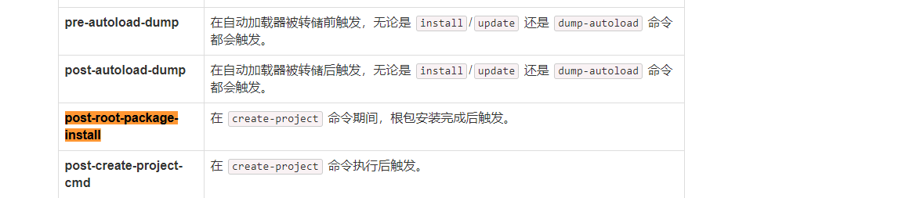
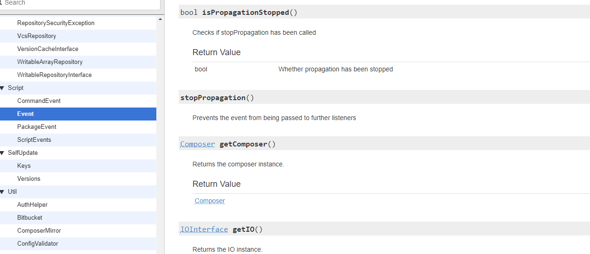
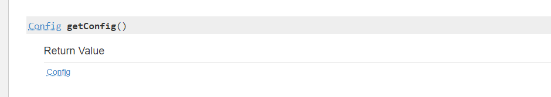
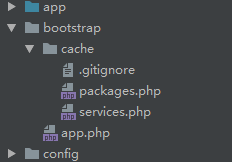
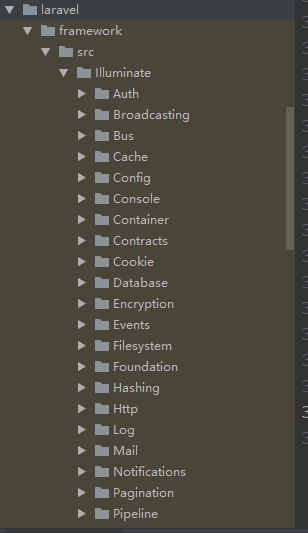
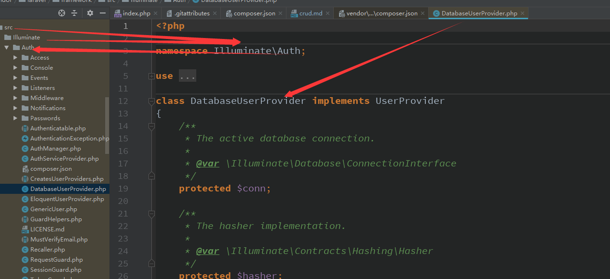

### CRUD整个流程注解  
[首页](../readme.md)      [下一页：App\Http\Kernel内核实例化的流程注解](web.md)   
- composer create-project laravel/laravel 
    运行此命令触发的玩意是啥？ 
    
    此命令相当于直接clone git上的仓库  
    [仓库](https://github.com/laravel/laravel/tree/master)  
    
    并下载composer.json指定的第三方扩展包  
    
    现在我们去看一下这个文件的内容    
    
    [composer.json文件各选项意义](https://docs.phpcomposer.com/04-schema.html)  
    
    ```json  
    {
        "name": "laravel/laravel",//包名
        "type": "project",//包的安装类型，一般有project,library,metapackage,composer-plugin
        "description": "The Laravel Framework.",
        "keywords": [
            "framework",
            "laravel"
        ],
        "license": "MIT",
        "require": {
            "php": "^7.1.3",
            "fideloper/proxy": "^4.0",//依赖的第三方扩展包，安装时会下载下来
            "laravel/framework": "5.8.*",//laravel的核心包，同样安装时下载下来
            "laravel/tinker": "^1.0"//同理
        },
        "require-dev": {
            "beyondcode/laravel-dump-server": "^1.0",
            "filp/whoops": "^2.0",
            "fzaninotto/faker": "^1.4",
            "mockery/mockery": "^1.0",
            "nunomaduro/collision": "^3.0",
            "phpunit/phpunit": "^7.5"
        },
        "config": {//可查看https://docs.phpcomposer.com/04-schema.html#config说明 
            "optimize-autoloader": true,
            "preferred-install": "dist",
            "sort-packages": true
        },
        "extra": {
            "laravel": {
                "dont-discover": []
            }
        },
        "autoload": {//应用运行时自动加载的根命名空间对应的应用目录 
            "psr-4": {
                "App\\": "app/"
            },
            "classmap": [
                "database/seeds",
                "database/factories"
            ]
        },
        "autoload-dev": {
            "psr-4": {
                "Tests\\": "tests/"
            }
        },
        "minimum-stability": "dev",
        "prefer-stable": true,
        "scripts": {//composer脚本，安装过程中触发的脚本命令https://docs.phpcomposer.com/articles/scripts.html
            "post-autoload-dump": [//事件名称
                "Illuminate\\Foundation\\ComposerScripts::postAutoloadDump",
                "@php artisan package:discover --ansi"
            ],
            "post-root-package-install": [//安装期间触发
                "@php -r \"file_exists('.env') || copy('.env.example', '.env');\""
            ],
            "post-create-project-cmd": [//安装完后触发
                "@php artisan key:generate --ansi"
            ]
        }
    }

    ```  
    composer脚本运行命令   
      
    
    post-autoload-dump 时做的事情  
    首先我们去找这个文件`Illuminate\\Foundation\\ComposerScripts::postAutoloadDump`  
    
    Illuminate\Foundation\ComposerScripts的postAutoloadDump内容 
    ```php  
    public static function postAutoloadDump(Event $event)
        {
            require_once $event->getComposer()->getConfig()->get('vendor-dir').'/autoload.php';
    
            static::clearCompiled();
        }
    ```  
    
    它使用的是Composer/Script/Event类，具体API可以自己看一下
    [composer API](http://getcomposer.org/apidoc/master/Composer.html)  
    
    `$event->getComposer()`返回Composer对象 
       
     再返回Config对象  
       
     再获取vendor目录  
        
     
     最终引入autoload.php文件用于类的自动加载，这个没问题吧  
     
     继续来看一下它的下一步 
     ```php  
     protected static function clearCompiled()
         {
         //实例化Application【具体实例化后干嘛了，后面说】
             $laravel = new Application(getcwd());
     
     //如果文件bootstrap/cache/services.php存在则删除
             if (file_exists($servicesPath = $laravel->getCachedServicesPath())) {
                 @unlink($servicesPath);
             }
     //如果文件bootstrap/cache/packages.php存在则删除
             if (file_exists($packagesPath = $laravel->getCachedPackagesPath())) {
                 @unlink($packagesPath);
             }
         }
     ```  
     
     文件目录位置  
         
     
     @php artisan package:discover --ansi命令所做的事情  
     
     它对应的文件内容是【package:discover控制台命令，后面会说console，当前laravel5.5版本有说明】
     laravel5.5LTS版本有注解，我就直接扔代码在这里了，不清楚的自己去看  
     ```php  
     <?php
     
     namespace Illuminate\Foundation\Console;
     
     use Illuminate\Console\Command;
     use Illuminate\Foundation\PackageManifest;
     
     class PackageDiscoverCommand extends Command
     {
         /**
          * The console command signature.
          *
          * @var string
          */
         protected $signature = 'package:discover';
     
         /**
          * The console command description.
          *
          * @var string
          */
         protected $description = 'Rebuild the cached package manifest';
     
         /**
          * Execute the console command.
          *
          * @param  \Illuminate\Foundation\PackageManifest  $manifest
          * @return void
          */
         public function handle(PackageManifest $manifest)
         {
             $manifest->build();
     
             foreach (array_keys($manifest->manifest) as $package) {
                 $this->line("Discovered Package: <info>{$package}</info>");
             }
     
             $this->info('Package manifest generated successfully.');
         }
     }

     ```  
     
     看第一句代码吧  
     
     ```php  
      public function build()
         {
             $packages = [];
     
     //没错，就是得到composer安装时生成的安装包记录
             if ($this->files->exists($path = $this->vendorPath.'/composer/installed.json')) {
                 $packages = json_decode($this->files->get($path), true);
             }
     
             $ignoreAll = in_array('*', $ignore = $this->packagesToIgnore());
     
             $this->write(collect($packages)->mapWithKeys(function ($package) {
                 return [$this->format($package['name']) => $package['extra']['laravel'] ?? []];
             })->each(function ($configuration) use (&$ignore) {
                 $ignore = array_merge($ignore, $configuration['dont-discover'] ?? []);
             })->reject(function ($configuration, $package) use ($ignore, $ignoreAll) {
                 return $ignoreAll || in_array($package, $ignore);
             })->filter()->all());
         }
     ```  
     
     然后写入指定的文件  
     
     ```php  
     protected function write(array $manifest)
         {
             if (! is_writable(dirname($this->manifestPath))) {
                 throw new Exception('The '.dirname($this->manifestPath).' directory must be present and writable.');
             }
     
             $this->files->replace(
                 $this->manifestPath, '<?php return '.var_export($manifest, true).';'
             );
         }
     ```  
     写入哪个文件呢？【跟console的运行流程有关，具体可以看前面5.5版本的注解，我不想再重复了】  
     bootstrap/cache/packages.php  就写入这文件，我怎么知道【你还是得看5.5LTS的注解哦】  
     
     这个命令的功能就这样 
     
     后面的2个命令不用分析了，这么简单的道理  
     
     下面我们去看看laravel/framework的加载，因为它是一个扩展包，也有自己的composer.json文件  
     composer也会去读取它的文件然后加载的【其它扩展包道理一样】  
     
     下面来看的composer.json文件吧  
     ```json  
     {
         "name": "laravel/framework",
         "description": "The Laravel Framework.",
         "keywords": ["framework", "laravel"],
         "license": "MIT",
         "homepage": "https://laravel.com",
         "support": {
             "issues": "https://github.com/laravel/framework/issues",
             "source": "https://github.com/laravel/framework"
         },
         "authors": [
             {
                 "name": "Taylor Otwell",
                 "email": "taylor@laravel.com"
             }
         ],
         "require": {
             "php": "^7.1.3",
             "ext-json": "*",
             "ext-mbstring": "*",
             "ext-openssl": "*",
             "doctrine/inflector": "^1.1",
             "dragonmantank/cron-expression": "^2.0",
             "egulias/email-validator": "^2.0",
             "erusev/parsedown": "^1.7",
             "league/flysystem": "^1.0.8",
             "monolog/monolog": "^1.12",
             "nesbot/carbon": "^1.26.3 || ^2.0",
             "opis/closure": "^3.1",
             "psr/container": "^1.0",
             "psr/simple-cache": "^1.0",
             "ramsey/uuid": "^3.7",
             "swiftmailer/swiftmailer": "^6.0",
             "symfony/console": "^4.2",
             "symfony/debug": "^4.2",
             "symfony/finder": "^4.2",
             "symfony/http-foundation": "^4.2",
             "symfony/http-kernel": "^4.2",
             "symfony/process": "^4.2",
             "symfony/routing": "^4.2",
             "symfony/var-dumper": "^4.2",
             "tijsverkoyen/css-to-inline-styles": "^2.2.1",
             "vlucas/phpdotenv": "^3.3"
         },
         "replace": {
             "illuminate/auth": "self.version",
             "illuminate/broadcasting": "self.version",
             "illuminate/bus": "self.version",
             "illuminate/cache": "self.version",
             "illuminate/config": "self.version",
             "illuminate/console": "self.version",
             "illuminate/container": "self.version",
             "illuminate/contracts": "self.version",
             "illuminate/cookie": "self.version",
             "illuminate/database": "self.version",
             "illuminate/encryption": "self.version",
             "illuminate/events": "self.version",
             "illuminate/filesystem": "self.version",
             "illuminate/hashing": "self.version",
             "illuminate/http": "self.version",
             "illuminate/log": "self.version",
             "illuminate/mail": "self.version",
             "illuminate/notifications": "self.version",
             "illuminate/pagination": "self.version",
             "illuminate/pipeline": "self.version",
             "illuminate/queue": "self.version",
             "illuminate/redis": "self.version",
             "illuminate/routing": "self.version",
             "illuminate/session": "self.version",
             "illuminate/support": "self.version",
             "illuminate/translation": "self.version",
             "illuminate/validation": "self.version",
             "illuminate/view": "self.version"
         },
         "conflict": {
             "tightenco/collect": "<5.5.33"
         },
         "require-dev": {
             "aws/aws-sdk-php": "^3.0",
             "doctrine/dbal": "^2.6",
             "filp/whoops": "^2.1.4",
             "guzzlehttp/guzzle": "^6.3",
             "league/flysystem-cached-adapter": "^1.0",
             "mockery/mockery": "^1.0",
             "moontoast/math": "^1.1",
             "orchestra/testbench-core": "3.8.*",
             "pda/pheanstalk": "^4.0",
             "phpunit/phpunit": "^7.5|^8.0",
             "predis/predis": "^1.1.1",
             "symfony/css-selector": "^4.2",
             "symfony/dom-crawler": "^4.2",
             "true/punycode": "^2.1"
         },
         "autoload": {
             "files": [
                 "src/Illuminate/Foundation/helpers.php",//你经常用的函数包文件
                 "src/Illuminate/Support/helpers.php"
             ],
             "psr-4": {
                 "Illuminate\\": "src/Illuminate/"//命名空间对应的根目录 
             }
         },
         "autoload-dev": {
             "files": [
                 "tests/Database/stubs/MigrationCreatorFakeMigration.php"
             ],
             "psr-4": {
                 "Illuminate\\Tests\\": "tests/"
             }
         },
         "extra": {
             "branch-alias": {
                 "dev-master": "5.8-dev"
             }
         },
         "suggest": {
             "ext-pcntl": "Required to use all features of the queue worker.",
             "ext-posix": "Required to use all features of the queue worker.",
             "aws/aws-sdk-php": "Required to use the SQS queue driver and SES mail driver (^3.0).",
             "doctrine/dbal": "Required to rename columns and drop SQLite columns (^2.6).",
             "filp/whoops": "Required for friendly error pages in development (^2.1.4).",
             "fzaninotto/faker": "Required to use the eloquent factory builder (^1.4).",
             "guzzlehttp/guzzle": "Required to use the Mailgun and Mandrill mail drivers and the ping methods on schedules (^6.0).",
             "laravel/tinker": "Required to use the tinker console command (^1.0).",
             "league/flysystem-aws-s3-v3": "Required to use the Flysystem S3 driver (^1.0).",
             "league/flysystem-cached-adapter": "Required to use the Flysystem cache (^1.0).",
             "league/flysystem-rackspace": "Required to use the Flysystem Rackspace driver (^1.0).",
             "league/flysystem-sftp": "Required to use the Flysystem SFTP driver (^1.0).",
             "moontoast/math": "Required to use ordered UUIDs (^1.1).",
             "nexmo/client": "Required to use the Nexmo transport (^1.0).",
             "pda/pheanstalk": "Required to use the beanstalk queue driver (^4.0).",
             "predis/predis": "Required to use the redis cache and queue drivers (^1.0).",
             "pusher/pusher-php-server": "Required to use the Pusher broadcast driver (^3.0).",
             "symfony/css-selector": "Required to use some of the crawler integration testing tools (^4.2).",
             "symfony/dom-crawler": "Required to use most of the crawler integration testing tools (^4.2).",
             "symfony/psr-http-message-bridge": "Required to use PSR-7 bridging features (^1.1).",
             "wildbit/swiftmailer-postmark": "Required to use Postmark mail driver (^3.0)."
         },
         "config": {
             "sort-packages": true
         },
         "minimum-stability": "dev",
         "prefer-stable": true
     }

     ```  
     根据这配置文件大家也应该知道了，它会去下载它的require指定的依赖扩展包，它的依赖扩展包 
     同样也是依赖其它的扩展包  
     
     根命名空间对应的目录结构 
     ```json 
     "psr-4": {
                      "Illuminate\\": "src/Illuminate/"//命名空间对应的根目录 
              }
     ```  
     
     
     下面是它的子目录【自然对应子命名空间】  
       
     
     其它的扩展包下载原理也是这样【相当于递归下载】
     