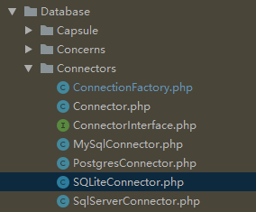
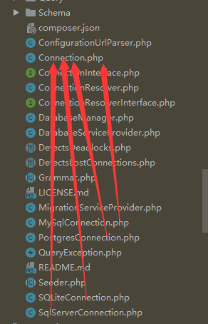
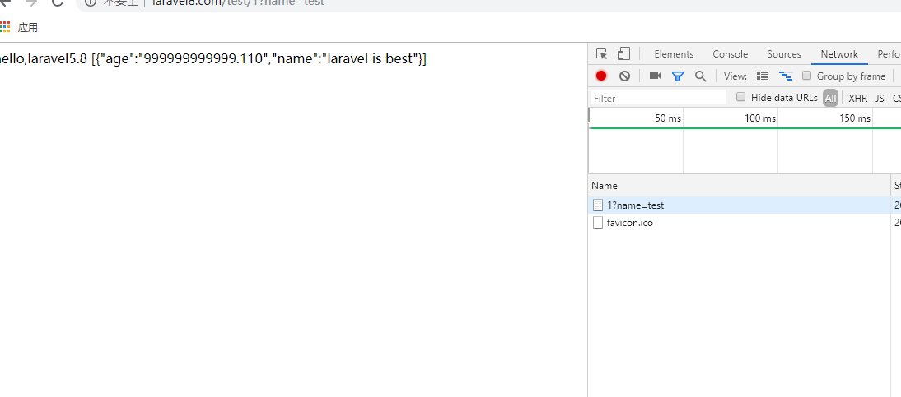
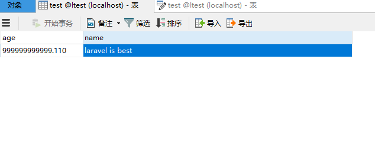
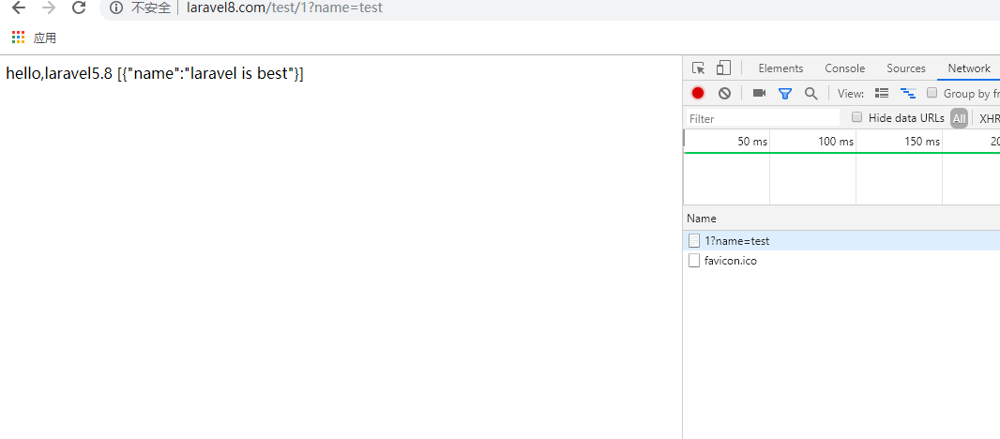
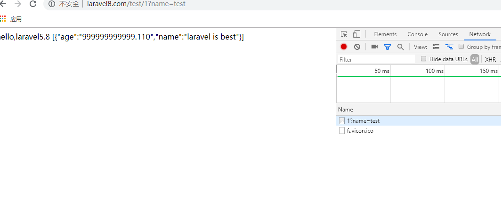
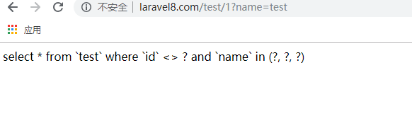
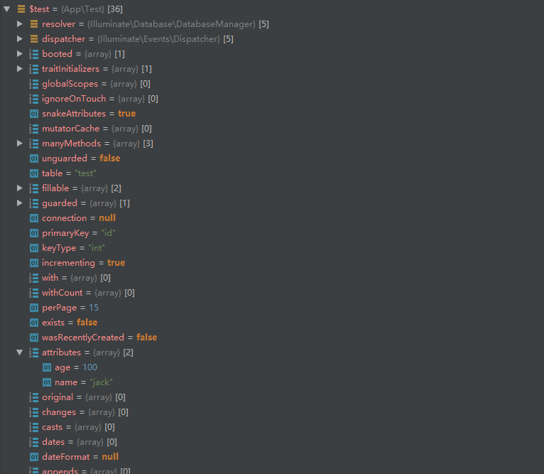

### 数据库使用  
[首页](../readme.md) [下一页：模板引擎实现流程](view.md)  [上一页：App\Http\Kernel的路由调度(寻址)流程](dispatch.md) 

- 数据库DB类的骚流程  
    数据库服务提供类的注册  
    ```php  
    <?php
    
    namespace Illuminate\Database;
    
    use Faker\Factory as FakerFactory;
    use Faker\Generator as FakerGenerator;
    use Illuminate\Database\Eloquent\Model;
    use Illuminate\Support\ServiceProvider;
    use Illuminate\Contracts\Queue\EntityResolver;
    use Illuminate\Database\Connectors\ConnectionFactory;
    use Illuminate\Database\Eloquent\QueueEntityResolver;
    use Illuminate\Database\Eloquent\Factory as EloquentFactory;
    
    class DatabaseServiceProvider extends ServiceProvider
    {
      
        public function boot()
        {
            Model::setConnectionResolver($this->app['db']);
    
            Model::setEventDispatcher($this->app['events']);
        }

        public function register()
        {
            Model::clearBootedModels();
    
            $this->registerConnectionServices();
    
            $this->registerEloquentFactory();
    
            $this->registerQueueableEntityResolver();
        }

        protected function registerConnectionServices()
        {
            
            $this->app->singleton('db.factory', function ($app) {
                return new ConnectionFactory($app);
            });

            $this->app->singleton('db', function ($app) {
                return new DatabaseManager($app, $app['db.factory']);
            });
    
            $this->app->bind('db.connection', function ($app) {
                return $app['db']->connection();
            });
        }

        protected function registerEloquentFactory()
        {
            $this->app->singleton(FakerGenerator::class, function ($app) {
                return FakerFactory::create($app['config']->get('app.faker_locale', 'en_US'));
            });
    
            $this->app->singleton(EloquentFactory::class, function ($app) {
                return EloquentFactory::construct(
                    $app->make(FakerGenerator::class), $this->app->databasePath('factories')
                );
            });
        }
    
        protected function registerQueueableEntityResolver()
        {
            $this->app->singleton(EntityResolver::class, function () {
                return new QueueEntityResolver;
            });
        }
    }

    ```    
    
    boot方法  
    ```php 
     public function boot()
        {
        //Illuminate\Database\Eloquent\Model
        //$this->app['db']=Illuminate\Database\DatabaseManager实例
        //new DatabaseManager($app, $app['db.factory'])
        //$app['db.factory']=Illuminate\Database\Connectors\ConnectionFactory实例
        
            Model::setConnectionResolver($this->app['db']);
    
            Model::setEventDispatcher($this->app['events']);
        }
    ```  
    
    设置模型的连接处理器  
    //Illuminate\Database\Eloquent\Model->setConnectionResolver()方法  
    ```php  
    public static function setConnectionResolver(Resolver $resolver)
        {
            static::$resolver = $resolver;
        }  
        
        
    ```  
    设置模型事件调度器  
    //Illuminate\Database\Eloquent\Model->setEventDispatcher()方法  
    ```php  
    public static function setEventDispatcher(Dispatcher $dispatcher)
        {
            static::$dispatcher = $dispatcher;
        }
    ```  
    这是我前面列出的代码，它引用了DB【具体实例化过程我不说了，前面已经讲过了】  
    ```php  
    use Illuminate\Support\Facades\DB;
    
    class TestController extends Controller
    {
        //
        function index(Request $request,User $user)
        {
            $data = DB::table("test")->get();
            return view("admin.index",compact('data'));
        }
    }

    ```  
    它最终运行【因为上面注册在Application里了，所以人家去里面找】     
    ```php  
    function ($app) {
        //Illuminate\Database\DatabaseManager 
        //Illuminate\Database\Connectors\ConnectionFactory实例
        
        return new DatabaseManager($app, $app['db.factory']);
     }
    ```  
    【Illuminate\Database\DatabaseManager大哥装逼场所】   
    DB::table()方法  
    ```php  
    //DatabaseManager没有此方法，当然运行魔术方法了
    public function __call($method, $parameters)
        {
            return $this->connection()->$method(...$parameters);
        }
    ```  
    
    DatabaseManager->connection()方法   
    ```php  
    public function connection($name = null)
        {
        //得到数据库的连接名称一般是mysql,null
            [$database, $type] = $this->parseConnectionName($name);
    
            $name = $name ?: $database;//mysql
            //正常情况下，这个连接实例是不存在的【开始的时候】 
            //当你第二次再调用它时【如第一次是mysql】，第二次直接返回数据即return
            //不再返回了，它存储的数据是这样的
            /**
            connections[mysql]=obj
            connections[sqlite]=obj
            connections[pgsql]=obj
            ...
            **/
            if (! isset($this->connections[$name])) {
            //存储连接实例
                $this->connections[$name] = $this->configure(
                    $this->makeConnection($database), $type
                );
            }
    
            return $this->connections[$name];
        }
    ```  
    DatabaseManager->parseConnectionName()方法【得到连接名称】   
    ```php  
     protected function parseConnectionName($name)
        {
        //得到数据库的连接名称
            $name = $name ?: $this->getDefaultConnection();
            //判断数组中每个数据元素是否含有指定的$name字符串 
            //除非你要配置主从复制，读写分离的数据库选项，不然返回数组
            return Str::endsWith($name, ['::read', '::write'])
                                ? explode('::', $name, 2) : [$name, null];
        }
    ```    
    
    DatabaseManager->getDefaultConnection()方法【得到默认的连接名称一般是mysql】    
    ```php  
    public function getDefaultConnection()
        {
        //返回mysql【具体自己去打开config/database.php配置文件看】
        //config到底对应什么东西【自己去看一下Application运行时动态的数据存储情况】
            return $this->app['config']['database.default'];
        }
    ```  
    
    DatabaseManager类的方法打印  
    ```php  
        namespace App\Http\Controllers\Admin;
        
        use App\User;
        use Illuminate\Database\DatabaseManager;
        use Illuminate\Http\Request;
        use App\Http\Controllers\Controller;
        use Illuminate\Support\Facades\DB;
        use Symfony\Component\Routing\RouteCollection;
        
        class TestController extends Controller
        {
            //
            function index(Request $request,User $user)
            {
                $data = DB::table("test")->get();
                /**@var RouteCollection */
               //print_r(app('routes')->get(app('request')->getMethod()));
                /** @var Request */
                //print_r(app("request")->headers->get('user-agent'));
                /** @var DatabaseManager $db */
                $db = app("db");
                $obj = new \ReflectionClass($db);
                print_r($obj->getMethods());//打印出它的所有方法
                //这样子的话，你就可以使用它了，后面我们会具体使用它的方法
        
                return view("admin.index",compact('data'));
            }
        }
    ```  
    
    [Str::endsWith方法说明](Str.md)     
    
    DatabaseManager->makeConnection($database)创建连接方法  
    ```php  
     protected function makeConnection($name)
        {
        //得到配置数组【默认是mysql】
            $config = $this->configuration($name);
            //这里是没有东西的【不用管了，后面再说】
            if (isset($this->extensions[$name])) {
                return call_user_func($this->extensions[$name], $config, $name);
            }
    
            if (isset($this->extensions[$driver = $config['driver']])) {
                return call_user_func($this->extensions[$driver], $config, $name);
            }
            //没有错就调用这句 
            //大家应该清楚Illuminate是一级目录，后面的为二级目录【即它自己的内置包】 
            //Connectors三级目录 ，后面才是类连接工厂
            //factory=Illuminate\Database\Connectors\ConnectionFactory实例  
            //我怎么知道的，看上面，上面的数据库服务提供类已经注册了
            return $this->factory->make($config, $name);
        }
    ```  
     DatabaseManager->configuration($name)得到数据库连接配置选项【得到mysql配置数组】
    ```php  
    protected function configuration($name)
        {
        //得到连接选项名称【默认为mysql】
            $name = $name ?: $this->getDefaultConnection();
            /**
            'connections' => [
            
                    'sqlite' => [
                        'driver' => 'sqlite',
                        'url' => env('DATABASE_URL'),
                        'database' => env('DB_DATABASE', database_path('database.sqlite')),
                        'prefix' => '',
                        'foreign_key_constraints' => env('DB_FOREIGN_KEYS', true),
                    ],
            
                    'mysql' => [
                        'driver' => 'mysql',
                        'url' => env('DATABASE_URL'),
                        'host' => env('DB_HOST', '127.0.0.1'),
                        'port' => env('DB_PORT', '3306'),
                        'database' => env('DB_DATABASE', 'forge'),
                        'username' => env('DB_USERNAME', 'forge'),
                        'password' => env('DB_PASSWORD', ''),
                        'unix_socket' => env('DB_SOCKET', ''),
                        'charset' => 'utf8mb4',
                        'collation' => 'utf8mb4_unicode_ci',
                        'prefix' => '',
                        'prefix_indexes' => true,
                        'strict' => true,
                        'engine' => null,
                        'options' => extension_loaded('pdo_mysql') ? array_filter([
                            PDO::MYSQL_ATTR_SSL_CA => env('MYSQL_ATTR_SSL_CA'),
                        ]) : [],
                    ],
            
                    'pgsql' => [
                        'driver' => 'pgsql',
                        'url' => env('DATABASE_URL'),
                        'host' => env('DB_HOST', '127.0.0.1'),
                        'port' => env('DB_PORT', '5432'),
                        'database' => env('DB_DATABASE', 'forge'),
                        'username' => env('DB_USERNAME', 'forge'),
                        'password' => env('DB_PASSWORD', ''),
                        'charset' => 'utf8',
                        'prefix' => '',
                        'prefix_indexes' => true,
                        'schema' => 'public',
                        'sslmode' => 'prefer',
                    ],
            
                    'sqlsrv' => [
                        'driver' => 'sqlsrv',
                        'url' => env('DATABASE_URL'),
                        'host' => env('DB_HOST', 'localhost'),
                        'port' => env('DB_PORT', '1433'),
                        'database' => env('DB_DATABASE', 'forge'),
                        'username' => env('DB_USERNAME', 'forge'),
                        'password' => env('DB_PASSWORD', ''),
                        'charset' => 'utf8',
                        'prefix' => '',
                        'prefix_indexes' => true,
                    ],
            
                ]
            **/
            $connections = $this->app['config']['database.connections'];
            //Arr:get不用了吧，得到mysql索引的数组返回
            //没有就扔个参数错误异常给你
            if (is_null($config = Arr::get($connections, $name))) {
                throw new InvalidArgumentException("Database [{$name}] not configured.");
            }
    
            return (new ConfigurationUrlParser)
                        ->parseConfiguration($config);
        }
    ```  
    Illuminate\Support\ConfigurationUrlParser类【配置解析，本处原样返回】 
    ```php  
    public function parseConfiguration($config)
        {
        //配置选项是数组的，所以这里判断没有用的
            if (is_string($config)) {
                $config = ['url' => $config];
            }
    
            $url = $config['url'] ?? null;
            //删除uri选项 
            //添加完了又删除
            $config = Arr::except($config, 'url');
            //uri不存在直接返回，存在下面就解析了
            if (! $url) {
                return $config;
            }
    
            $parsedUrl = $this->parseUrl($url);
    
            return array_merge(
                $config,
                $this->getPrimaryOptions($parsedUrl),
                $this->getQueryOptions($parsedUrl)
            );
        }
    ```  
    
    Illuminate\Database\Connectors\ConnectionFactory连接工厂构造
    ```php  
    namespace Illuminate\Database\Connectors;
    
    use PDOException;
    use Illuminate\Support\Arr;
    use InvalidArgumentException;
    use Illuminate\Database\Connection;
    use Illuminate\Database\MySqlConnection;
    use Illuminate\Database\SQLiteConnection;
    use Illuminate\Database\PostgresConnection;
    use Illuminate\Database\SqlServerConnection;
    use Illuminate\Contracts\Container\Container;
    
    class ConnectionFactory
    {
        /**
         * The IoC container instance.
         *
         * @var \Illuminate\Contracts\Container\Container
         */
        protected $container;
    
        /**
         * Create a new connection factory instance.
         *
         * @param  \Illuminate\Contracts\Container\Container  $container
         * @return void
         */
        public function __construct(Container $container)
        {
            $this->container = $container;
        }
    ```  
    Illuminate\Database\Connectors\ConnectionFactory->make()连接工厂开始制造
    ```php  
    /**
    array $config, $name = null生产原料
    **/
     public function make(array $config, $name = null)
        {
        //给配置数组选项添加prefix,name选项返回
            $config = $this->parseConfig($config, $name);
            //这个是不会存在的【如果你的项目搞多读写库，就自己看】  
            //一般我们用一些第三方的中间件就可以了
            if (isset($config['read'])) {
                return $this->createReadWriteConnection($config);
            }
    
            return $this->createSingleConnection($config);
        }
    ```  
    连接工厂制造单一连接
    Illuminate\Database\Connectors\ConnectionFactory->createSingleConnection($config)  
    ```php  
    protected function createSingleConnection(array $config)
        {
        
            /**
            根据数据库的配置选项【决定要使用哪个连接器】
            //返回的内容就是这样【我简化了】
            function ()use($config){
                return new Illuminate\Database\Connectors\MySqlConnector();
            }
            **/
            $pdo = $this->createPdoResolver($config);
    
            return $this->createConnection(
                $config['driver'], $pdo, $config['database'], $config['prefix'], $config
            );
        }
    ```  
    
    Illuminate\Database\Connectors\ConnectionFactory->createPdoResolver($config)  
    ```php  
     protected function createPdoResolver(array $config)
        {
        
            return array_key_exists('host', $config)
                                ? $this->createPdoResolverWithHosts($config)
                                : $this->createPdoResolverWithoutHosts($config);
        }
    ```    
    
     Illuminate\Database\Connectors\ConnectionFactory->createPdoResolverWithHosts($config)  
     
     ```php  
      protected function createPdoResolverWithHosts(array $config)
         {
         //返回一个匿名函数
             return function () use ($config) {
             /**
             $hosts = Arr::wrap($config['host']);
            
             $hosts = [$hosts];
             **/
             //shuffle 随机打乱数组【老外真闲，套路一套套的，获取一个配置参数也搞这么多】
                 foreach (Arr::shuffle($hosts = $this->parseHosts($config)) as $key => $host) {
                     $config['host'] = $host;
                     //得到数据库的ip
                     
                     try {
                         return $this->createConnector($config)->connect($config);
                     } catch (PDOException $e) {
                         continue;
                     }
                 }
     
                 throw $e;
             };
         }
     ```    
     
     Illuminate\Database\Connectors\ConnectionFactory->createConnector($config)   
     
     ```php  
     public function createConnector(array $config)
         {
             if (! isset($config['driver'])) {
                 throw new InvalidArgumentException('A driver must be specified.');
             }
             //是否绑定了，没有绑定不用理它
             if ($this->container->bound($key = "db.connector.{$config['driver']}")) {
                 return $this->container->make($key);
             }
     
             switch ($config['driver']) {
                 case 'mysql'://我们要用的就是Mysql【其它的连接方式自己看了】
                     return new MySqlConnector;
                 case 'pgsql':
                     return new PostgresConnector;
                 case 'sqlite':
                     return new SQLiteConnector;
                 case 'sqlsrv':
                     return new SqlServerConnector;
             }
     
             throw new InvalidArgumentException("Unsupported driver [{$config['driver']}]");
         }
     ```  
     
     Illuminate\Database\Connectors\MySqlConnector mysql连接器  
     
     //连接工厂创建连接
     Illuminate\Database\Connectors\ConnectionFactory->createConnection($config)   
     
     ```php
     //$config['driver'], $pdo, $config['database'], $config['prefix'], $config  
     protected function createConnection($driver, $connection, $database, $prefix = '', array $config = [])
         {
         
         //这个也不用管它
             if ($resolver = Connection::getResolver($driver)) {
                 return $resolver($connection, $database, $prefix, $config);
             }
     
             switch ($driver) {
                 case 'mysql'://看这个就行了
                     return new MySqlConnection($connection, $database, $prefix, $config);
                 case 'pgsql':
                     return new PostgresConnection($connection, $database, $prefix, $config);
                 case 'sqlite':
                     return new SQLiteConnection($connection, $database, $prefix, $config);
                 case 'sqlsrv':
                     return new SqlServerConnection($connection, $database, $prefix, $config);
             }
     
             throw new InvalidArgumentException("Unsupported driver [{$driver}]");
         }
     ```    
     
     数据库连接MySqlConnector->connect()  
     ```php  
      public function connect(array $config)
         {
         //得到dsn连接配置参数
         //支持本地域unix_socket协议  
         
         //数据库的连接支持PF_INET,PF_INET6,PF_UNIX协议
             $dsn = $this->getDsn($config);
     //得到配置选项
             $options = $this->getOptions($config);
             //得到pdo连接实例
             $connection = $this->createConnection($dsn, $config, $options);
             //选择数据库
             if (! empty($config['database'])) {
                 $connection->exec("use `{$config['database']}`;");
             }
             //设置编码
             $this->configureEncoding($connection, $config);
             //设置时区
             $this->configureTimezone($connection, $config);
             //设置数据库模式【模式会影响数据库什么，请自行查资料】
             $this->setModes($connection, $config);
             //返回pdo
             return $connection;
         }
     ```  
     
     数据库连接MySqlConnector->createConnection() 
     ```php  
     public function createConnection($dsn, array $config, array $options)
         {
             [$username, $password] = [
                 $config['username'] ?? null, $config['password'] ?? null,
             ];
     
             try {
                 return $this->createPdoConnection(
                     $dsn, $username, $password, $options
                 );
             } catch (Exception $e) {
                 return $this->tryAgainIfCausedByLostConnection(
                     $e, $dsn, $username, $password, $options
                 );
             }
         }
     ```  
     
     数据库连接MySqlConnector->createPdoConnection()  
     ```php  
     protected function createPdoConnection($dsn, $username, $password, $options)
         {
             if (class_exists(PDOConnection::class) && ! $this->isPersistentConnection($options)) {
                 return new PDOConnection($dsn, $username, $password, $options);
             }
             //默认返回pdo实例 
             //pdo操作数据库是基本功了【不解释了】
             return new PDO($dsn, $username, $password, $options);
         }
     ```   
     
     Illuminate\Database\MySqlConnection extends Illuminate\Database\Connection构造器  
     ```php  
     public function __construct($pdo, $database = '', $tablePrefix = '', array $config = [])
         {
             $this->pdo = $pdo;
    
             $this->database = $database;
     
             $this->tablePrefix = $tablePrefix;
     
             $this->config = $config;
     
             $this->useDefaultQueryGrammar();
     
             $this->useDefaultPostProcessor();
         }
     ```
     Illuminate\Database\MySqlConnection extends Illuminate\Database\Connection->useDefaultQueryGrammar()方法  
     ```php  
     public function useDefaultQueryGrammar()
         {
         //new Illuminate\Database\Query\Grammars\Grammar
             $this->queryGrammar = $this->getDefaultQueryGrammar();
         }
     ``` 
     Illuminate\Database\MySqlConnection extends Illuminate\Database\Connection->useDefaultPostProcessor()方法  
     ```php  
      public function useDefaultPostProcessor()
         {
         //Illuminate\Database\Query\Processors\Processor
             $this->postProcessor = $this->getDefaultPostProcessor();
         }
     ```
     
     DatabaseManager的流程概括
     ```php  
          第一步：DatabaseManager->connection() 
          第二步：DatabaseManager->makeConnection(){$connections【mysql】=Illuminate\Database\Connectors\ConnectionFactory->make()}  
          第三步：ConnectionFactory->make(){
                 $pdo = function () use ($config) {
                                return $this->createConnector($config){
                                      switch ($config['driver']) {
                                                 case 'mysql':
                                                     return new MySqlConnector;
                                                 case 'pgsql':
                                                     return new PostgresConnector;
                                                 case 'sqlite':
                                                     return new SQLiteConnector;
                                                 case 'sqlsrv':
                                                     return new SqlServerConnector;
                                             }
                                }->connect($config)//connection执行后会返回PDO数据库的连接实例;
                        };
                 
                 return $this->createConnection(
                     $config['driver'], $pdo, $config['database'], $config['prefix'], $config
                 ){
                         switch ($driver) {
                             case 'mysql':
                             //返回Illuminate\Database\MySqlConnection extends Illuminate\Database\Connection实例对象
                                 return new MySqlConnection($connection, $database, $prefix, $config);
                             case 'pgsql':
                                 return new PostgresConnection($connection, $database, $prefix, $config);
                             case 'sqlite':
                                 return new SQLiteConnection($connection, $database, $prefix, $config);
                             case 'sqlsrv':
                                 return new SqlServerConnection($connection, $database, $prefix, $config);
                         }
                 };
          }  
     ```  
     四大连接器【mysql,sqlite,sqlserver,postgres】都是继承Connector  
       
     
     四大连接【mysql,sqlite,sqlserver,postgres】都是继承Connection  
       
     
     所以当DB::table()的时候，它会根据数据库的连接类型【mysql,sqlite,sqlserver,pgsql】让连接工厂生产不同的   
     的数据库连接返回，同时连接即Connection是基于连接器Connector的  
     连接器Connector也是根据参数决定要生产什么连接器返回【PDO】
     
     连接工厂使用了工厂模式，根据参数不同返回不同的制造产品  
     
     连接工厂生产出来的连接Connection保存在数据库管理器的DatabaseManager->connections数组里，下次使用直接取出来  
     
     那么DB的实例化过程就此说完了.  
     
     下面我们要说它的方法table()了
     这个方法当然是Illuminate\Database\MySqlConnection extends  Illuminate\Database\Connection->table()了  
     ```php  
     public function table($table)
         {
             return $this->query()->from($table);
         }
     ```  
     Illuminate\Database\MySqlConnection extends  Illuminate\Database\Connection->query()方法
     ```php  
     public function query()
         {
         //Illuminate\Database\Query\Builder实例【就叫查询构建器吧】
             return new QueryBuilder(
             //$this->getQueryGrammar()返回Illuminate\Database\Query\Grammars\Grammar实例对象
             //$this->getPostProcessor()返回Illuminate\Database\Query\Processors\Processor实例对象
                 $this, $this->getQueryGrammar(), $this->getPostProcessor()
             );
         }
     ```  
     
     Illuminate\Database\Query\Builder->from()方法  
     ```php  
     namespace Illuminate\Database\Query;
     
     use Closure;
     use RuntimeException;
     use DateTimeInterface;
     use Illuminate\Support\Arr;
     use Illuminate\Support\Str;
     use InvalidArgumentException;
     use Illuminate\Support\Collection;
     use Illuminate\Pagination\Paginator;
     use Illuminate\Support\Traits\Macroable;
     use Illuminate\Contracts\Support\Arrayable;
     use Illuminate\Database\ConnectionInterface;
     use Illuminate\Support\Traits\ForwardsCalls;
     use Illuminate\Database\Concerns\BuildsQueries;
     use Illuminate\Database\Query\Grammars\Grammar;
     use Illuminate\Database\Query\Processors\Processor;
     use Illuminate\Database\Eloquent\Builder as EloquentBuilder;
     
     class Builder
     {
         use BuildsQueries, ForwardsCalls, Macroable {
             __call as macroCall;
         }
         public $connection;
         public $grammar;
         public $processor;
         public $bindings = [
             'select' => [],
             'from'   => [],
             'join'   => [],
             'where'  => [],
             'having' => [],
             'order'  => [],
             'union'  => [],
         ];
         public $aggregate;
         public $columns;
         public $distinct = false;
         public $from;
         public $joins;
         public $wheres = [];
         public $groups;
         public $havings;
         public $orders;
         public $limit;
         public $offset;
         public $unions;
         public $unionLimit;
         public $unionOffset;
         public $unionOrders;
         public $lock;
         public $operators = [
             '=', '<', '>', '<=', '>=', '<>', '!=', '<=>',
             'like', 'like binary', 'not like', 'ilike',
             '&', '|', '^', '<<', '>>',
             'rlike', 'regexp', 'not regexp',
             '~', '~*', '!~', '!~*', 'similar to',
             'not similar to', 'not ilike', '~~*', '!~~*',
         ];
         public $useWritePdo = false;
         public function __construct(ConnectionInterface $connection,
                                     Grammar $grammar = null,
                                     Processor $processor = null)
         {
             Illuminate\Database\MySqlConnection extends  Illuminate\Database\Connection实例
             $this->connection = $connection;
            //Illuminate\Database\Query\Grammars\Grammar实例对象
           
             $this->grammar = $grammar ?: $connection->getQueryGrammar();
              //Illuminate\Database\Query\Processors\Processor实例对象
             $this->processor = $processor ?: $connection->getPostProcessor();
         }
         
         public function from($table)
         {
             $this->from = $table;
     
             return $this;
         }
     ```  
     
     DB::table()->get()方法  
     ```php  
     public function get($columns = ['*'])
         {
         //Arr::wrap($columns) = ['*']
             return collect($this->onceWithColumns(Arr::wrap($columns), function () {
             //返回执行的sql结果【是个对象集合】
                 return $this->processor->processSelect($this, $this->runSelect());
             }));
         }
         
     protected function onceWithColumns($columns, $callback)
         {
             //
             $original = $this->columns;
            //所有列*默认
             if (is_null($original)) {
                 $this->columns = $columns;
             }
             //运行回调函数
             /**
             function () {
                //Illuminate\Database\Query\Processors\Processor
                return $this->processor->processSelect($this, $this->runSelect());
             }
             **/
             $result = $callback();
     
             $this->columns = $original;
     
             return $result;
         }  
         
         
     protected function runSelect()
      {
          return $this->connection->select(
          //得到sql语法器处理的sql语句
              $this->toSql(), $this->getBindings(), ! $this->useWritePdo
          );
      }
      
      public function getBindings()
         {//返回一个数组
             return Arr::flatten($this->bindings);
         }
         
      
     public function toSql()
     {
     //Illuminate\Database\Query\Grammars\Grammar  
     //$this = Builder
         return $this->grammar->compileSelect($this);
     }
     ```    
     
     Illuminate\Database\Query\Grammars\Grammar->compileSelect() SQL语法器    
     ```php  
     protected $selectComponents = [
             'aggregate',
             'columns',
             'from',
             'joins',
             'wheres',
             'groups',
             'havings',
             'orders',
             'limit',
             'offset',
             'unions',
             'lock',
         ];
         
         
     public function compileSelect(Builder $query)
         {
         //这里不用看【我们现在暂时不用】
             if ($query->unions && $query->aggregate) {
                 return $this->compileUnionAggregate($query);
             }
     
             $original = $query->columns;
     
             if (is_null($query->columns)) {
                 $query->columns = ['*'];
             }
               /**
               return implode(' ', array_filter($segments, function ($value) {
                           return (string) $value !== '';
                       }));
               **/
             $sql = trim($this->concatenate(
                 $this->compileComponents($query))
             );
     
             $query->columns = $original;
     
             return $sql;
         }
         
     protected function compileComponents(Builder $query)
      {
          $sql = [];
            
          foreach ($this->selectComponents as $component) {
            
            //判断这个Builder是否有指定的属性且有值【可以看Builder和SQL请求成员的结构】  
            //我们现在只给Builder->columns=['*']只有它有值
              if (isset($query->$component) && ! is_null($query->$component)) {
              //拼装方法得到complieColumns方法
                  $method = 'compile'.ucfirst($component);
                    //complieColumns($query,$query->columns)
                    //处理好的sql语句
                    //$sql[]
                  $sql[$component] = $this->$method($query, $query->$component);
              }
          }
  
          return $sql;
      }
      
      protected function compileColumns(Builder $query, $columns)
          {
              if (! is_null($query->aggregate)) {
                  return;
              }
              //$query->distinct=false【对照builder构造器就知道了】
              $select = $query->distinct ? 'select distinct ' : 'select ';
      
              return $select.$this->columnize($columns);
          }
          
      public function columnize(array $columns)
          {
          //循环对字段进行处理
              return implode(', ', array_map([$this, 'wrap'], $columns));
          }
          
      public function wrap($value, $prefixAlias = false)
          {
          /**
           public function isExpression($value)
              {
                  return $value instanceof Expression;
              }判断是否是表达式类
          **/
              if ($this->isExpression($value)) {
                  return $this->getValue($value);
              }
            //字段含有as别名时
              if (stripos($value, ' as ') !== false) {
                  return $this->wrapAliasedValue($value, $prefixAlias);
              }
      
              return $this->wrapSegments(explode('.', $value));
          }
          
      protected function wrapAliasedValue($value, $prefixAlias = false)
          {
          //以as分离成数组如这样的列:select name as Cname from xxx;
              $segments = preg_split('/\s+as\s+/i', $value);
              if ($prefixAlias) {
                  $segments[1] = $this->tablePrefix.$segments[1];
              }
      
              return $this->wrap(
                  $segments[0]).' as '.$this->wrapValue($segments[1]
              );
          }
          
      protected function wrapValue($value)
          {
          //列名不是*号时，加上双号变成"Cname"
              if ($value !== '*') {
                  return '"'.str_replace('"', '""', $value).'"';
              }
      //返回列名
              return $value;
          }
          
       protected function wrapSegments($segments)
          {
          //map方法可以查看Arr类的说明
          //$segment=是原数组
          //$key是该数组的索引构成的新数组
              return collect($segments)->map(function ($segment, $key) use ($segments) {
                  return $key == 0 && count($segments) > 1
                                  ? $this->wrapTable($segment)//表名.字段名返回
                                  : $this->wrapValue($segment);//字段名返回
              })->implode('.');
          }
     ```      
     [Illuminate\Database\Query\Expression表达式类](expression.md)  
     [Builder构造器成员默认值](Builder.md)  
     [GrammarSQL语法器成员默认值](Grammar.md)  
     [Arr类](Arr.md)      
     
     执行sql语句  
     在SQL【Grammar sql语法器处理完后生成sql语句】  
     【所以得出当使用连接MysqlConnection类的table方法时返回Illuminate\Database\Query\Builder查询构建器】
     
     Illuminate\Database\MySqlConnection extends  Illuminate\Database\Connection->select()  
     ```php  
     $query=sql语句
     $bindings =  [
                         'select' => [],
                         'from'   => [],
                         'join'   => [],
                         'where'  => [],
                         'having' => [],
                         'order'  => [],
                         'union'  => [],
                     ];
     public function select($query, $bindings = [], $useReadPdo = true)
         {
             return $this->run($query, $bindings, function ($query, $bindings) use ($useReadPdo) {
                 if ($this->pretending()) {
                     return [];
                 }
                 //$this->getPdoForSelect($useReadPdo)得到PDO实例 对象
                 //this->prepared($this->getPdoForSelect($useReadPdo)得到PDO并设置数据获取方式为
                 //FETCH_OBJ
                 $statement = $this->prepared($this->getPdoForSelect($useReadPdo)
                                   ->prepare($query));
                 //PDO->query(sql);
                 //PDO->bind绑定
                 $this->bindValues($statement, $this->prepareBindings($bindings));
                 //PDO->execute执行SQL
                 $statement->execute();
                 //获取数据返回
                 //每条数据都是一个对象，字段作为对象的属性存在
                 return $statement->fetchAll();
             });
         }
     protected function getPdoForSelect($useReadPdo = true)
     {
         return $useReadPdo ? $this->getReadPdo() : $this->getPdo();
     }
     
     public function getPdo()
     {
         if ($this->pdo instanceof Closure) {
         //得到pdo连接
             return $this->pdo = call_user_func($this->pdo);
         }
 
         return $this->pdo;
     }
     
     protected function prepared(PDOStatement $statement)
         {
         //设置PDO数据的读取方式 
         //https://www.php.net/manual/zh/pdostatement.setfetchmode.php
         //$fetchMode = PDO::FETCH_OBJ
             $statement->setFetchMode($this->fetchMode);
     
             $this->event(new Events\StatementPrepared(
                 $this, $statement
             ));
     //返回PDO
             return $statement;
         }
      
     protected function run($query, $bindings, Closure $callback)
         {
         //确认pdo连接对象是否存在，否则 重新再连接
             $this->reconnectIfMissingConnection();
     
     //开始时间
             $start = microtime(true);
     
             try {
                 $result = $this->runQueryCallback($query, $bindings, $callback);
             } catch (QueryException $e) {
                 $result = $this->handleQueryException(
                     $e, $query, $bindings, $callback
                 );
             }
     
             $this->logQuery(
                 $query, $bindings, $this->getElapsedTime($start)
             );
     
             return $result;
         }
         
     protected function runQueryCallback($query, $bindings, Closure $callback)
         {
            //$query=sql
            //把回调函数传递到这里运行【有意思吗？^_^】
            //还经过2个方法传递进 来的，有病吧【^_^】
            //其实就是了捕获不同类型的异常【就是想垃圾分类】
             try {
                 $result = $callback($query, $bindings);
             }
     
             catch (Exception $e) {
                 throw new QueryException(
                     $query, $this->prepareBindings($bindings), $e
                 );
             }
     
             return $result;
         }
     ```
     
     总结DB::table('user')->get()方法   
     ```php  
  
     第一步：DB返回Connection对象  
     第二步：调用Connection的table方法  
     public function table($table)
         {
             return $this->query()->from($table);
         } 
         
     得到查询构建器Illuminate\Database\Query  
     
     第三步：设置数据表【给查询构建器传递表】  
     public function from($table)
         {
             $this->from = $table;
     
             return $this;
         }
         
     第四步：get操作 【给查询构建器传递字段】 
     public function get($columns = ['*'])
         {
             return collect($this->onceWithColumns(Arr::wrap($columns), function () {
                 return $this->processor->processSelect($this, $this->runSelect());
             }));
         }  
         
     protected function runSelect()
         {
             return $this->connection->select(
                 $this->toSql(), $this->getBindings(), ! $this->useWritePdo
             );
     }
         
     第五步：使用SQL语法器拼装SQL语句 【Illuminate\Database\Query\Grammars\Grammar】  
     【拼装的数据来源于你在调用查询构造器时传递的参数如你设置】
     public function toSql()
         {
             return $this->grammar->compileSelect($this);
         }
         
     protected function compileComponents(Builder $query)
         {
             $sql = [];
     
             foreach ($this->selectComponents as $component) {
                
                 if (isset($query->$component) && ! is_null($query->$component)) {
                     $method = 'compile'.ucfirst($component);
     
                     $sql[$component] = $this->$method($query, $query->$component);
                 }
             }
     
             return $sql;
         }   
         
     第六步：执行SQL语句 【Connection类】 
     ```php  
     public function select($query, $bindings = [], $useReadPdo = true)
         {
             return $this->run($query, $bindings, function ($query, $bindings) use ($useReadPdo) {
                 if ($this->pretending()) {
                     return [];
                 }
                 //PDO对象
                 $statement = $this->prepared($this->getPdoForSelect($useReadPdo)
                                   ->prepare($query));
     
                 $this->bindValues($statement, $this->prepareBindings($bindings));
                 //执行SQL返回
                 $statement->execute();
     
                 return $statement->fetchAll();
             });
         }

     第七步：使用集合Collection封装获取的数据结果  
     return new Collection(SQL执行的结果);    
     ```     
     
     至此DB::table('users')->get() 运行过程解释就完成了   
     
     所以呢你使用table的时候【你调用的就是查询构建器的方法，就是传递给它参数，它进行保存】  
     然后当你执行get/insert/delete/等方法时它会拼装【使用SQL语法处理器给你处理拼装成SQL】  
     
     然后调用Connection的方法执行拼装的SQL返回结果，同时结果会被Collection类封装返回   
     
     //它的过程就是这样：
     Connection->添加/删除/修改/查找(你的SQL语句||你调用查询构建器生成的SQL语句)->execute()    
     
- 数据库使用源码测试  
    上面我们已经分析它的大体流程，所以我们下来来说一下使用的一些基本方法【就是不看手册，看完源码就直接撸】  
    达到随心所欲，随便侮辱laravel，强上她，不要遵守她的封建制度【手册】规则，我爱怎么用就怎么用  
    
    以上言论过激【^_^】  
    好了，言归正转，下面我们开始   
    ```php  
    <?php
    namespace App\Http\Controllers\Admin;
    use App\User;
    use Illuminate\Database\DatabaseManager;
    use Illuminate\Database\MySqlConnection;
    use Illuminate\Foundation\Application;
    use Illuminate\Http\Request;
    use App\Http\Controllers\Controller;
    use Illuminate\Support\Facades\DB;
    use Symfony\Component\Routing\RouteCollection;
    class TestController extends Controller
    {
        function index(Request $request,User $user)
        {
            /** @var Application $app */
            $app = app();
            /** @var DatabaseManager $db */
            $db = $app['db'];//我直接获取DatabaseManager实例  
            //此方法只会实例化一次连接
            $data = $db->table("test")->get();//下面直接调用Builder的方法了
    
            return view("admin.index",compact('data'));
        }
    }

    ```  
    输出结果  
    
    
    
    ```php   
    
     $dbFactory = new ConnectionFactory(app());
            $dbManager = new DatabaseManager(app(),$dbFactory);
            /** @var MySqlConnection $connection */
            $connection = $dbManager->connection();
            $data = $connection->table("test")->get("name");
    
            return view("admin.index",compact('data'));
    ```  
    输出结果  
      
    
    ```php  
     /** @var MySqlConnection $db */
            $db = new MySqlConnection(function (){
                return (new MySqlConnector())->connect(config("database")['connections']['mysql']);
            },config("database")['connections']['mysql']['database'],"",config("database")['connections']['mysql']);
    
            $data = $db->table("test")->get();
    
            return view("admin.index",compact('data'));
    ```  
    
    输出结果  
        
    
    查询构造器【SQL语句生成器使用】  
    ```php  
     /** @var DatabaseManager $db */
            $db = app("db");
            $connection = $db->connection();
            $builder = new Builder($connection);
            $builder->from("test")
            ->where("id","<>",1)
            ->whereIn("name",[1,2,3]);
            $sql = $builder->toSql();
            $data = $sql;  
            
            //得到的sql你可以直接运行Connection->select(sql)
            return view("admin.index",compact('data'));
    ```  
    输出结果  
      
    
    以上我们完成了DB的流程说明和它的使用规则    
    
    
- 模型流程  
    我们就拿它默认给我们生的User.php类文件【当然许多人会特点喜欢分Model层，非要建一个Model目录，Controller目录】  
    然后还嫌不够，要建一堆Service,Logic一堆所谓的分层，即逻辑层，服务层【说话简单点，做事简单点，别搞太多的套路^_^】  
    开玩笑的  
    
    ```php  
    namespace Illuminate\Foundation\Auth;
    
    use Illuminate\Auth\Authenticatable;
    use Illuminate\Auth\MustVerifyEmail;
    use Illuminate\Database\Eloquent\Model;
    use Illuminate\Auth\Passwords\CanResetPassword;
    use Illuminate\Foundation\Auth\Access\Authorizable;
    use Illuminate\Contracts\Auth\Authenticatable as AuthenticatableContract;
    use Illuminate\Contracts\Auth\Access\Authorizable as AuthorizableContract;
    use Illuminate\Contracts\Auth\CanResetPassword as CanResetPasswordContract;
    
    class User extends Model implements
        AuthenticatableContract,
        AuthorizableContract,
        CanResetPasswordContract
    {
        use Authenticatable, Authorizable, CanResetPassword, MustVerifyEmail;
    }

    ```  
    
    下面是我用php artisan make:model Test创建的模型【此命令原理后面我们会说到】  
    ```php  
    namespace App;
    
    use Illuminate\Database\Eloquent\Model;
    
    class Test extends Model
    {
        //
    }

    ```  
    
    我的测试源码  
    ```php  
     $test = new Test();
     $data = $test->all();

     return view("admin.index",compact('data'));
    ```  
    
    就这么简单  
    [Model鸡类](Model.md)  
    实现化过程： 
    ```php  
    public function __construct(array $attributes = [])
        {
            //也是废的
            $this->bootIfNotBooted();
            //废的
            $this->initializeTraits();
            /**
              public function syncOriginal()
                {
                    $this->original = $this->attributes;
            
                    return $this;
                }
            **/
            $this->syncOriginal();
    
            $this->fill($attributes);
        }
        
    protected function bootIfNotBooted()
        {
            if (! isset(static::$booted[static::class])) {
                static::$booted[static::class] = true;
                //目前它真没有什么吊用【虽然每次实例化模型类的时候，它都运行，简直是丧尽天量，浪费时间】
                //后面我们说到调度器的时候来看看它你就更多加清楚了，现在我们放过
                $this->fireModelEvent('booting', false);
    
                static::boot();
    
                $this->fireModelEvent('booted', false);
            }
        }
        
    protected function fireModelEvent($event, $halt = true)
        {
        //事件调度器
            if (! isset(static::$dispatcher)) {
                return true;
            }
            $method = $halt ? 'until' : 'dispatch';
    
            $result = $this->filterModelEventResults(
                $this->fireCustomModelEvent($event, $method)
            );
            //此时$result=null
            if ($result === false) {
                return false;
            }
            //调度器->dispatch("eloquentbooting: App\\Test", $this)
            return ! empty($result) ? $result : static::$dispatcher->{$method}(
                "eloquent.{$event}: ".static::class, $this
            );
        }
        
    protected function fireCustomModelEvent($event, $method)
        {
        //直接返回
            if (! isset($this->dispatchesEvents[$event])) {
                return;
            }
    
            $result = static::$dispatcher->$method(new $this->dispatchesEvents[$event]($this));
    
            if (! is_null($result)) {
                return $result;
            }
        }
        
    protected static function boot()
        {
            static::bootTraits();
        }
    //现在它真没有吊用【完全是在装逼】
    protected static function bootTraits()
        {
            $class = static::class;
    
            $booted = [];
    
            static::$traitInitializers[$class] = [];
            //得到这个类的所有类【包括所有子类，父类全返回】
            foreach (class_uses_recursive($class) as $trait) {
            //取得子类名称拼装方法
            
                $method = 'boot'.class_basename($trait);
    
                //此类存在指定方法则运行
                if (method_exists($class, $method) && ! in_array($method, $booted)) {
                //https://www.php.net/manual/zh/function.forward-static-call.php
                //调用类的静态方法
                    forward_static_call([$class, $method]);
    
                    $booted[] = $method;
                }
                //或是子类存在initializeXXX方法也运行
                if (method_exists($class, $method = 'initialize'.class_basename($trait))) {
                    static::$traitInitializers[$class][] = $method;
    
                    static::$traitInitializers[$class] = array_unique(
                        static::$traitInitializers[$class]
                    );
                }
            }
        }
        
        
    public function fill(array $attributes)
        {
        //true
            $totallyGuarded = $this->totallyGuarded();
    
    //$this->fillableFromArray($attributes)直接 原样返回
            foreach ($this->fillableFromArray($attributes) as $key => $value) {
                $key = $this->removeTableFromKey($key);
                //原样得到key
                //指定$key存在于fillable数组中，或是ungrarded为真值或是fillable为空且没有_符号开头返回true,如果存在于guarded或是它为*号
                //就是fillable存在或是它为空且你的属性字段没_线就能设置  
                //guarded设置了就不能设置了
                if ($this->isFillable($key)) {
                    $this->setAttribute($key, $value);
                } elseif ($totallyGuarded) {
                    throw new MassAssignmentException(sprintf(
                        'Add [%s] to fillable property to allow mass assignment on [%s].',
                        $key, get_class($this)
                    ));
                }
            }
    
            return $this;
        }
        
    public function totallyGuarded()
        {
            return count($this->getFillable()) === 0 && $this->getGuarded() == ['*'];
        }
        
    public function getFillable()
        {
        //默认是空的
            return $this->fillable;
        }
        
    public function getGuarded()
        {
        //默认['*']
            return $this->guarded;
        }
        
    protected function fillableFromArray(array $attributes)
        {
        
            if (count($this->getFillable()) > 0 && ! static::$unguarded) {
                return array_intersect_key($attributes, array_flip($this->getFillable()));
            }
    
            return $attributes;
        }
        
    protected function removeTableFromKey($key)
        {   //key含有.符号直接获取最后一个，否则原样返回
            return Str::contains($key, '.') ? last(explode('.', $key)) : $key;
        }
        
    public function isFillable($key)判断是否能填充【指定$key存在于fillable数组中，或是ungrarded为真值或是fillable为空且没有_符号开头返回true,如果存在于guarded或是它为*号】
        {
            if (static::$unguarded) {
                return true;
            }
            
            if (in_array($key, $this->getFillable())) {
                return true;
            }
            
            if ($this->isGuarded($key)) {
                return false;
            }
    
            return empty($this->getFillable()) &&
                ! Str::startsWith($key, '_');
        }
        
    public function isGuarded($key)
        {
        //$guarded验证此参数是否有值
            return in_array($key, $this->getGuarded()) || $this->getGuarded() == ['*'];
        }
        
    保存属性 
    public function setAttribute($key, $value)
        {
        //存在set.$keyAttrbute方法的话就用它的方法
            if ($this->hasSetMutator($key)) {
            /
                return $this->setMutatedAttributeValue($key, $value);
            }
            //检测用户设置的字段是否是日期时间字段
            elseif ($value && $this->isDateAttribute($key)) {
                $value = $this->fromDateTime($value);
            }
            //暂时不管
            if ($this->isJsonCastable($key) && ! is_null($value)) {
                $value = $this->castAttributeAsJson($key, $value);
            }
            if (Str::contains($key, '->')) {
                return $this->fillJsonAttribute($key, $value);
            }
            //存储属性字段
            $this->attributes[$key] = $value;
    
            return $this;
        }
    protected function setMutatedAttributeValue($key, $value)属性方法运行
        {
            return $this->{'set'.Str::studly($key).'Attribute'}($value);
        }
        
    public function hasSetMutator($key)
        {
        //Str::studly($key)转换首字母为大写
            return method_exists($this, 'set'.Str::studly($key).'Attribute');
        }
        
    protected function isDateAttribute($key)
        {
            return in_array($key, $this->getDates()) ||
                                        $this->isDateCastable($key);
        }
        
    public function getDates()
        {
        //取得子模型设置的内容
            $defaults = [static::CREATED_AT, static::UPDATED_AT];
            
            return $this->usesTimestamps()//返回true
                        ? array_unique(array_merge($this->dates, $defaults))
                        : $this->dates;
        }
        
    public function usesTimestamps()
        {
            return $this->timestamps;
        }
    ```    
    
    [helpers函数说明](helpers.md)    
    
    ```php  
    $test = new Test(['age'=>100,'name'=>'jack']);
    $data = $test->save();  
    
    class Test extends Model
    {
        //
        public $table = "test";
        public $fillable = ['name','age'];
        public $guarded = ['*'];
    }
    ```  
    就是这么回事，存储如下    
         
    
    现在我们看一下它的save方法操作流程  
    ```php  
    public function save(array $options = [])
        {
        //返回Illuminate\Database\Eloquent\Builder模型构建器【内置查询构建器】   
            $query = $this->newModelQuery();
            
            //暂时不管它
            if ($this->fireModelEvent('saving') === false) {
                return false;
            }
    
            //过，不要
            if ($this->exists) {
                $saved = $this->isDirty() ?
                            $this->performUpdate($query) : true;
            }
    
            else {
            
                $saved = $this->performInsert($query);
    
                if (! $this->getConnectionName() &&
                    $connection = $query->getConnection()) {
                    $this->setConnection($connection->getName());
                }
            }
    
            if ($saved) {
                $this->finishSave($options);
            }
    
            return $saved;
        }
        
    public function newModelQuery()
        {
        //返回Illuminate\Database\Eloquent\Builder模型构建器实例
            return $this->newEloquentBuilder(
            //Builder构建器【具体看前面的注解，已经说过了】
                $this->newBaseQueryBuilder()
            )->setModel($this);
        }
        
    protected function newBaseQueryBuilder()
        {
        //得到MysqlConnection对象并调用query返回Builder构建器
            return $this->getConnection()->query();
        }
        
    public function getConnection()
        {
            return static::resolveConnection($this->getConnectionName());
        }
        
    public function getConnectionName()
        {
            return $this->connection;
        }
    public static function resolveConnection($connection = null)
        {
        //static::$resolve 数据库服务提供类在运行的时候注册了【忘记了可以看前面的注解】
        //这里的连接流程【就是DB实现的整个过程】，不在重复说明 
        //返回MysqlConnection实例
            return static::$resolver->connection($connection);
        }  
        
    public function newEloquentBuilder($query)
        {
            return new Builder($query);
        }
    ```  
    Illuminate\Database\Eloquent\Builder模型构建器【内置查询构建器】   
    ```php  
    namespace Illuminate\Database\Eloquent;
    
    use Closure;
    use Exception;
    use BadMethodCallException;
    use Illuminate\Support\Arr;
    use Illuminate\Support\Str;
    use Illuminate\Pagination\Paginator;
    use Illuminate\Contracts\Support\Arrayable;
    use Illuminate\Support\Traits\ForwardsCalls;
    use Illuminate\Database\Concerns\BuildsQueries;
    use Illuminate\Database\Eloquent\Relations\Relation;
    use Illuminate\Database\Query\Builder as QueryBuilder;
    
    /**
     * @property-read HigherOrderBuilderProxy $orWhere
     *
     * @mixin \Illuminate\Database\Query\Builder
     */
    class Builder
    {
        use BuildsQueries, Concerns\QueriesRelationships, ForwardsCalls;
        }  
        
        
    public function setModel(Model $model)
        {
            $this->model = $model;
            //查询构建器 query
            $this->query->from($model->getTable());
    
            return $this;
        }
    ```  
    Model->getTable()获取表名方法   
    ```php  
    public function getTable()
        {
        //设置table了没有【子模型】，否则就自动获取当前实例化的子模型并取得类名
            return $this->table ?? Str::snake(Str::pluralStudly(class_basename($this)));
        }
    ```  
    
    Model->performInsert方法   
    ```php  
    protected function performInsert(Builder $query)
        {
        //过
            if ($this->fireModelEvent('creating') === false) {
                return false;
            }
            
            if ($this->usesTimestamps()) {
                $this->updateTimestamps();
            }
            //获取数据
            $attributes = $this->getAttributes();
            //返回true 属于自动增长的插入
            if ($this->getIncrementing()) {
                $this->insertAndSetId($query, $attributes);
            }
    
            else {
                if (empty($attributes)) {
                    return true;
                }
    
                $query->insert($attributes);
            }
    
            $this->exists = true;
    
            $this->wasRecentlyCreated = true;
    
            $this->fireModelEvent('created', false);
    
            return true;
        }
    //模型构建器，数据内容
    protected function insertAndSetId(Builder $query, $attributes)
        {
        //$keyName = $this->getKeyName() 得到子模型的主键名称
        //$query->insertGetId此时将触发魔术方法【并返回查询构造器】   
            $id = $query->insertGetId($attributes, $keyName = $this->getKeyName());
    
            $this->setAttribute($keyName, $id);
        }
    ```  
    Illuminate\Database\Query\Builder->insertGetId()方法   
    ```php  
    public function insertGetId(array $values, $sequence = null)
        {
        //SQL语法器构建sql
            $sql = $this->grammar->compileInsertGetId($this, $values, $sequence);
    
            $values = $this->cleanBindings($values);
    
            return $this->processor->processInsertGetId($this, $sql, $values, $sequence);
        }  
        
    
    ```  
    Illuminate\Database\Query\Processors\Processor->processInsertGetId()方法  
    ```php  
    //
    public function processInsertGetId(Builder $query, $sql, $values, $sequence = null)
        {
        //查询构建器返回MysqlConnection实例直接进行插入操作
            $query->getConnection()->insert($sql, $values);
            //返回插入的id并返回
            $id = $query->getConnection()->getPdo()->lastInsertId($sequence);
    
            return is_numeric($id) ? (int) $id : $id;
        }
    ```  
    
    模型查询构建器魔术方法  
    ```php  
    public function __call($method, $parameters)
        {
            if ($method === 'macro') {
                $this->localMacros[$parameters[0]] = $parameters[1];
    
                return;
            }
    
            if (isset($this->localMacros[$method])) {
                array_unshift($parameters, $this);
    
                return $this->localMacros[$method](...$parameters);
            }
    
            if (isset(static::$macros[$method])) {
                if (static::$macros[$method] instanceof Closure) {
                    return call_user_func_array(static::$macros[$method]->bindTo($this, static::class), $parameters);
                }
    
                return call_user_func_array(static::$macros[$method], $parameters);
            }
    
            if (method_exists($this->model, $scope = 'scope'.ucfirst($method))) {
                return $this->callScope([$this->model, $scope], $parameters);
            }
    
    /**
    protected $passthru = [
            'insert', 'insertGetId', 'getBindings', 'toSql', 'dump', 'dd',
            'exists', 'doesntExist', 'count', 'min', 'max', 'avg', 'average', 'sum', 'getConnection',
        ];
    **/
            if (in_array($method, $this->passthru)) {
                return $this->toBase()->{$method}(...$parameters);
            }
    
            $this->forwardCallTo($this->query, $method, $parameters);
    
            return $this;
        }
    ```
    
    总结流程【save方法】    
    ```php  
    
    
    第一步：实例化模型构建器  
    $query = $this->newModelQuery();
    public function newModelQuery()
        {
        //返回模型构建器
            return $this->newEloquentBuilder(
                $this->newBaseQueryBuilder()//查询建构器
            )->setModel($this);//将当前运行模型保存在查询构建器里
        }  
        
    第二步：插入操作  
    $this->insertAndSetId($query, $attributes);  
    protected function insertAndSetId(Builder $query, $attributes)
        {
        //模型构建器转换为查询构建器
            $id = $query->insertGetId($attributes, $keyName = $this->getKeyName());
    
            $this->setAttribute($keyName, $id);
        }
    模型构建器转换为查询构建器【经过魔术方法转换】     
    
    第三步：使用查询构建器  
    public function insertGetId(array $values, $sequence = null)
        {
        //生成sql
            $sql = $this->grammar->compileInsertGetId($this, $values, $sequence);
    
            $values = $this->cleanBindings($values);
    
        //处理器执行插入
            return $this->processor->processInsertGetId($this, $sql, $values, $sequence);
        }
    public function processInsertGetId(Builder $query, $sql, $values, $sequence = null)
        {
        //查询构建器获取连接MysqlConnection
            $query->getConnection()->insert($sql, $values);
    
            $id = $query->getConnection()->getPdo()->lastInsertId($sequence);
    
            return is_numeric($id) ? (int) $id : $id;
        }
        
    MysqlConnection->insert()  
    
    public function insert($query, $bindings = [])
        {
            return $this->statement($query, $bindings);
        }  
        
    第四步：使用原生PDO执行SQL  
    public function statement($query, $bindings = [])
        {
            return $this->run($query, $bindings, function ($query, $bindings) {
                if ($this->pretending()) {
                    return true;
                }
                //PDO
                $statement = $this->getPdo()->prepare($query);
    
                $this->bindValues($statement, $this->prepareBindings($bindings));
    
                $this->recordsHaveBeenModified();
                //执行SQL
                return $statement->execute();
            });
        }  
        
    ```  
    
    前面说过DB它运行时返回MysqlConnection实例，基于此实例你就可以进行插入，删除，查询，修改操作了  
    执行时它会返回PDO原生对象执行sql   
    
    当使用DB::table()方法它是返回查询构建器Builder的，你可以使用它提供的方法填写参数，然后再执行插入，删除，修改，获取   
    的时候它内置的SQL语法生成器会生SQL【帮你】，它再调用MysqlConnection执行SQL的  
    
    而当你使用模型时，它会使用模型构建器，但是当真正的进行插入，删除，修改，查询操作时它会使用查询构建器来处理  
    
    基于以上说明：模型构建器，查询构建器，SQL【Grammar语法生成器】只是为你生成SQL【花费时间】然后再调用MysqlConnection  
    执行生成的SQL语句   
    
    自此数据库的基本操作就是这样了  
    
    MysqlConnection->insert/delete/select/update(sql)  
    sql的生成由Grammar语法器生成，生成的数据来源于查询构建器Builder
    
   
    
     
     
     
     
     
   
      
   