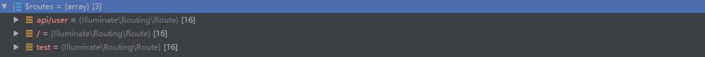
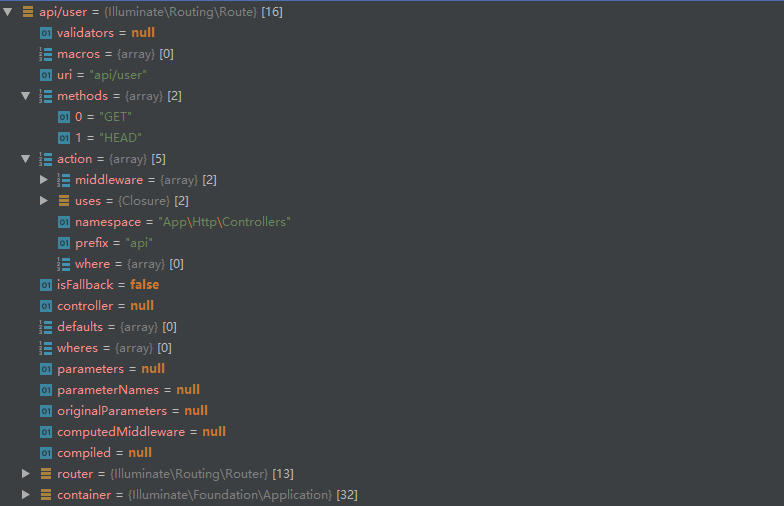
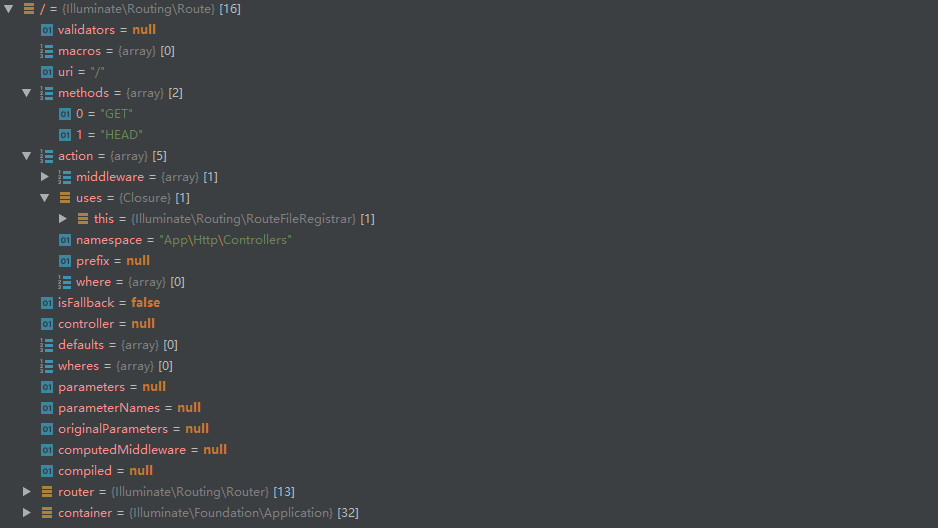
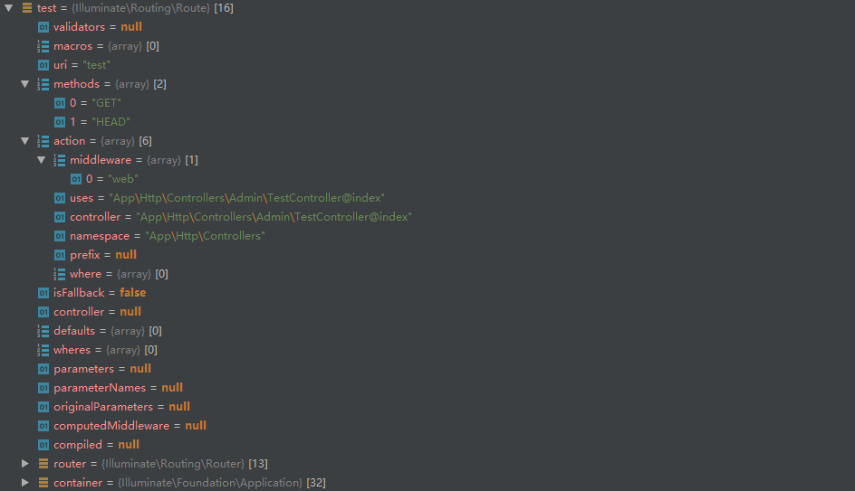
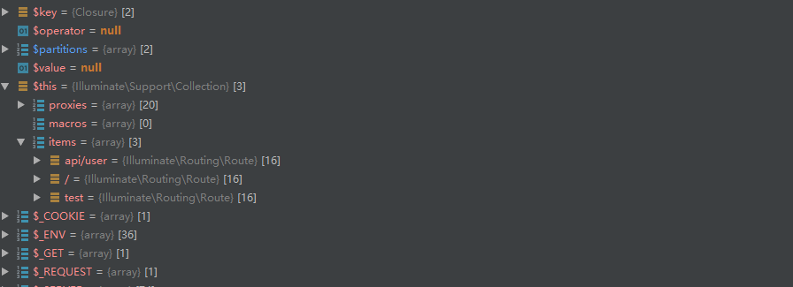
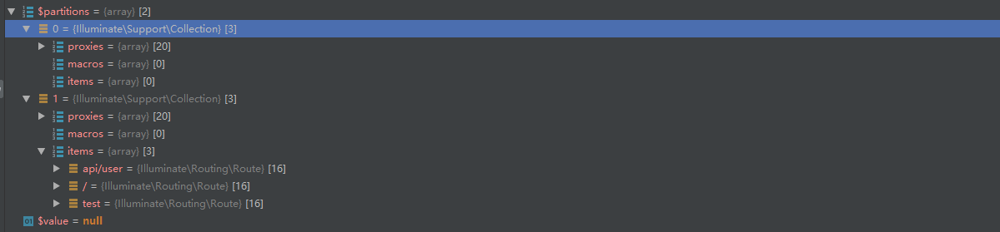
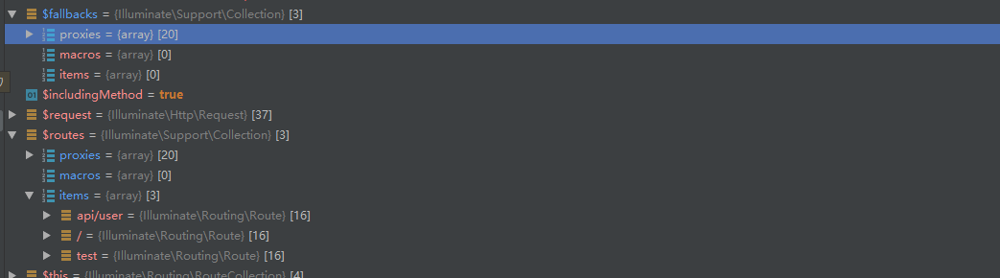
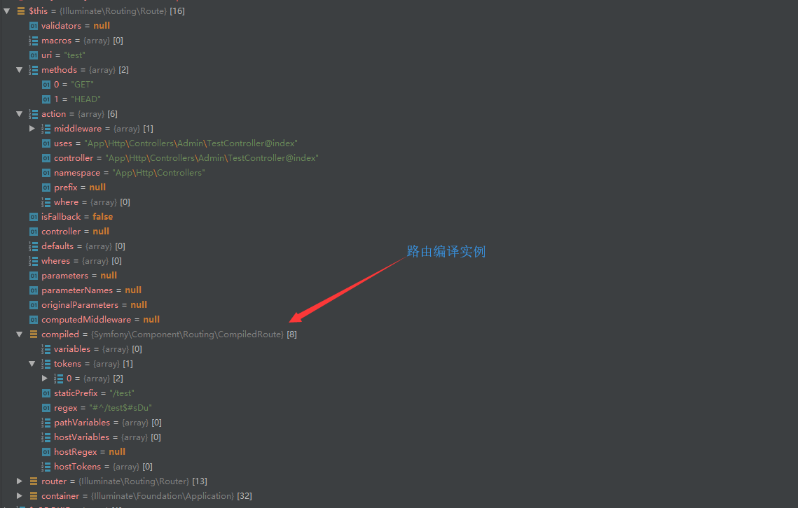
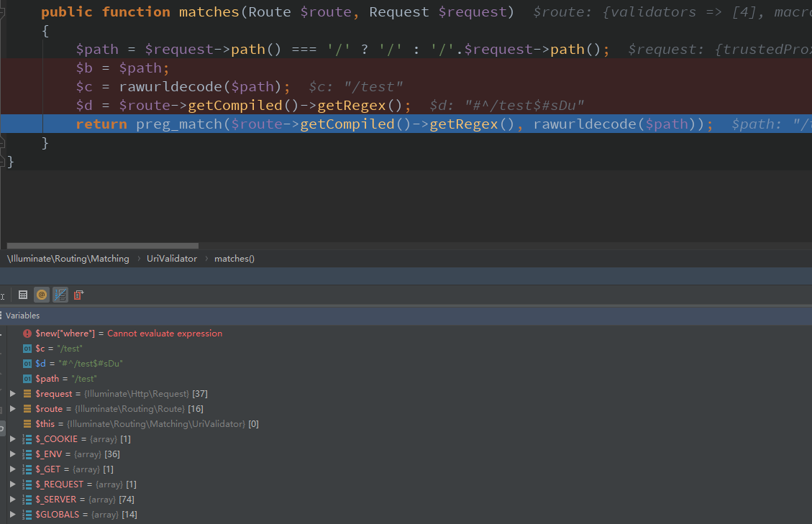
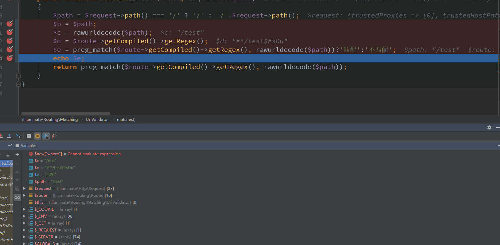

## CRUD整个流程注解 【App\Http\Kernel的路由调度流程】【路由寻址】       
[首页](../readme.md) [下一页：待定](dispatch.md)  [上一页：App\Http\Kernel的路由加载【注册】流程](route.md)  

- 路由寻址过程   
    就是http请求时，它会从路由集合【routeCollection】里检索到对应的路由，本座称为路由寻址   
    如有不服者，杀无赦! ^_^   
    
    Illuminate\Foundation\Http->sendRequestThroughRouter()方法   
    【希望阁下从第一页开始看(具体在中间类的运行玄机奥秘)，不然真不然我怎么一下子就执行这方法了】    
    
    ```php  
    
    protected function sendRequestThroughRouter($request)
        {
            $this->app->instance('request', $request);
    
            Facade::clearResolvedInstance('request');
    
            $this->bootstrap();
    
            return (new Pipeline($this->app))
                        ->send($request)
                        ->through($this->app->shouldSkipMiddleware() ? [] : $this->middleware)
                        ->then($this->dispatchToRouter());
        }
    ```     
    
    以上前面已经解释过了，现在主要看  
    Illuminate\Foundation\Http->dispatchToRouter()方法   
    `$this->dispatchToRouter()`方法   
    ```php  
    protected function dispatchToRouter()
        {
        //这个函数是怎么运行的【记得看前面中间件类的运行原理】
            return function ($request) {
            //这个不用说了吧
                $this->app->instance('request', $request);
    
                return $this->router->dispatch($request);
            };
        }
    ```  
    
    Router->dispatch()调度方法      
    
    ```php  
    public function dispatch(Request $request)
        {
        
            $this->currentRequest = $request;
    
            return $this->dispatchToRoute($request);
        }
    ```  
    Router->dispatchToRoute()调度方法     
    ```php  
    public function dispatchToRoute(Request $request)
        {
        //查到路由对象后运行
            return $this->runRoute($request, $this->findRoute($request));
        }
    ```  
    
    Router->findRoute()方法  
    
    ```php  
    protected function findRoute($request)
        {
        //匹配路由
            $this->current = $route = $this->routes->match($request);
    
    //将当前路由【请求时匹配到的路由对象】暂存在容器
            $this->container->instance(Route::class, $route);
    
            return $route;
        }
    ```       
    
    [request对象数据存储情况]（我叫request时局图）(request.md)  
    RouteCollection->match()方法  
    ```php  
    public function match(Request $request)
        {
        //$request->getMethod()=GET
        /**
        返回结果
         GET=>[
                api/user=>route实例
                /=>route实例
                test=>route实例{
                    validators
                    macros
                    uri=>test
                    methods=>[GET,HEAD]
                    action=>[
                        middleware=>['web']
                        uses=>App\Http\Controllers\Admin\TestController@index
                        controller=>App\Http\Controllers\Admin\TestController@index
                        namespace=>App\Http\Controllers
                        prefix=>null
                        where=>[]
                    ]
                    isFallback
                    controller
                    defaults
                    wheres
                    parameters
                    parameterNames
                    originalParameters
                    computedMiddleware
                    compiled
                }
            ]
        **/
            $routes = $this->get($request->getMethod());
    
            $route = $this->matchAgainstRoutes($routes, $request);
            //得到路由实例
            if (! is_null($route)) {
                return $route->bind($request);
            }
    
            $others = $this->checkForAlternateVerbs($request);
    
            if (count($others) > 0) {
                return $this->getRouteForMethods($request, $others);
            }
            //路由没有找到
            throw new NotFoundHttpException;
        }
    ```  
    
    Request->getMethod()方法  
    
    ```php  
     public function getMethod()
        {
            if (null !== $this->method) {
                return $this->method;
            }
            //得到请求方式，默认
            //去看一下Request请求时局图
            $this->method = strtoupper($this->server->get('REQUEST_METHOD', 'GET'));
               //不是post请求直接返回【打住，后面分析post再说】
            if ('POST' !== $this->method) {
                return $this->method;
            }
    
            $method = $this->headers->get('X-HTTP-METHOD-OVERRIDE');
    
            if (!$method && self::$httpMethodParameterOverride) {
                $method = $this->request->get('_method', $this->query->get('_method', 'POST'));
            }
    
            if (!\is_string($method)) {
                return $this->method;
            }
    
            $method = strtoupper($method);
    
            if (\in_array($method, ['GET', 'HEAD', 'POST', 'PUT', 'DELETE', 'CONNECT', 'OPTIONS', 'PATCH', 'PURGE', 'TRACE'], true)) {
                return $this->method = $method;
            }
    
            if (!preg_match('/^[A-Z]++$/D', $method)) {
                throw new SuspiciousOperationException(sprintf('Invalid method override "%s".', $method));
            }
    
            return $this->method = $method;
        }
    ```  
      RouteCollection->get()方法  
    ```php  
    public function get($method = null)
        {
        //不用说Arr::get了吧【前面讲过了】  
        //routes实例请看它的时局图
        //最终返回配合routes时局图看，免得你看晕了
        /**
        [
           uri=>route实例
         ]
        **/
            return is_null($method) ? $this->getRoutes() : Arr::get($this->routes, $method, []);
        }
    ```    
    
    [routes时局图](routeCollection.md)    
    ` $routes = $this->get($request->getMethod());`  返回的动态数据如下  
    
    
    
      
    
    RouteCollection->matchAgainstRoutes()方法  
    ```php  
    //
    protected function matchAgainstRoutes(array $routes, $request, $includingMethod = true)
        {
        //partition这玩意前面说过【服务提供类分类的时候】就是分Illuminate和App命名空间类的时候 
        //
            [$fallbacks, $routes] = collect($routes)->partition(function ($route) {
                return $route->isFallback;
            });
            //此时$fallbacks,$routes数据存储结构是【请看fallback-routes时局图】
            //此时$routes为Collection实例
            return $routes->merge($fallbacks)->first(function ($value) use ($request, $includingMethod) {
                return $value->matches($request, $includingMethod);
            });
        }
    ```  
    Collection构造函数  
    
    ```php  
    class Collection implements ArrayAccess, Arrayable, Countable, IteratorAggregate, Jsonable, JsonSerializable
     public function __construct($items = [])
        {
        /**
        api/user=Illuminate\Routing\Route实例
        /=Illuminate\Routing\Route实例
        test=Illuminate\Routing\Route实例
        **/
            $this->items = $this->getArrayableItems($items);
        }
    ```  
    Collection->partition()方法  
    ```php  
    public function partition($key, $operator = null, $value = null)
        {
            $partitions = [new static, new static];
    
            
            $callback = func_num_args() === 1
                    ? $this->valueRetriever($key)
                    : $this->operatorForWhere(...func_get_args());
    
            foreach ($this->items as $key => $item) {
                $partitions[(int) ! $callback($item, $key)][$key] = $item;
            }
    
            return new static($partitions);
        }
    ```  
    
    RouteCollection此时的状态  
    
      
    
    fallback-routes时局图 
      
    
    Collection->merge()方法  
    ```php  
     return $routes->merge($fallbacks)->first(function ($value) use ($request, $includingMethod) {
                    return $value->matches($request, $includingMethod);
                });
    ```  
    
    ```php  
    /**
    
    **/
     public function merge($items)
        {
        /**
        $items= [
            proxies=>[
            ],
            macros=>[],
            items=>[]
        ]
        $this->items=>[
            proxies=>[],
            macros=>[],
            items=>[
                api/user=>route实例,
                /=>route实例,
                test=>route实例,
            ]
        ]
        **/
            return new static(array_merge($this->items, $this->getArrayableItems($items)));
        }
    ```  
    Collection->first()方法  
    ```php  
    public function first(callable $callback = null, $default = null)
        {
        /**
        $this->items=>[
                 
                        api/user=>route实例,
                        /=>route实例,
                        test=>route实例,
                    
                ]
        **/
        //循环items并执行$value->matches($request, $includingMethod)函数
        //此时$value=Illuminate\Routing\Route实例
            return Arr::first($this->items, $callback, $default);
        }
    ```  
    [Arr:first说明](Arr.md)  
    
    `return $value->matches($request, $includingMethod);`Route->matches()方法   
    ```php  
    public function matches(Request $request, $includingMethod = true)
        {
        //路由编译【编译后是啥，请看它的时局图】
            $this->compileRoute();
        
        //四大验证器
            foreach ($this->getValidators() as $validator) {
                if (! $includingMethod && $validator instanceof MethodValidator) {
                    continue;
                }
    
                if (! $validator->matches($this, $request)) {
                    return false;
                }
            }
    
            return true;
        }
    ```  
    
    Route->compileRoute()方法  
    
    ```php  
    protected function compileRoute()
        {
            if (! $this->compiled) {
                $this->compiled = (new RouteCompiler($this))->compile();
            }
    
            return $this->compiled;
        }
    ```  
    Illuminate\Routing\RouteCompiler构造
    ```php  
    namespace Illuminate\Routing;
    
    use Symfony\Component\Routing\Route as SymfonyRoute;
    
    class RouteCompiler
    {
        protected $route;
        public function __construct($route)
        {
            $this->route = $route;
        }
        
    ```  
     Illuminate\Routing\RouteCompiler->compile()方法    
    ```php  
    public function compile()
        {
        /**
        得到路由可选参数数组
        **/
            $optionals = $this->getOptionalParameters();
    
    //处理后得到这样的数据：http://www.baidu.com/posts/{post}/comments/{comment}
            $uri = preg_replace('/\{(\w+?)\?\}/', '{$1}', $this->route->uri());
    
            return (
                new SymfonyRoute($uri, $optionals, $this->route->wheres, ['utf8' => true], $this->route->getDomain() ?: '')
            )->compile();
        }
    ```  
    Illuminate\Routing\RouteCompiler->getOptionalParameters()方法    
    ```php  
    protected function getOptionalParameters()
        {
        //专门匹配可选参数的路由如：http://www.baidu.com/posts/{post?}/comments/{comment?}
        //匹配后它返回的是
        /**
        [0]=>[
            [0]=>{post?}
            [1]=>{comment?}
        ]
        [1]=>[
            [0]=>post
            [1]=>comment
        ]
        **/
            preg_match_all('/\{(\w+?)\?\}/', $this->route->uri(), $matches);
        
        /**
        处理得到
        Array
        (
            [post] => 
            [comment] => 
        )
        **/
            return isset($matches[1]) ? array_fill_keys($matches[1], null) : [];
        }
    ```  
    
    Illuminate\Routing\RouteCompiler\->compile方法返回的数据状态  
      
    
    Route->getValidators()方法   
    路由验证器  
    ```php  
     public static function getValidators()
        {
            if (isset(static::$validators)) {
                return static::$validators;
            }
            //四子逆子前来验证
            return static::$validators = [
                new UriValidator, new MethodValidator,
                new SchemeValidator, new HostValidator,
            ];
        }
    ```  
    
    Illuminate\Routing\Matching\UriValidator->matches（）验证方法 【验证请求的uri地址是否匹配】   
    
    ```php  
    public function matches(Route $route, Request $request)
        {
        //获取当前请求路径test
            $path = $request->path() === '/' ? '/' : '/'.$request->path();
            
            //getRegex="#^/test$#sDu"
            //检测是否含有test地址
            return preg_match($route->getCompiled()->getRegex(), rawurldecode($path));
        }
    ```  
    
    UriValidator->matches匹配时的状态  
    
      
    
    Illuminate\Routing\Matching\MethodValidator->matches（）验证方法 【验证请求的method是否匹配】
    ```php  
    class MethodValidator implements ValidatorInterface
    {
        public function matches(Route $route, Request $request)
        {
            return in_array($request->getMethod(), $route->methods());
        }
    }
    ```  
    
    Illuminate\Routing\Matching\SchemeValidator->matches（）验证方法 【验证请求的协议是否匹配】
    ```php  
    namespace Illuminate\Routing\Matching;
    
    use Illuminate\Http\Request;
    use Illuminate\Routing\Route;
    
    class SchemeValidator implements ValidatorInterface
    {
     
        public function matches(Route $route, Request $request)
        {
            if ($route->httpOnly()) {
                return ! $request->secure();
            } elseif ($route->secure()) {
                return $request->secure();
            }
    
            return true;
        }
    }
    ```  
     Illuminate\Routing\Matching\HostValidator->matches（）验证方法 【验证请求的ip是否匹配】
    ```php  
    class HostValidator implements ValidatorInterface
    {
     
        public function matches(Route $route, Request $request)
        {
            if (is_null($route->getCompiled()->getHostRegex())) {
                return true;
            }
            $a = $route->getCompiled()->getHostRegex();
            $b = $request->getHost();
            return preg_match($route->getCompiled()->getHostRegex(), $request->getHost());
        }
    }
    ```
    
    路由验证总结  
    1、先从RouteCollection得到匹配的路由数组   
    `$routes = RouteCollection->get($request->getMethod());`     
    2、从该数组中检索【uri,host,method,scheme】都匹配的Route实例  
    `$route = RouteCollection->matchAgainstRoutes($routes, $request);`  
    3、循环$routes路由数组，开始检索  
    ```php  
    collect($routes)->first(function ($value) use ($request, $includingMethod) {
                return $value->matches($request, $includingMethod);
    });
    Arr::first
    foreach ($routes as $key => $value) {
                if (call_user_func($callback, $value, $key)) {
                    return $value;
                }
                /**
                $value=Route实例对象
                运行此函数function ($value) use ($request, $includingMethod) {
                     return $value->matches($request, $includingMethod);
                }
                **/
    }
    
    $value->matches(Request $request, $includingMethod = true)
        {
        //四大验证器
        //验证器都成功时返回
            foreach ($this->getValidators() as $validator) {
                if (! $includingMethod && $validator instanceof MethodValidator) {
                    continue;
                }
                //验证器全验证成功时返回true !之后
                if (! $validator->matches($this, $request)) {
                    return false;
                }
            }
            return true;
        }
    ```  
    
    找到路由后绑定操作Route->bind()  
    ```php  
    public function bind(Request $request)
        {
            $this->compileRoute();
    
            $this->parameters = (new RouteParameterBinder($this))
                            ->parameters($request);
    
            $this->originalParameters = $this->parameters;
    
            return $this;
        }
    ```  
    
    开始运行路由实例  
    ```php  
    //$this->findRoute($request)  从routeCollection里找到匹配的路由Route实例后返回
    
     return $this->runRoute($request, $this->findRoute($request));  
     
     
    ```  
    
    Router->runRoute()     
    ```php  
    protected function runRoute(Request $request, Route $route)
        {
        //给当前请求保存匹配到的路由实例
        /**
         public function setRouteResolver(Closure $callback)
            {
                $this->routeResolver = $callback;
        
                return $this;
            }

        **/
            $request->setRouteResolver(function () use ($route) {
                return $route;
            });
            //事件调度不过目前在这里没有什么用【简直是吃饱了没事干】  
            $this->events->dispatch(new Events\RouteMatched($route, $request));
    
            return $this->prepareResponse($request,
                $this->runRouteWithinStack($route, $request)
            );
        }
    ```  
    Router->runRouteWithinStack()方法【运行路由】   
    ```php  
    protected function runRouteWithinStack(Route $route, Request $request)
        {
            $shouldSkipMiddleware = $this->container->bound('middleware.disable') &&
                                    $this->container->make('middleware.disable') === true;
    
            //返回路由定义的中间件数组
            $middleware = $shouldSkipMiddleware ? [] : $this->gatherRouteMiddleware($route);
    
            return (new Pipeline($this->container))
                            ->send($request)
                            ->through($middleware)//web默认的中间件数组，用户在定义时如果添加了新的中间件也会存在   
                            ->then(function ($request) use ($route) {
                                return $this->prepareResponse(
                                    $request, $route->run()
                                );
                            });
        }
        
        中间件全运行通过后【前面已经说过中间件类的运行原理了】，执行  
        function ($request) use ($route) 
        {
              
              return $this->prepareResponse(
                    $request, $route->run()
              
              );
    ```  
    
    Router->gatherRouteMiddleware()方法【运行路由】    
    ```php  
    public function gatherRouteMiddleware(Route $route)
        {
            $middleware = collect($route->gatherMiddleware())->map(function ($name) {
                return (array) MiddlewareNameResolver::resolve($name, $this->middleware, $this->middlewareGroups);
            })->flatten();
            /**
            得到这样的中间件数组返回
            所以你如果添加了自定义的中间件也会返回
            'web' => [
                        \App\Http\Middleware\EncryptCookies::class,
                        \Illuminate\Cookie\Middleware\AddQueuedCookiesToResponse::class,
                        \Illuminate\Session\Middleware\StartSession::class,
                        // \Illuminate\Session\Middleware\AuthenticateSession::class,
                        \Illuminate\View\Middleware\ShareErrorsFromSession::class,
                        \App\Http\Middleware\VerifyCsrfToken::class,
                        \Illuminate\Routing\Middleware\SubstituteBindings::class,
                    ],
            **/
            return $this->sortMiddleware($middleware);
        }
    ```  
    
    Route->gatherMiddleware()方法      
    ```php  
     public function gatherMiddleware()
        {
            if (! is_null($this->computedMiddleware)) {
                return $this->computedMiddleware;
            }
    
            $this->computedMiddleware = [];
    
            return $this->computedMiddleware = array_unique(array_merge(
            //返回所有的路由中间件名称
                $this->middleware(), $this->controllerMiddleware()
            ), SORT_REGULAR);
        }
    ```  
    
    Route->middleware()方法【返回路由中间件，默认有一个web中间件】               
    ```php  
    public function middleware($middleware = null)
        {
        //返回路由中间件【默认是web中间件】 
        //[0=>'web']
        //如果你在写路由的时候添加了中间件，就会返回[0=>'web',1=>'你的中间件名称']
            if (is_null($middleware)) {
                return (array) ($this->action['middleware'] ?? []);
            }
    
            if (is_string($middleware)) {
                $middleware = func_get_args();
            }
    
            $this->action['middleware'] = array_merge(
                (array) ($this->action['middleware'] ?? []), $middleware
            );
    
            return $this;
        }
    ```   
     Route->controllerMiddleware()方法  
    ```php  
    public function controllerMiddleware()
        {
        /**
        protected function isControllerAction()
            {
                return is_string($this->action['uses']);
            }
        **/
            if (! $this->isControllerAction()) {
                return [];
            }
            //这个吊毛我就不说了
            return $this->controllerDispatcher()->getMiddleware(
                $this->getController(), $this->getControllerMethod()
            );
        }
    ```  
    
    Route->run()运行路由    
    ```php  
     public function run()
        {
            $this->container = $this->container ?: new Container;
    
            try {
            /**
            protected function isControllerAction()
                {
                    return is_string($this->action['uses']);
                }
                如果你定义的路由是Controller@action形式就这样运行
            **/
                if ($this->isControllerAction()) {
                    return $this->runController();
                }
                //如果你定义的是路由是匿名函数就运行下面这句
                return $this->runCallable();
            } catch (HttpResponseException $e) {
            //如果控制器运行出错，就运行这句
                return $e->getResponse();
            }
        }
    ```  
    
    Route->runController()运行控制器  
    ```php  
    protected function runController()
        {
            return $this->controllerDispatcher()->dispatch(
            /**
            public function getController()
                {
                    if (! $this->controller) {
                        $class = $this->parseControllerCallback()[0];
                        //实例化控制器【不用说了吧】
                        $this->controller = $this->container->make(ltrim($class, '\\'));
                    }
            
                    return $this->controller;
                }
            **/
                $this, $this->getController(), $this->getControllerMethod()//控制器的方法，很简单就是将controller@method这个method拿到【我不想再去看了，LTS5.5早就看过了】   
            );
        }
    ```  
    Route->controllerDispatcher()得到控制器调度器  
    ```php  
    public function controllerDispatcher()
        {
               //检测是否已经绑定过
               //前面已经分析过了【可以去看一下，仔细想想前面实例Application时干了什么坏事就知道了】
            if ($this->container->bound(ControllerDispatcherContract::class)) {
                return $this->container->make(ControllerDispatcherContract::class);
            }
    
            return new ControllerDispatcher($this->container);
        }
    ```  
    Illuminate\Routing\ControllerDispatcher控制器调度器构造 
    ```php  
    <?php
    
    namespace Illuminate\Routing;
    
    use Illuminate\Container\Container;
    use Illuminate\Routing\Contracts\ControllerDispatcher as ControllerDispatcherContract;
    
    class ControllerDispatcher implements ControllerDispatcherContract
    {
        use RouteDependencyResolverTrait;
    
        protected $container;
    
        public function __construct(Container $container)
        {
            $this->container = $container;
        }
    ```  
      Illuminate\Routing\ControllerDispatcher->dispatch()控制器调度方法   
    ```php  
    public function dispatch(Route $route, $controller, $method)
        {
            $parameters = $this->resolveClassMethodDependencies(
            //$route->parametersWithoutNulls() 路由参数假设
            //用户定义的路由为/test/{users}那么这里的参数返回就是['users'=>request后面的参数']
            //假设当前的请求地址为/test/100 则这个数组就是['users'=>100']
                $route->parametersWithoutNulls(), $controller, $method
            );
            
            //运行控制器
            参数则是
            /*8
            $parameters = [
                0=>Request对象实例,
                1=>User对象实例,
                'users'=>1
            ]
            **/
            if (method_exists($controller, 'callAction')) {
                return $controller->callAction($method, $parameters);
            }
    
            return $controller->{$method}(...array_values($parameters));
        }
    ```  
    
    Illuminate\Routing\ControllerDispatcher->resolveClassMethodDependencies()控制器方法依赖处理  
    ```php  
    protected function resolveClassMethodDependencies(array $parameters, $instance, $method)
        {
        //控制器是否存在指定的方法
            if (! method_exists($instance, $method)) {
                return $parameters;
            }
    
            return $this->resolveMethodDependencies(
            //反射方法手册https://www.php.net/manual/zh/class.reflectionmethod.php  
                $parameters, new ReflectionMethod($instance, $method)
            );
        }
    ```     
    Illuminate\Routing\ControllerDispatcher->resolveMethodDependencies()控制器方法依赖处理
    ```php  
    public function resolveMethodDependencies(array $parameters, ReflectionFunctionAbstract $reflector)
        {
            $instanceCount = 0;
            //方法的参数【这个参数一般是路由参数】
            $values = array_values($parameters);
            //得到这个控制器的方法参数
            //反射参数类手册https://www.php.net/manual/zh/class.reflectionparameter.php  
            /**
            [
                name=>index
                class=>App\Http\Controllers\Admin\TestController
            ]
            **/
            
            $parameters = [
                'users'=>100
            ]
            //$reflector->getParameters()= ['name'=>'request']
            foreach ($reflector->getParameters() as $key => $parameter) {
            //实例化Request类返回
                $instance = $this->transformDependency(
                    $parameter, $parameters
                );
    
                if (! is_null($instance)) {
                    $instanceCount++;
    
                    $this->spliceIntoParameters($parameters, $key, $instance);
                } elseif (! isset($values[$key - $instanceCount]) &&
                          $parameter->isDefaultValueAvailable()) {
                          //参数合并
                    $this->spliceIntoParameters($parameters, $key, $parameter->getDefaultValue());
                }
            }
    
            return $parameters;
        }

    ```  
     Illuminate\Routing\ControllerDispatcher->transformDependency()控制器方法依赖处理
    ```php  
     protected function transformDependency(ReflectionParameter $parameter, $parameters)
        {
        //得到参数的类名 假设是Request则是Illuminate\Http\Request
            $class = $parameter->getClass();
           /**
           protected function alreadyInParameters($class, array $parameters)
               {
               //循环参数数组，判断值是否属于指定类名
                   return ! is_null(Arr::first($parameters, function ($value) use ($class) {
                       return $value instanceof $class;
                   }));
               }
               
           **/
            if ($class && ! $this->alreadyInParameters($class->name, $parameters)) {
                return $parameter->isDefaultValueAvailable()
                    ? $parameter->getDefaultValue()
                    : $this->container->make($class->name);//实例化参数类名【从而解决依赖注入】  
            }
        }
    ```  
    
    路由参数绑定
    routes/web.php路由内容  
    ```php  
    Route::get('/test/{users}', "Admin\TestController@index");
    ```  
    
    控制器内容  
    ```php  
    function index(Request $request,User $user)
        {
            $data = DB::table("test")->get();
            return view("admin.index",compact('data'));
        }
    ```  
    请求的uri路径信息  
      
    
    Controller->callAction()方法  
    ```php  
     public function callAction($method, $parameters)
        {
            return call_user_func_array([$this, $method], $parameters);
        }
    ```  
    
    控制器响应Router->prepareResponse方法  
    ```php  
     public function prepareResponse($request, $response)
        {
            return static::toResponse($request, $response);
        }
    ```  
    
    ```php  
    public static function toResponse($request, $response)
        {
            if ($response instanceof Responsable) {
                $response = $response->toResponse($request);
            }
    
            if ($response instanceof PsrResponseInterface) {
                $response = (new HttpFoundationFactory)->createResponse($response);
            } elseif ($response instanceof Model && $response->wasRecentlyCreated) {
                $response = new JsonResponse($response, 201);
            } elseif (! $response instanceof SymfonyResponse &&
                       ($response instanceof Arrayable ||
                        $response instanceof Jsonable ||
                        $response instanceof ArrayObject ||
                        $response instanceof JsonSerializable ||
                        is_array($response))) {
                $response = new JsonResponse($response);
            } elseif (! $response instanceof SymfonyResponse) {
                $response = new Response($response);
            }
    
            if ($response->getStatusCode() === Response::HTTP_NOT_MODIFIED) {
                $response->setNotModified();
            }
    
            return $response->prepare($request);
        }
    ``` 
    
    别看它搞一堆响应类型，我们看最一个就行了【老外很闲啊】 
    
    Symfony\Component\HttpFoundation\Response
    ```php 
    头部响应设置和cookie响应设置，准备响应
    public function prepare(Request $request)
        {
        
            $headers = $this->headers;
    
            if ($this->isInformational() || $this->isEmpty()) {
                $this->setContent(null);
                $headers->remove('Content-Type');
                $headers->remove('Content-Length');
            } else {
                // Content-type based on the Request
                if (!$headers->has('Content-Type')) {
                    $format = $request->getRequestFormat();
                    if (null !== $format && $mimeType = $request->getMimeType($format)) {
                        $headers->set('Content-Type', $mimeType);
                    }
                }
    
                // Fix Content-Type
                $charset = $this->charset ?: 'UTF-8';
                if (!$headers->has('Content-Type')) {
                    $headers->set('Content-Type', 'text/html; charset='.$charset);
                } elseif (0 === stripos($headers->get('Content-Type'), 'text/') && false === stripos($headers->get('Content-Type'), 'charset')) {
                    // add the charset
                    $headers->set('Content-Type', $headers->get('Content-Type').'; charset='.$charset);
                }
    
                // Fix Content-Length
                if ($headers->has('Transfer-Encoding')) {
                    $headers->remove('Content-Length');
                }
    
                if ($request->isMethod('HEAD')) {
                    // cf. RFC2616 14.13
                    $length = $headers->get('Content-Length');
                    $this->setContent(null);
                    if ($length) {
                        $headers->set('Content-Length', $length);
                    }
                }
            }
    
            // Fix protocol
            if ('HTTP/1.0' != $request->server->get('SERVER_PROTOCOL')) {
                $this->setProtocolVersion('1.1');
            }
    
            // Check if we need to send extra expire info headers
            if ('1.0' == $this->getProtocolVersion() && false !== strpos($headers->get('Cache-Control'), 'no-cache')) {
                $headers->set('pragma', 'no-cache');
                $headers->set('expires', -1);
            }
    
            $this->ensureIEOverSSLCompatibility($request);
    
            if ($request->isSecure()) {
                foreach ($headers->getCookies() as $cookie) {
                    $cookie->setSecureDefault(true);
                }
            }
    
            return $this;
        }
    ```  
    Kernel->handle终于回来了吧【响应处理】  
    ```php  
    public function handle($request)
        {
            try {
                $request->enableHttpMethodParameterOverride();
    
                $response = $this->sendRequestThroughRouter($request);
            } catch (Exception $e) {
                $this->reportException($e);
                //处理异常
                $response = $this->renderException($request, $e);
            } catch (Throwable $e) {
                $this->reportException($e = new FatalThrowableError($e));
    
                $response = $this->renderException($request, $e);
            }
    
            $this->app['events']->dispatch(
                new Events\RequestHandled($request, $response)
            );
    
            return $response;
        }
    ```  
    
    Kernel->reportException异常处理  
    ```php 
    protected function reportException(Exception $e)
        {
            $this->app[ExceptionHandler::class]->report($e);
        }
    ```  
    
    App\Exceptions\Handler->report()方法  
    ```php  
    public function report(Exception $exception)
        {
            parent::report($exception);
        }
    ```  
    Illuminate\Foundation\Exceptions\Handler->report（）方法  
    ```php 
    public function report(Exception $e)
        {
            //判断属于某个异常时直接返回
            if ($this->shouldntReport($e)) {
                return;
            }
            //运行report方法
            if (is_callable($reportCallable = [$e, 'report'])) {
                return $this->container->call($reportCallable);
            }
    
            try {
            //实例化日志类
                $logger = $this->container->make(LoggerInterface::class);
            } catch (Exception $ex) {
                throw $e;
            }
    
            $logger->error(
                $e->getMessage(),
                array_merge($this->context(), ['exception' => $e]
            ));
        }
    ```  
    Illuminate\Foundation\Exceptions\Handler->shouldntReport（）方法  
    是否要报告异常  
    ```php  
    if ($this->shouldntReport($e)) {
                return;
            }
            
     protected function shouldntReport(Exception $e)
        {
        /**
        protected $internalDontReport = [
                AuthenticationException::class,//跟认证相关的
                AuthorizationException::class,
                HttpException::class,//http相关
                HttpResponseException::class,
                ModelNotFoundException::class,//模型相关
                SuspiciousOperationException::class,
                TokenMismatchException::class,//token
                ValidationException::class,//验证相关
            ];
        **/
            $dontReport = array_merge($this->dontReport, $this->internalDontReport);
            //功能不用说了吧，就是循环这个数组，并判断当前的异常类型是否属于其中的
            //return !is_null(true)双重否定
            
            return ! is_null(Arr::first($dontReport, function ($type) use ($e) {
                return $e instanceof $type;
            }));
        }
    ```  
    
    Response->send()处理  
    ```php  
    public function send()
        {
            $this->sendHeaders();
            $this->sendContent();
    
            if (\function_exists('fastcgi_finish_request')) {
                fastcgi_finish_request();
            } elseif (!\in_array(\PHP_SAPI, ['cli', 'phpdbg'], true)) {
                static::closeOutputBuffers(0, true);
            }
    
            return $this;
        }
    ```  
    
    ```php  
    public function terminate($request, $response)
        {
            $this->terminateMiddleware($request, $response);
    
            $this->app->terminate();
        }
    
        /**
         * Call the terminate method on any terminable middleware.
         *
         * @param  \Illuminate\Http\Request  $request
         * @param  \Illuminate\Http\Response  $response
         * @return void
         */
        protected function terminateMiddleware($request, $response)
        {
            $middlewares = $this->app->shouldSkipMiddleware() ? [] : array_merge(
                $this->gatherRouteMiddleware($request),
                $this->middleware
            );
    
            foreach ($middlewares as $middleware) {
                if (! is_string($middleware)) {
                    continue;
                }
    
                [$name] = $this->parseMiddleware($middleware);
    
                $instance = $this->app->make($name);
    
                if (method_exists($instance, 'terminate')) {
                    $instance->terminate($request, $response);
                }
            }
        }
    ```  
    
    Application->terminate()  
    ```php  
    public function terminate()
        {
            foreach ($this->terminatingCallbacks as $terminating) {
                $this->call($terminating);
            }
        }
    ```  
    
    最后说一下  
    ```php  
    <?php
    

    define('LARAVEL_START', microtime(true));
    
    require __DIR__.'/../vendor/autoload.php';
    
   
    $app = require_once __DIR__.'/../bootstrap/app.php';
    
    
    $kernel = $app->make(Illuminate\Contracts\Http\Kernel::class);
    
    $response = $kernel->handle(
        $request = Illuminate\Http\Request::capture()
    );
    
    $response->send();
    $response->sendContent();
    //这句话可有可无，全是废话【不高兴你来打我啊】
    //$kernel->terminate($request, $response);

    ```  
    
    路由加载到控制器的调度运行就说到这此处，大家在使用的时候可以随便乱整！别怕框架会死掉！！！  
    
    
