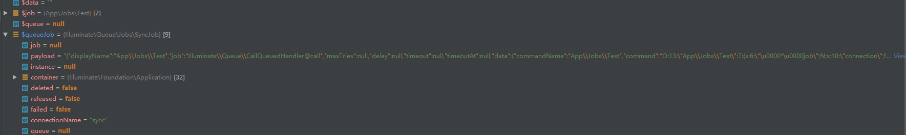
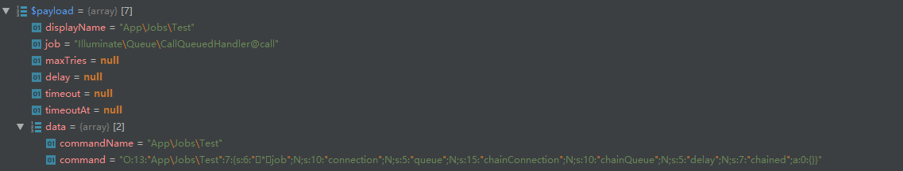
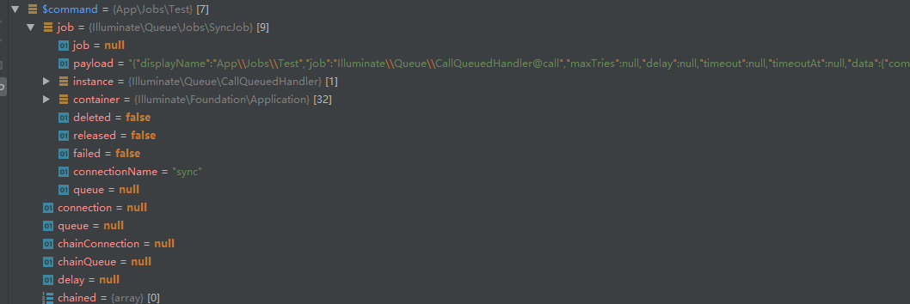

### 队列系统    
[首页](../readme.md)   
[什么是队列](https://learnku.com/articles/30430)     

- 队列任务创建  
    php artisan make:job xxx   
    Illuminate\Foundation\Providers\ArtisanServiceProvider
    
    输入的命令触发的内容   
    ```php  
      protected function registerJobMakeCommand()
        {
            $this->app->singleton('command.job.make', function ($app) {
                return new JobMakeCommand($app['files']);
            });
        }
    ```  
    Illuminate\Foundation\Console\JobMakeCommand  
    
    框架的命令类【有的放Symfony组件下，有的放Illuminate目录下，反正它就是随便放，其实你也可以使用整！】  
    看完console的说明你也应该能随便写个所谓的命令类了【废话】   
    
    ```php  
     public function handle()
        {
        //得到输入的job 任务名称类
            $name = $this->qualifyClass($this->getNameInput());
            //拼装构成任务类文件
            $path = $this->getPath($name);
            //创建任务类目录
            $this->makeDirectory($path);
            //生成任务类文件
            $this->files->put($path, $this->buildClass($name));
    
            $this->info($this->type.' created successfully.');
        }
        
     protected function buildClass($name)
         {
         //得到任务类模板内容
             $stub = $this->files->get($this->getStub());
              //用具体的任务名称替换模板内容
             return $this->replaceNamespace($stub, $name)->replaceClass($stub, $name);
         }
         
     protected function getStub()
         {
         //得到任务类文件模板内容
             return $this->option('sync')
                             ? __DIR__.'/stubs/job.stub'
                             : __DIR__.'/stubs/job-queued.stub';
         }
    ```  
    
    任务模板内容  
    ```php  
    <?php
    
    namespace DummyNamespace;
    
    use Illuminate\Bus\Queueable;
    use Illuminate\Foundation\Bus\Dispatchable;
    
    class DummyClass
    {
        use Dispatchable, Queueable;
    
        /**
         * Create a new job instance.
         *
         * @return void
         */
        public function __construct()
        {
            //
        }
    
        /**
         * Execute the job.
         *
         * @return void
         */
        public function handle()
        {
            //
        }
    }
    <?php
    
    namespace DummyNamespace;
    
    use Illuminate\Bus\Queueable;
    use Illuminate\Queue\SerializesModels;
    use Illuminate\Queue\InteractsWithQueue;
    use Illuminate\Contracts\Queue\ShouldQueue;
    use Illuminate\Foundation\Bus\Dispatchable;
    
    class DummyClass implements ShouldQueue
    {
        use Dispatchable, InteractsWithQueue, Queueable, SerializesModels;
    
        /**
         * Create a new job instance.
         *
         * @return void
         */
        public function __construct()
        {
            //
        }
    
        /**
         * Execute the job.
         *
         * @return void
         */
        public function handle()
        {
            //
        }
    }

    ```     
    
    运行后生成一个任务类,替换后内容如下    
    
    ```php  
    <?php
    
    namespace App\Jobs;
    
    use Illuminate\Bus\Queueable;
    use Illuminate\Queue\SerializesModels;
    use Illuminate\Queue\InteractsWithQueue;
    use Illuminate\Contracts\Queue\ShouldQueue;
    use Illuminate\Foundation\Bus\Dispatchable;
    
    class Test implements ShouldQueue
    {
    //继承的类
        use Dispatchable, InteractsWithQueue, Queueable, SerializesModels;
    
        /**
         * Create a new job instance.
         *
         * @return void
         */
        public function __construct()
        {
            //
        }
    
        /**
         * Execute the job.
         *
         * @return void
         */
        public function handle()
        {
            //
        }
    }

    ```  
    
    运行时，先运行队列服务提供类，下面是服务提供类的注册内容  
    ```php  
    <?php
    
    namespace Illuminate\Queue;
    
    use Illuminate\Support\Str;
    use Opis\Closure\SerializableClosure;
    use Illuminate\Support\ServiceProvider;
    use Illuminate\Queue\Connectors\SqsConnector;
    use Illuminate\Queue\Connectors\NullConnector;
    use Illuminate\Queue\Connectors\SyncConnector;
    use Illuminate\Queue\Connectors\RedisConnector;
    use Illuminate\Contracts\Debug\ExceptionHandler;
    use Illuminate\Queue\Connectors\DatabaseConnector;
    use Illuminate\Queue\Failed\NullFailedJobProvider;
    use Illuminate\Contracts\Support\DeferrableProvider;
    use Illuminate\Queue\Connectors\BeanstalkdConnector;
    use Illuminate\Queue\Failed\DatabaseFailedJobProvider;
    
    class QueueServiceProvider extends ServiceProvider implements DeferrableProvider
    {
        /**
         * Register the service provider.
         *
         * @return void
         */
        public function register()
        {
            $this->registerManager();
            $this->registerConnection();
            $this->registerWorker();
            $this->registerListener();
            $this->registerFailedJobServices();
            $this->registerOpisSecurityKey();
        }
    
        /**
         * Register the queue manager.
         *
         * @return void
         */
        protected function registerManager()
        {
            $this->app->singleton('queue', function ($app) {
                // Once we have an instance of the queue manager, we will register the various
                // resolvers for the queue connectors. These connectors are responsible for
                // creating the classes that accept queue configs and instantiate queues.
                return tap(new QueueManager($app), function ($manager) {
                    $this->registerConnectors($manager);
                });
            });
        }
    
        /**
         * Register the default queue connection binding.
         *
         * @return void
         */
        protected function registerConnection()
        {
            $this->app->singleton('queue.connection', function ($app) {
                return $app['queue']->connection();
            });
        }
    
        /**
         * Register the connectors on the queue manager.
         *
         * @param  \Illuminate\Queue\QueueManager  $manager
         * @return void
         */
        public function registerConnectors($manager)
        {
            foreach (['Null', 'Sync', 'Database', 'Redis', 'Beanstalkd', 'Sqs'] as $connector) {
                $this->{"register{$connector}Connector"}($manager);
            }
        }
    
        /**
         * Register the Null queue connector.
         *
         * @param  \Illuminate\Queue\QueueManager  $manager
         * @return void
         */
        protected function registerNullConnector($manager)
        {
            $manager->addConnector('null', function () {
                return new NullConnector;
            });
        }
    
        /**
         * Register the Sync queue connector.
         *
         * @param  \Illuminate\Queue\QueueManager  $manager
         * @return void
         */
        protected function registerSyncConnector($manager)
        {
            $manager->addConnector('sync', function () {
                return new SyncConnector;
            });
        }
    
        /**
         * Register the database queue connector.
         *
         * @param  \Illuminate\Queue\QueueManager  $manager
         * @return void
         */
        protected function registerDatabaseConnector($manager)
        {
            $manager->addConnector('database', function () {
                return new DatabaseConnector($this->app['db']);
            });
        }
    
        /**
         * Register the Redis queue connector.
         *
         * @param  \Illuminate\Queue\QueueManager  $manager
         * @return void
         */
        protected function registerRedisConnector($manager)
        {
            $manager->addConnector('redis', function () {
                return new RedisConnector($this->app['redis']);
            });
        }
    
        /**
         * Register the Beanstalkd queue connector.
         *
         * @param  \Illuminate\Queue\QueueManager  $manager
         * @return void
         */
        protected function registerBeanstalkdConnector($manager)
        {
            $manager->addConnector('beanstalkd', function () {
                return new BeanstalkdConnector;
            });
        }
    
        /**
         * Register the Amazon SQS queue connector.
         *
         * @param  \Illuminate\Queue\QueueManager  $manager
         * @return void
         */
        protected function registerSqsConnector($manager)
        {
            $manager->addConnector('sqs', function () {
                return new SqsConnector;
            });
        }
    
        /**
         * Register the queue worker.
         *
         * @return void
         */
        protected function registerWorker()
        {
            $this->app->singleton('queue.worker', function () {
                return new Worker(
                    $this->app['queue'], $this->app['events'], $this->app[ExceptionHandler::class]
                );
            });
        }
    
        /**
         * Register the queue listener.
         *
         * @return void
         */
        protected function registerListener()
        {
            $this->app->singleton('queue.listener', function () {
                return new Listener($this->app->basePath());
            });
        }
    
        /**
         * Register the failed job services.
         *
         * @return void
         */
        protected function registerFailedJobServices()
        {
            $this->app->singleton('queue.failer', function () {
                $config = $this->app['config']['queue.failed'];
    
                return isset($config['table'])
                            ? $this->databaseFailedJobProvider($config)
                            : new NullFailedJobProvider;
            });
        }
    
        /**
         * Create a new database failed job provider.
         *
         * @param  array  $config
         * @return \Illuminate\Queue\Failed\DatabaseFailedJobProvider
         */
        protected function databaseFailedJobProvider($config)
        {
            return new DatabaseFailedJobProvider(
                $this->app['db'], $config['database'], $config['table']
            );
        }
    
        /**
         * Configure Opis Closure signing for security.
         *
         * @return void
         */
        protected function registerOpisSecurityKey()
        {
            if (Str::startsWith($key = $this->app['config']->get('app.key'), 'base64:')) {
                $key = base64_decode(substr($key, 7));
            }
    
            SerializableClosure::setSecretKey($key);
        }
    
        /**
         * Get the services provided by the provider.
         *
         * @return array
         */
        public function provides()
        {
            return [
                'queue', 'queue.worker', 'queue.listener',
                'queue.failer', 'queue.connection',
            ];
        }
    }
 
    
    ```   
    Bus服务提供类  
    ```php  
    <?php
    
    namespace Illuminate\Bus;
    
    use Illuminate\Support\ServiceProvider;
    use Illuminate\Contracts\Support\DeferrableProvider;
    use Illuminate\Contracts\Bus\Dispatcher as DispatcherContract;
    use Illuminate\Contracts\Queue\Factory as QueueFactoryContract;
    use Illuminate\Contracts\Bus\QueueingDispatcher as QueueingDispatcherContract;
    
    class BusServiceProvider extends ServiceProvider implements DeferrableProvider
    {
        /**
         * Register the service provider.
         *
         * @return void
         */
        public function register()
        {
            $this->app->singleton(Dispatcher::class, function ($app) {
                return new Dispatcher($app, function ($connection = null) use ($app) {
                    return $app[QueueFactoryContract::class]->connection($connection);
                });
            });
    
            $this->app->alias(
                Dispatcher::class, DispatcherContract::class
            );
    
            $this->app->alias(
                Dispatcher::class, QueueingDispatcherContract::class
            );
        }
    
        /**
         * Get the services provided by the provider.
         *
         * @return array
         */
        public function provides()
        {
            return [
                Dispatcher::class,
                DispatcherContract::class,
                QueueingDispatcherContract::class,
            ];
        }
    }

    ```  
    
    任务分发  
    ```php  
    <?php
    
    namespace Illuminate\Foundation\Bus;
    
    use Illuminate\Contracts\Bus\Dispatcher;
    
    trait Dispatchable
    {
        public static function dispatch()
        {
        //new static(...func_get_args()) 将会实例化你的任务类构造【所以你构造可以写一些废话】  
        //同时构造你还可传递参数  
        
            return new PendingDispatch(new static(...func_get_args()));
        }
        public static function dispatchNow()
        {
            return app(Dispatcher::class)->dispatchNow(new static(...func_get_args()));
        }
        public static function withChain($chain)
        {
            return new PendingChain(static::class, $chain);
        }
    }
    ```  
    
    Illuminate\Foundation\Bus\PendingDispatch 等待调度构造  
    
    ```php  
    
    namespace Illuminate\Foundation\Bus;

    use Illuminate\Contracts\Bus\Dispatcher;

    class PendingDispatch
    {
    /**
     * The job.
     *
     * @var mixed
     */
    protected $job;

    /**
     * Create a new pending job dispatch.
     *
     * @param  mixed  $job
     * @return void
     */
    public function __construct($job)
    {   
        //你创建的任务类实例对象
        $this->job = $job;
    }
    
    析构函数【实例化本类，结束时会运行这吊毛】
    public function __destruct()
        {
        
            app(Dispatcher::class)->dispatch($this->job);
        }
    ```  
    
    `app(Dispatcher::class)->dispatch($this->job)`干的工作流程   
    
    运行  
    ```php  
    function ($app) {
    // Illuminate\Bus\Dispatcher
                return new Dispatcher($app, function ($connection = null) use ($app) {
                    return $app[QueueFactoryContract::class]->connection($connection);
                });
            }
    ```  
    Illuminate\Bus\Dispatcher构造   
    ```php  
    namespace Illuminate\Bus;
    
    use Closure;
    use RuntimeException;
    use Illuminate\Pipeline\Pipeline;
    use Illuminate\Contracts\Queue\Queue;
    use Illuminate\Contracts\Queue\ShouldQueue;
    use Illuminate\Contracts\Container\Container;
    use Illuminate\Contracts\Bus\QueueingDispatcher;
    
    class Dispatcher implements QueueingDispatcher
    {
        /**
         * The container implementation.
         *
         * @var \Illuminate\Contracts\Container\Container
         */
        protected $container;
    
        /**
         * The pipeline instance for the bus.
         *
         * @var \Illuminate\Pipeline\Pipeline
         */
        protected $pipeline;
    
        /**
         * The pipes to send commands through before dispatching.
         *
         * @var array
         */
        protected $pipes = [];
    
        /**
         * The command to handler mapping for non-self-handling events.
         *
         * @var array
         */
        protected $handlers = [];
    
        /**
         * The queue resolver callback.
         *
         * @var \Closure|null
         */
        protected $queueResolver;
    
        /**
         * Create a new command dispatcher instance.
         *
         * @param  \Illuminate\Contracts\Container\Container  $container
         * @param  \Closure|null  $queueResolver
         * @return void
         */
        public function __construct(Container $container, Closure $queueResolver = null)
        {
            $this->container = $container;//Application容器
            /**
            $this->queueResolver=function ($connection = null) use ($app) {
                                return $app[QueueFactoryContract::class]->connection($connection);
            }
            **/
            $this->queueResolver = $queueResolver;
            //Illuminate\Pipeline\Pipeline实例对象
            $this->pipeline = new Pipeline($container);
        }
        
        /**
         * Dispatch a command to its appropriate handler.
         *
         * @param  mixed  $command
         * @return mixed
         */
        public function dispatch($command)
        {
        //$this->commandShouldBeQueued($command)判断是否属于ShouldQueue类
            if ($this->queueResolver && $this->commandShouldBeQueued($command)) {
                return $this->dispatchToQueue($command);
            }
            //不属于就运行此方法【后面解释】
            return $this->dispatchNow($command);
        }
        
        protected function commandShouldBeQueued($command)
            {
                return $command instanceof ShouldQueue;
            }
            
            
            
        public function dispatchToQueue($command)
            {
            //任务所属连接
                $connection = $command->connection ?? null;
                /**
                function ($connection = null) use ($app) {
                //实例队列管理器
                   return $app[QueueFactoryContract::class]->connection($connection);
                }
                **/  
                
                //默认取得SyncQueue队列类实例
                $queue = call_user_func($this->queueResolver, $connection);
        
                if (! $queue instanceof Queue) {
                    throw new RuntimeException('Queue resolver did not return a Queue implementation.');
                }
                //判断任务类是否有queue方法【我们创建的任务没有此方法】
                if (method_exists($command, 'queue')) {
                    return $command->queue($queue, $command);
                }
        
                return $this->pushCommandToQueue($queue, $command);
            }
        
    }
    ```  
    
    `$queue = call_user_func($this->queueResolver, $connection);`   
    实例化队列管理器 Illuminate\Queue\QueueServiceProvider下的方法 
    ```php  
     function ($app) {
           //实例化并传递给匿名函数运行【tap函数功能看下helpers.php就知道了】   
            return tap(new QueueManager($app), function ($manager) {
                $this->registerConnectors($manager);
            });
        }
        
     //注册各种队列连接器
     public function registerConnectors($manager)
         {
             foreach (['Null', 'Sync', 'Database', 'Redis', 'Beanstalkd', 'Sqs'] as $connector) {
                 $this->{"register{$connector}Connector"}($manager);
             }
         }
     
     //sync连队连接器
     protected function registerSyncConnector($manager)
         {
             $manager->addConnector('sync', function () {
                 return new SyncConnector;
             });
         }
    ```  
    
    队列管理器获取连接Illuminate\Queue\QueueManager  
    ```php  
    public function connection($name = null)
        {
        //你不配置默认就是sync
            $name = $name ?: $this->getDefaultDriver();
            //生产好的队列连接实例放在连接池里
            if (! isset($this->connections[$name])) {
                $this->connections[$name] = $this->resolve($name);
    
                $this->connections[$name]->setContainer($this->app);
            }
    
            return $this->connections[$name];
        }
        
    public function getDefaultDriver()
        {
        //获取队列默认连接
            return $this->app['config']['queue.default'];
        }
        
    处理队列连接  
    protected function resolve($name)
        {   
            //得到连接配置选项数组
            $config = $this->getConfig($name);
            //取得队列连接器【不配置情况下默认是sync队列连接器】
            return $this->getConnector($config['driver'])
                            ->connect($config)//执行后返回此类实例  Illuminate\Queue\SyncQueue extend  Illuminate\Queue\Queue 
                            ->setConnectionName($name);
        }
    //取得队列连接器
    protected function getConnector($driver)
        {
        
            if (! isset($this->connectors[$driver])) {
                throw new InvalidArgumentException("No connector for [$driver]");
            }
            //运行队列连接器
            return call_user_func($this->connectors[$driver]);
        }
    ```  
    
    运行默认的sync队列连接器匿名函数  
    ```php  
    function () {
    //Illuminate\Queue\Connectors\SyncConnector
                return new SyncConnector;
            }
    ```
    Sync队列连接器连接  
    ```php  
    namespace Illuminate\Queue\Connectors;
    
    use Illuminate\Queue\SyncQueue;
    
    class SyncConnector implements ConnectorInterface
    {
        /**
         * Establish a queue connection.
         *
         * @param  array  $config
         * @return \Illuminate\Contracts\Queue\Queue
         */
        public function connect(array $config)
        {
        //Illuminate\Queue\SyncQueue
            return new SyncQueue;
        }
    }
    ```    
    Sync队列类
    Illuminate\Queue\SyncQueue extend  Illuminate\Queue\Queue 
    ```php  
    namespace Illuminate\Queue;
    
    use Exception;
    use Throwable;
    use Illuminate\Queue\Jobs\SyncJob;
    use Illuminate\Contracts\Queue\Job;
    use Illuminate\Contracts\Queue\Queue as QueueContract;
    use Symfony\Component\Debug\Exception\FatalThrowableError;
    
    class SyncQueue extends Queue implements QueueContract
    {
        /**
         * Get the size of the queue.
         *
         * @param  string|null  $queue
         * @return int
         */
        public function size($queue = null)
        {
            return 0;
        }
        
    }
    基类方法  
    public function setConnectionName($name)
        {
            $this->connectionName = $name;
    
            return $this;
        }
    ```   
    
    Illuminate\Bus\Dispatcher->pushCommandToQueue()  
    ```php  
    //$queue=默认是SyncQueue实例
    //$command=你创建的任务实例
    protected function pushCommandToQueue($queue, $command)
        {
        //任务类是否指定了队列连接
            if (isset($command->queue, $command->delay)) {
                return $queue->laterOn($command->queue, $command->delay, $command);
            }
    
            if (isset($command->queue)) {
                return $queue->pushOn($command->queue, $command);
            }
    
            if (isset($command->delay)) {
                return $queue->later($command->delay, $command);
            }
            //队列添加任务实例
            return $queue->push($command);
        }
    ```  
    
    默认队列Illuminate\Queue\SyncQueue->push()  任务进队操作  
    ```php  
    public function push($job, $data = '', $queue = null)
        {
            $queueJob = $this->resolveJob($this->createPayload($job, $queue, $data), $queue);
    
            try {
            //事件调度毛线【目前它根本没有用】
                $this->raiseBeforeJobEvent($queueJob);
    
                $queueJob->fire();
    
                $this->raiseAfterJobEvent($queueJob);
            } catch (Exception $e) {
                $this->handleException($queueJob, $e);
            } catch (Throwable $e) {
                $this->handleException($queueJob, new FatalThrowableError($e));
            }
    
            return 0;
        }
    
    protected function resolveJob($payload, $queue)
        {
            return new SyncJob($this->container, $payload, $this->connectionName, $queue);
        }


    protected function createPayload($job, $queue, $data = '')
        {
        //创建任务负荷数组
            $payload = json_encode($this->createPayloadArray($job, $queue, $data));
    
            if (JSON_ERROR_NONE !== json_last_error()) {
                throw new InvalidPayloadException(
                    'Unable to JSON encode payload. Error code: '.json_last_error()
                );
            }
    
            return $payload;
        }
        
    protected function createPayloadArray($job, $queue, $data = '')
        {
            return is_object($job)
                        ? $this->createObjectPayload($job, $queue)
                        : $this->createStringPayload($job, $queue, $data);
        }
        
    protected function createObjectPayload($job, $queue)
        {
            $payload = $this->withCreatePayloadHooks($queue, [
                'displayName' => $this->getDisplayName($job),//获取任务类名
                'job' => 'Illuminate\Queue\CallQueuedHandler@call',
                'maxTries' => $job->tries ?? null,//任务的最大尝试次数
                'delay' => $this->getJobRetryDelay($job),//【任务延迟多久后尝试执行】
                'timeout' => $job->timeout ?? null,//任务超时
                'timeoutAt' => $this->getJobExpiration($job),//任务过期时间
                'data' => [//任务内容 
                    'commandName' => $job,
                    'command' => $job,
                ],
            ]);
    
            return array_merge($payload, [
                'data' => [
                    'commandName' => get_class($job),
                    'command' => serialize(clone $job),
                ],
            ]);
        }
        
    protected function createStringPayload($job, $queue, $data)
        {
            return $this->withCreatePayloadHooks($queue, [
                'displayName' => is_string($job) ? explode('@', $job)[0] : null,
                'job' => $job,
                'maxTries' => null,
                'delay' => null,
                'timeout' => null,
                'data' => $data,
            ]);
        }
        
    protected function withCreatePayloadHooks($queue, array $payload)
        {
            if (! empty(static::$createPayloadCallbacks)) {
                foreach (static::$createPayloadCallbacks as $callback) {
                    $payload = array_merge($payload, call_user_func(
                        $callback, $this->getConnectionName(), $queue, $payload
                    ));
                }
            }
    
            return $payload;
        }
        
    protected function getDisplayName($job)【得到任务类的显示名称，没有就返回类名】
        {
            return method_exists($job, 'displayName')
                            ? $job->displayName() : get_class($job);
        }
        
    public function getJobRetryDelay($job)【任务延迟多久后尝试执行】
        {
        //任务类是否存在retryAfter方法
            if (! method_exists($job, 'retryAfter') && ! isset($job->retryAfter)) {
                return;
            }
    
            $delay = $job->retryAfter ?? $job->retryAfter();
    
            return $delay instanceof DateTimeInterface
                            ? $this->secondsUntil($delay) : $delay;
        }
        
    public function getJobExpiration($job)【任务过期时间】
        {
            if (! method_exists($job, 'retryUntil') && ! isset($job->timeoutAt)) {
                return;
            }
    
            $expiration = $job->timeoutAt ?? $job->retryUntil();
    
            return $expiration instanceof DateTimeInterface
                            ? $expiration->getTimestamp() : $expiration;
        }
    ```  
    `  $queueJob->fire();`  任务激活
    ```php  
    namespace Illuminate\Queue\Jobs;
    
    use Illuminate\Queue\Events\JobFailed;
    use Illuminate\Support\InteractsWithTime;
    use Illuminate\Contracts\Events\Dispatcher;
    use Illuminate\Queue\ManuallyFailedException;
    
    abstract class Job
    {
        use InteractsWithTime;
    
        /**
         * The job handler instance.
         *
         * @var mixed
         */
        protected $instance;
    
        /**
         * The IoC container instance.
         *
         * @var \Illuminate\Container\Container
         */
        protected $container;
    
        /**
         * Indicates if the job has been deleted.
         *
         * @var bool
         */
        protected $deleted = false;
    
        /**
         * Indicates if the job has been released.
         *
         * @var bool
         */
        protected $released = false;
    
        /**
         * Indicates if the job has failed.
         *
         * @var bool
         */
        protected $failed = false;
    
        /**
         * The name of the connection the job belongs to.
         *
         * @var string
         */
        protected $connectionName;
    
        /**
         * The name of the queue the job belongs to.
         *
         * @var string
         */
        protected $queue;
    
        /**
         * Get the job identifier.
         *
         * @return string
         */
        abstract public function getJobId();
    
        /**
         * Get the raw body of the job.
         *
         * @return string
         */
        abstract public function getRawBody();
    
        /**
         * Fire the job.
         *
         * @return void
         */
        public function fire()
        {
        /**
        [
          displayName=App\Jobs\Test
          job=Illuminate\Queue\CallQueuedHandler@call
          maxTries=null
          delay=null
          timeout=null
          timeoutAt=null
          data = [
            commandName=App\Jobs\Test
            command=O:13:"App\Jobs\Test":7:{s:6:"*job";N;s:10:"connection";N;s:5:"queue";N;s:15:"chainConnection";N;s:10:"chainQueue";N;s:5:"delay";N;s:7:"chained";a:0:{}}
          ]
        ]
        **/
            $payload = $this->payload();
            //$method=call
            //$class=Illuminate\Queue\CallQueuedHandler
            [$class, $method] = JobName::parse($payload['job']);
            //$this->resolve($class)) 实例化
            //Illuminate\Queue\CallQueuedHandler->call();
            ($this->instance = $this->resolve($class))->{$method}($this, $payload['data']);
        }
    ```  
       
    ```php  
    $queueJob=[
        job=null
        payload={"displayName":"App\\Jobs\\Test","job":"Illuminate\\Queue\\CallQueuedHandler@call","maxTries":null,"delay":null,"timeout":null,"timeoutAt":null,"data":{"commandName":"App\\Jobs\\Test","command":"O:13:\"App\\Jobs\\Test\":7:{s:6:\"\u0000*\u0000job\";N;s:10:\"connection\";N;s:5:\"queue\";N;s:15:\"chainConnection\";N;s:10:\"chainQueue\";N;s:5:\"delay\";N;s:7:\"chained\";a:0:{}}"}}
        instance=null
        deleted=false
        released=false
        failed=false
        connectionName=sync
        queue=null
    ]
    ```  
      
    Illuminate\Queue\CallQueuedHandler->call()
    ```php  
     public function call(Job $job, array $data)
        {
            try {
              //
                $command = $this->setJobInstanceIfNecessary(
                    $job, unserialize($data['command'])
                );
            } catch (ModelNotFoundException $e) {
                return $this->handleModelNotFound($job, $e);
            }
    
            $this->dispatcher->dispatchNow(
                $command, $this->resolveHandler($job, $command)
            );
    
            if (! $job->hasFailed() && ! $job->isReleased()) {
                $this->ensureNextJobInChainIsDispatched($command);
            }
    
            if (! $job->isDeletedOrReleased()) {
                $job->delete();
            }
        }
    ```  
    $command数据存储如下 
      
    
    ```php  
    public function dispatchNow($command, $handler = null)
        {
            if ($handler || $handler = $this->getCommandHandler($command)) {
                $callback = function ($command) use ($handler) {
                //运行任务类的handle方法
                    return $handler->handle($command);
                };
            } else {
            //同样的运行任务类的handle方法
                $callback = function ($command) {
                    return $this->container->call([$command, 'handle']);
                };
            }
    
            return $this->pipeline->send($command)->through($this->pipes)->then($callback);
        }
    ```  
    
    以上是默认的sync队列  

- redis队列处理  
    
    Illuminate\Queue\RedisQueue  
    ```php  
     public function push($job, $data = '', $queue = null)
        {
            return $this->pushRaw($this->createPayload($job, $this->getQueue($queue), $data), $queue);
        }
    
        /**
         * Push a raw payload onto the queue.
         *
         * @param  string  $payload
         * @param  string|null  $queue
         * @param  array   $options
         * @return mixed
         */
        public function pushRaw($payload, $queue = null, array $options = [])
        {
            $this->getConnection()->eval(
                LuaScripts::push(), 2, $this->getQueue($queue),
                $this->getQueue($queue).':notify', $payload
            );
    
    
            return json_decode($payload, true)['id'] ?? null;
        }
        
     LuaScripts::function push()
         {
             return <<<'LUA'
     -- Push the job onto the queue...
     redis.call('rpush', KEYS[1], ARGV[1])
     -- Push a notification onto the "notify" queue...
     redis.call('rpush', KEYS[2], 1)
     LUA;
         }
    ```  
    
    启动队列处理器  php artisan queue:work
    ```php  
    public function handle()
        {
             //得到默认的队列连接名称【redis,database等】
            $connection = $this->argument('connection')
                            ?: $this->laravel['config']['queue.default'];
    
            // We need to get the right queue for the connection which is set in the queue
            // configuration file for the application. We will pull it based on the set
            // connection being run for the queue operation currently being executed.
            
            //获取连接中的队列默认是default【当然如果你在分发任务时指定了队列连接和队列名称的话可以通过输入 参数控制  
            //队列名称
            $queue = $this->getQueue($connection);
    
            $this->runWorker(
                $connection, $queue
            );
        }
        
    protected function runWorker($connection, $queue)
        {
        //设置缓存管理器
            $this->worker->setCache($this->laravel['cache']->driver());
            //检测用户是否了php artisan queue:work --once
            return $this->worker->{$this->option('once') ? 'runNextJob' : 'daemon'}(
                $connection, $queue, $this->gatherWorkerOptions()
            );
        }
    ```  
    Illuminate\Queue\Worker 队列工作管理器【守护进程方式运行】
    ```php  
    public function daemon($connectionName, $queue, WorkerOptions $options)
        {
        //进程控制扩展是否支持
            if ($this->supportsAsyncSignals()) {
                $this->listenForSignals();
            }
    
            $lastRestart = $this->getTimestampOfLastQueueRestart();
            //死循环【为了兼容垃圾win】
            while (true) {
                
                if (! $this->daemonShouldRun($options, $connectionName, $queue)) {
                //退出当前进程【进程创建linux下是fork,win默认运行的当前进程，退出当前进程是exit】
                    $this->pauseWorker($options, $lastRestart);
    
                    continue;
                }
                $job = $this->getNextJob(
                //从队列管理器中取到队列连接器
                    $this->manager->connection($connectionName), $queue
                );
    
                if ($this->supportsAsyncSignals()) {//非win系统的使用，最好去linux下测试
                    $this->registerTimeoutHandler($job, $options);
                }
    
                if ($job) {
                    $this->runJob($job, $connectionName, $options);
                } else {
                    $this->sleep($options->sleep);
                }
    
                $this->stopIfNecessary($options, $lastRestart, $job);
            }
        }
        【任务超时异常处理】
    protected function registerTimeoutHandler($job, WorkerOptions $options)
            {
                //定时信号【时间到后触发】
                pcntl_signal(SIGALRM, function () use ($job, $options) {
                    $this->markJobAsFailedIfWillExceedMaxAttempts(
                        $job->getConnectionName(), $job, (int) $options->maxTries, $this->maxAttemptsExceededException($job)
                    );
        
                    $this->kill(1);
                });
                //定时
                pcntl_alarm(
                    max($this->timeoutForJob($job, $options), 0)
                );
            }
            
    protected function supportsAsyncSignals()【是否支持进程扩展，win默认不支持，linux可以】
        {
            return extension_loaded('pcntl');
        }
        
    protected function listenForSignals()【linux管用】  
        {
        //进程信号安装
            pcntl_async_signals(true);
            //SIGQUIT 3 C 键盘的退出键被按下 
            pcntl_signal(SIGTERM, function () {
                $this->shouldQuit = true;
            });
            //SIGUSR1 30,10,16 A 用户自定义信号1 
            //SIGUSR2 31,12,17 A 用户自定义信号2 
            pcntl_signal(SIGUSR2, function () {
                $this->paused = true;
            });
            //SIGCONT 19,18,25 进程继续（曾被停止的进程） 
            pcntl_signal(SIGCONT, function () {
                $this->paused = false;
            });
        }
        
    protected function getTimestampOfLastQueueRestart()【从缓存获取队列最后重启时间】
        {
            if ($this->cache) {
                return $this->cache->get('illuminate:queue:restart');
            }
        }
        
    protected function getNextJob($connection, $queue)【从队列连接器指定队列取出任务】
        {
            try {
                foreach (explode(',', $queue) as $queue) {
                //从队列连接器取到指定队列的任务
                    if (! is_null($job = $connection->pop($queue))) {
                        return $job;
                    }
                }
            } catch (Exception $e) {
                $this->exceptions->report($e);
    
                $this->stopWorkerIfLostConnection($e);
    
                $this->sleep(1);
            } catch (Throwable $e) {
                $this->exceptions->report($e = new FatalThrowableError($e));
    
                $this->stopWorkerIfLostConnection($e);
    
                $this->sleep(1);
            }
        }
        
    protected function runJob($job, $connectionName, WorkerOptions $options)
        {
            try {
                return $this->process($connectionName, $job, $options);
            } catch (Exception $e) {
                $this->exceptions->report($e);
    
                $this->stopWorkerIfLostConnection($e);
            } catch (Throwable $e) {
                $this->exceptions->report($e = new FatalThrowableError($e));
    
                $this->stopWorkerIfLostConnection($e);
            }
        }
        
    public function process($connectionName, $job, WorkerOptions $options)
        {
            try {
                // First we will raise the before job event and determine if the job has already ran
                // over its maximum attempt limits, which could primarily happen when this job is
                // continually timing out and not actually throwing any exceptions from itself.
                $this->raiseBeforeJobEvent($connectionName, $job);
    
                $this->markJobAsFailedIfAlreadyExceedsMaxAttempts(
                    $connectionName, $job, (int) $options->maxTries
                );
    
                // Here we will fire off the job and let it process. We will catch any exceptions so
                // they can be reported to the developers logs, etc. Once the job is finished the
                // proper events will be fired to let any listeners know this job has finished.
                //运行任务方法
                $job->fire();
    
                $this->raiseAfterJobEvent($connectionName, $job);
            } catch (Exception $e) {
                $this->handleJobException($connectionName, $job, $options, $e);
            } catch (Throwable $e) {
                $this->handleJobException(
                    $connectionName, $job, $options, new FatalThrowableError($e)
                );
            }
        }
    ```  
    Illuminate\Queue\RedisQueue
    Redis从队列取出任务  
    ```php  
     public function pop($queue = null)
        {
            $this->migrate($prefixed = $this->getQueue($queue));
    
            if (empty($nextJob = $this->retrieveNextJob($prefixed))) {
                return;
            }
    
            [$job, $reserved] = $nextJob;
    
            if ($reserved) {
                return new RedisJob(
                    $this->container, $this, $job,
                    $reserved, $this->connectionName, $queue ?: $this->default
                );
            }
        }
        
     protected function retrieveNextJob($queue, $block = true)
         {
         //没错运行一下lua脚本取回
             $nextJob = $this->getConnection()->eval(
                 LuaScripts::pop(), 3, $queue, $queue.':reserved', $queue.':notify',
                 $this->availableAt($this->retryAfter)
             );
     
             if (empty($nextJob)) {
                 return [null, null];
             }
     
             [$job, $reserved] = $nextJob;
     
             if (! $job && ! is_null($this->blockFor) && $block &&
                 $this->getConnection()->blpop([$queue.':notify'], $this->blockFor)) {
                 return $this->retrieveNextJob($queue, false);
             }
     
             return [$job, $reserved];
         }
    ```    
    
    队列流程：  
    ```php  
    1、App\Jobs\Test::dispatch();任务分发
      Illuminate\Foundation\Bus\Dispatchable->dispatch(){
            return new PendingDispatch(new static(...func_get_args()));
        }  
    Illuminate\Foundation\Bus\PendingDispatch->__destruct()  
        {
            app(Dispatcher::class)->dispatch($this->job);
        }
        
    Illuminate\Bus\Dispatcher->dispatch($command)
        {
            if ($this->queueResolver && $this->commandShouldBeQueued($command)) {
                return $this->dispatchToQueue($command);
            }
    
            return $this->dispatchNow($command);
        }
    
   2、从队列管理器取到配置好的队列连接器【连接后返回sync队列实例】 Illumin ate\Bus\Dispatcher->dispatchToQueue($command)
   【如果配置是redis就是返回RedisQueue,是数据库就返回DatabaseQueue实例】
        {
            //队列连接名称
            $connection = $command->connection ?? null;
            /**
            function ($connection = null) use ($app) {
                //Illuminate\Queue\QueueManager 
                //实例化队列管理器默认会取回Sync队列连接器
                return $app[QueueFactoryContract::class]->connection($connection);
            }
            **/
            //运行匿名函数实例化队列管理器返回
            $queue = call_user_func($this->queueResolver, $connection);
            return $this->pushCommandToQueue($queue, $command);
        } 
        
        Illuminate\Queue\QueueManager->connection($name = null)
            {
                $name = $name ?: $this->getDefaultDriver();
                if (! isset($this->connections[$name])) {
                    $this->connections[$name] = $this->resolve($name);
                    $this->connections[$name]->setContainer($this->app);
                }
        
                return $this->connections[$name];
            }
            
        Illuminate\Queue\QueueManager->resolve($name)
            {
                $config = $this->getConfig($name);
                //$this->connectors[$driver]) 队列连接器【在队列服务提供类运行时注册进来】
                return $this->getConnector($config['driver'])
                                ->connect($config)
                                ->setConnectionName($name);
            }
            
        假设现在是sync【所以不同的配置会返回不同的队列连接器】
        class SyncConnector implements ConnectorInterface
        {
            public function connect(array $config)
            {
            //Illuminate\Queue\SyncQueue
                return new SyncQueue;
            }
        }
        
    3、向队列【默认的syncQueue】推送数据  
    Illuminate\Bus\Dispatcher->pushCommandToQueue($queue, $command)
        {
            if (isset($command->queue, $command->delay)) {
                return $queue->laterOn($command->queue, $command->delay, $command);
            }
    
            if (isset($command->queue)) {
                return $queue->pushOn($command->queue, $command);
            }
    
            if (isset($command->delay)) {
                return $queue->later($command->delay, $command);
            }
    
            return $queue->push($command);
        }  
        
   4、Sync队列推送数据  
   Illuminate\Queue\SyncQueue->push($job, $data = '', $queue = null)
       {
       //queueJob 属于Illuminate\Queue\Jobs 类实例
            //返回实例对象$queueJob=obj[
                job=null
                payload={"displayName":"App\\Jobs\\Test","job":"Illuminate\\Queue\\CallQueuedHandler@call","maxTries":null,"delay":null,"timeout":null,"timeoutAt":null,"data":{"commandName":"App\\Jobs\\Test","command":"O:13:\"App\\Jobs\\Test\":7:{s:6:\"\u0000*\u0000job\";N;s:10:\"connection\";N;s:5:\"queue\";N;s:15:\"chainConnection\";N;s:10:\"chainQueue\";N;s:5:\"delay\";N;s:7:\"chained\";a:0:{}}"}}
                instance=null
                deleted=false
                released=false
                faild=false
                connectionName=sync
                queue=null
            ]
            /**
            $this->createPayload($job, $queue, $data) = {"displayName":"App\\Jobs\\Test","job":"Illuminate\\Queue\\CallQueuedHandler@call","maxTries":null,"delay":null,"timeout":null,"timeoutAt":null,"data":{"commandName":"App\\Jobs\\Test","command":"O:13:\"App\\Jobs\\Test\":7:{s:6:\"\u0000*\u0000job\";N;s:10:\"connection\";N;s:5:\"queue\";N;s:15:\"chainConnection\";N;s:10:\"chainQueue\";N;s:5:\"delay\";N;s:7:\"chained\";a:0:{}}"}}
            **/
           $queueJob = $this->resolveJob($this->createPayload($job, $queue, $data), $queue);//构建SyncObj任务类返回
           $queueJob->fire();//执行任务
           return 0;
       }
       
   Illuminate\Queue\SyncQueue->resolveJob($payload, $queue)
       {
           return new SyncJob($this->container, $payload, $this->connectionName, $queue);
       }
       
   5、执行任务  
   Illuminate\Queue\SyncQueue->fire()
       {
           $payload = $this->payload();
            
           [$class, $method] = JobName::parse($payload['job']);
            //Illuminate\\Queue\\CallQueuedHandler@call执行该类的call方法
           ($this->instance = $this->resolve($class))->{$method}($this, $payload['data']);
       }
       
   Illuminate\\Queue\\CallQueuedHandler@call(Job $job, array $data)
       {
          
           $this->dispatcher->dispatchNow(
               $command, $this->resolveHandler($job, $command)
           );
       }
   【运行任务类的handle方法】
   Illuminate\Bus\Dispatcher->dispatchNow($command, $handler = null)
       {
           if ($handler || $handler = $this->getCommandHandler($command)) {
               $callback = function ($command) use ($handler) {
                   return $handler->handle($command);
               };
           } else {
               $callback = function ($command) {
                   return $this->container->call([$command, 'handle']);
               };
           }
   
           return $this->pipeline->send($command)->through($this->pipes)->then($callback);
       }

    ```  
    
    Redis流程  
    ```php  
    //进队
     Illuminate\Queue\RedisQueue->push($job, $data = '', $queue = null)
        {
        //任务封装后进队
            return $this->pushRaw($this->createPayload($job, $this->getQueue($queue), $data), $queue);
        }
     
     Illuminate\Queue\RedisQueue->pushRaw($payload, $queue = null, array $options = [])
         {
         //执行lua脚本写入
             $this->getConnection()->eval(
                 LuaScripts::push(), 2, $this->getQueue($queue),
                 $this->getQueue($queue).':notify', $payload
             );
     
     
             return json_decode($payload, true)['id'] ?? null;
         }  
         
     运行队列守护进程  
     php artisan queue:work  
     Illuminate\Queue\Worker->daemon($connectionName, $queue, WorkerOptions $options)
         {
          
          //任务出队
         $job = $this->getNextJob(
         //从队列管理器取得队列【这里取回RedisQueue】
             $this->manager->connection($connectionName), $queue
         );

         
         if ($job) {
         //运行任务实例
             $this->runJob($job, $connectionName, $options);
         } else {
             $this->sleep($options->sleep);
         }
     
             }
         }
     任务出队
     Illuminate\Queue\Worker->getNextJob($connection, $queue)
         {
                 foreach (explode(',', $queue) as $queue) {
                     if (! is_null($job = $connection=RedisQueue->pop($queue))) {
                         return $job;
                     }
                 }
         }
         
     Illuminate\Queue\RedisQueue->pop($queue = null)【任务出队后封装为RedisJob实例返回】
         {
             $this->migrate($prefixed = $this->getQueue($queue));
     
             if (empty($nextJob = $this->retrieveNextJob($prefixed))) {
                 return;
             }
     
             [$job, $reserved] = $nextJob;
     
             if ($reserved) {
                 return new RedisJob(
                     $this->container, $this, $job,
                     $reserved, $this->connectionName, $queue ?: $this->default
                 );
             }
         }
         
     Illuminate\Queue\Worker->runJob($job, $connectionName, WorkerOptions $options)
         {
                return $this->process($connectionName, $job, $options);
         }
         
     Illuminate\Queue\Worker->process($connectionName, $job, WorkerOptions $options)
         {
         //这里的流程后Sync一样的啦
                 $job->fire();
         }
    ```  
    
    
   大体流程就是：分发任务时【就是封装任务类进队操作】【可以选择要用什么队列连接器默认是sync，以及队列名称默认是default】  
   开启一个守护进程【弄个死循环】，从队列里取出数据【解析后并封装为对应的任务类】，然后运行任务类即可  
   
      
   
   
   
    
    