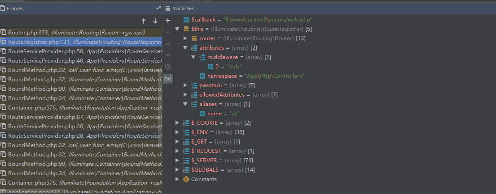
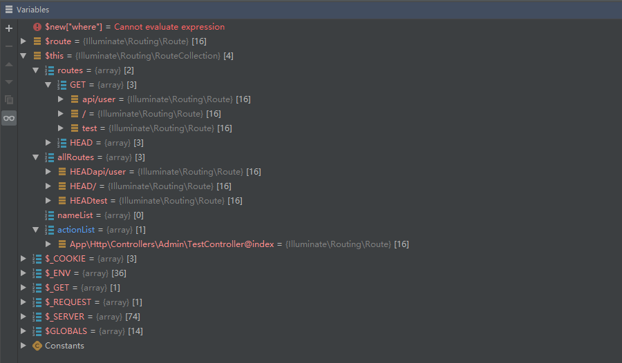
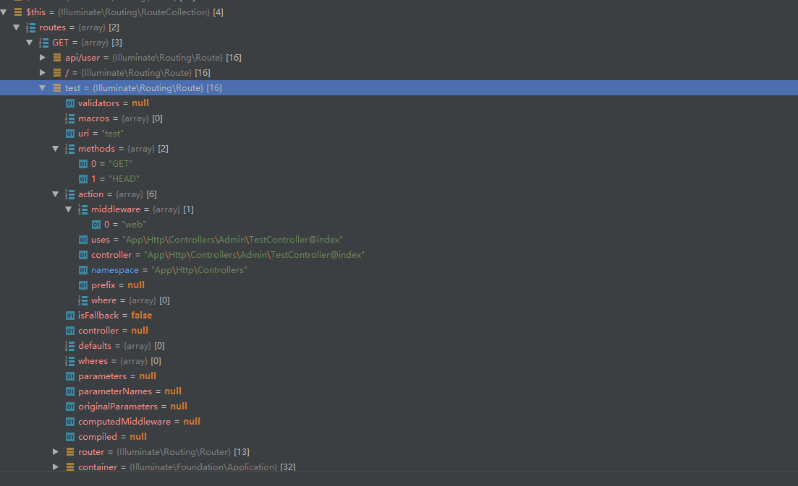
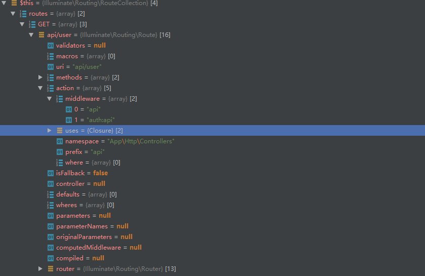
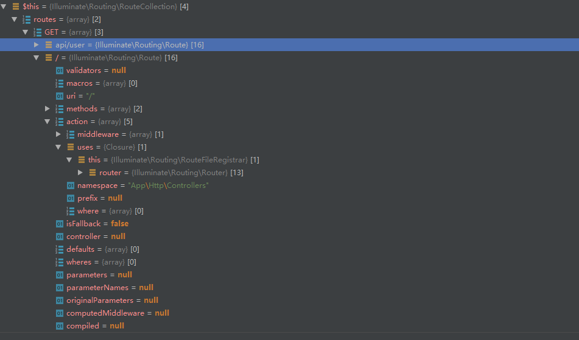

## CRUD整个流程注解   
[首页](../readme.md) [下一页：App\Http\Kernel的路由调度流程](dispatch.md)  [上一页：App\Http\Kernel的handle开车流程](handle.md)  

- 路由注册  
 前面已经解释过服务提供类是如何运行的了，现在我们直接去看路由注册服务提供类  
 希望大家在脑海里弄成一个意识【HTTP请求一次会经过一堆流程，然后死亡即响应所做的事情就是它的生命周期】  
 
 服务提供类   
 config/app.php   
 ```php  
 'providers' => [
 
         /*
          * Laravel Framework Service Providers...
          */
         Illuminate\Auth\AuthServiceProvider::class,
         Illuminate\Broadcasting\BroadcastServiceProvider::class,
         Illuminate\Bus\BusServiceProvider::class,
         Illuminate\Cache\CacheServiceProvider::class,
         Illuminate\Foundation\Providers\ConsoleSupportServiceProvider::class,
         Illuminate\Cookie\CookieServiceProvider::class,
         Illuminate\Database\DatabaseServiceProvider::class,
         Illuminate\Encryption\EncryptionServiceProvider::class,
         Illuminate\Filesystem\FilesystemServiceProvider::class,
         Illuminate\Foundation\Providers\FoundationServiceProvider::class,
         Illuminate\Hashing\HashServiceProvider::class,
         Illuminate\Mail\MailServiceProvider::class,
         Illuminate\Notifications\NotificationServiceProvider::class,
         Illuminate\Pagination\PaginationServiceProvider::class,
         Illuminate\Pipeline\PipelineServiceProvider::class,
         Illuminate\Queue\QueueServiceProvider::class,
         Illuminate\Redis\RedisServiceProvider::class,
         Illuminate\Auth\Passwords\PasswordResetServiceProvider::class,
         Illuminate\Session\SessionServiceProvider::class,
         Illuminate\Translation\TranslationServiceProvider::class,
         Illuminate\Validation\ValidationServiceProvider::class,
         Illuminate\View\ViewServiceProvider::class,
 
         /*
          * Package Service Providers...
          */
 
         /*
          * Application Service Providers...
          */
         App\Providers\AppServiceProvider::class,
         App\Providers\AuthServiceProvider::class,
         // App\Providers\BroadcastServiceProvider::class,
         App\Providers\EventServiceProvider::class,
         App\Providers\RouteServiceProvider::class,
 
     ],

 ```  
 合并后的服务提供类【与第三方扩展包的合并，就是为laravel撸扩展的人】   
 bootstrap/cache/services.php  
 服务提供类进行分类，分别是eager,when事件,deferred延迟   
 ```php  
 <?php return array (
   'providers' => 
   array (
     0 => 'Illuminate\\Auth\\AuthServiceProvider',
     1 => 'Illuminate\\Broadcasting\\BroadcastServiceProvider',
     2 => 'Illuminate\\Bus\\BusServiceProvider',
     3 => 'Illuminate\\Cache\\CacheServiceProvider',
     4 => 'Illuminate\\Foundation\\Providers\\ConsoleSupportServiceProvider',
     5 => 'Illuminate\\Cookie\\CookieServiceProvider',
     6 => 'Illuminate\\Database\\DatabaseServiceProvider',
     7 => 'Illuminate\\Encryption\\EncryptionServiceProvider',
     8 => 'Illuminate\\Filesystem\\FilesystemServiceProvider',
     9 => 'Illuminate\\Foundation\\Providers\\FoundationServiceProvider',
     10 => 'Illuminate\\Hashing\\HashServiceProvider',
     11 => 'Illuminate\\Mail\\MailServiceProvider',
     12 => 'Illuminate\\Notifications\\NotificationServiceProvider',
     13 => 'Illuminate\\Pagination\\PaginationServiceProvider',
     14 => 'Illuminate\\Pipeline\\PipelineServiceProvider',
     15 => 'Illuminate\\Queue\\QueueServiceProvider',
     16 => 'Illuminate\\Redis\\RedisServiceProvider',
     17 => 'Illuminate\\Auth\\Passwords\\PasswordResetServiceProvider',
     18 => 'Illuminate\\Session\\SessionServiceProvider',
     19 => 'Illuminate\\Translation\\TranslationServiceProvider',
     20 => 'Illuminate\\Validation\\ValidationServiceProvider',
     21 => 'Illuminate\\View\\ViewServiceProvider',
     22 => 'BeyondCode\\DumpServer\\DumpServerServiceProvider',
     23 => 'Fideloper\\Proxy\\TrustedProxyServiceProvider',
     24 => 'Laravel\\Tinker\\TinkerServiceProvider',
     25 => 'Carbon\\Laravel\\ServiceProvider',
     26 => 'NunoMaduro\\Collision\\Adapters\\Laravel\\CollisionServiceProvider',
     27 => 'App\\Providers\\AppServiceProvider',
     28 => 'App\\Providers\\AuthServiceProvider',
     29 => 'App\\Providers\\EventServiceProvider',
     30 => 'App\\Providers\\RouteServiceProvider',
   ),
   'eager' => 
   array (
     0 => 'Illuminate\\Auth\\AuthServiceProvider',
     1 => 'Illuminate\\Cookie\\CookieServiceProvider',
     2 => 'Illuminate\\Database\\DatabaseServiceProvider',
     3 => 'Illuminate\\Encryption\\EncryptionServiceProvider',
     4 => 'Illuminate\\Filesystem\\FilesystemServiceProvider',
     5 => 'Illuminate\\Foundation\\Providers\\FoundationServiceProvider',
     6 => 'Illuminate\\Notifications\\NotificationServiceProvider',
     7 => 'Illuminate\\Pagination\\PaginationServiceProvider',
     8 => 'Illuminate\\Session\\SessionServiceProvider',
     9 => 'Illuminate\\View\\ViewServiceProvider',
     10 => 'BeyondCode\\DumpServer\\DumpServerServiceProvider',
     11 => 'Fideloper\\Proxy\\TrustedProxyServiceProvider',
     12 => 'Carbon\\Laravel\\ServiceProvider',
     13 => 'App\\Providers\\AppServiceProvider',
     14 => 'App\\Providers\\AuthServiceProvider',
     15 => 'App\\Providers\\EventServiceProvider',
     16 => 'App\\Providers\\RouteServiceProvider',
   ),
   'deferred' => 
   array (
     'Illuminate\\Broadcasting\\BroadcastManager' => 'Illuminate\\Broadcasting\\BroadcastServiceProvider',
     'Illuminate\\Contracts\\Broadcasting\\Factory' => 'Illuminate\\Broadcasting\\BroadcastServiceProvider',
     'Illuminate\\Contracts\\Broadcasting\\Broadcaster' => 'Illuminate\\Broadcasting\\BroadcastServiceProvider',
     'Illuminate\\Bus\\Dispatcher' => 'Illuminate\\Bus\\BusServiceProvider',
     'Illuminate\\Contracts\\Bus\\Dispatcher' => 'Illuminate\\Bus\\BusServiceProvider',
     'Illuminate\\Contracts\\Bus\\QueueingDispatcher' => 'Illuminate\\Bus\\BusServiceProvider',
     'cache' => 'Illuminate\\Cache\\CacheServiceProvider',
     'cache.store' => 'Illuminate\\Cache\\CacheServiceProvider',
     'memcached.connector' => 'Illuminate\\Cache\\CacheServiceProvider',
     'command.cache.clear' => 'Illuminate\\Foundation\\Providers\\ConsoleSupportServiceProvider',
     'command.cache.forget' => 'Illuminate\\Foundation\\Providers\\ConsoleSupportServiceProvider',
     'command.clear-compiled' => 'Illuminate\\Foundation\\Providers\\ConsoleSupportServiceProvider',
     'command.auth.resets.clear' => 'Illuminate\\Foundation\\Providers\\ConsoleSupportServiceProvider',
     'command.config.cache' => 'Illuminate\\Foundation\\Providers\\ConsoleSupportServiceProvider',
     'command.config.clear' => 'Illuminate\\Foundation\\Providers\\ConsoleSupportServiceProvider',
     'command.down' => 'Illuminate\\Foundation\\Providers\\ConsoleSupportServiceProvider',
     'command.environment' => 'Illuminate\\Foundation\\Providers\\ConsoleSupportServiceProvider',
     'command.event.cache' => 'Illuminate\\Foundation\\Providers\\ConsoleSupportServiceProvider',
     'command.event.clear' => 'Illuminate\\Foundation\\Providers\\ConsoleSupportServiceProvider',
     'command.event.list' => 'Illuminate\\Foundation\\Providers\\ConsoleSupportServiceProvider',
     'command.key.generate' => 'Illuminate\\Foundation\\Providers\\ConsoleSupportServiceProvider',
     'command.migrate' => 'Illuminate\\Foundation\\Providers\\ConsoleSupportServiceProvider',
     'command.migrate.fresh' => 'Illuminate\\Foundation\\Providers\\ConsoleSupportServiceProvider',
     'command.migrate.install' => 'Illuminate\\Foundation\\Providers\\ConsoleSupportServiceProvider',
     'command.migrate.refresh' => 'Illuminate\\Foundation\\Providers\\ConsoleSupportServiceProvider',
     'command.migrate.reset' => 'Illuminate\\Foundation\\Providers\\ConsoleSupportServiceProvider',
     'command.migrate.rollback' => 'Illuminate\\Foundation\\Providers\\ConsoleSupportServiceProvider',
     'command.migrate.status' => 'Illuminate\\Foundation\\Providers\\ConsoleSupportServiceProvider',
     'command.optimize' => 'Illuminate\\Foundation\\Providers\\ConsoleSupportServiceProvider',
     'command.optimize.clear' => 'Illuminate\\Foundation\\Providers\\ConsoleSupportServiceProvider',
     'command.package.discover' => 'Illuminate\\Foundation\\Providers\\ConsoleSupportServiceProvider',
     'command.preset' => 'Illuminate\\Foundation\\Providers\\ConsoleSupportServiceProvider',
     'command.queue.failed' => 'Illuminate\\Foundation\\Providers\\ConsoleSupportServiceProvider',
     'command.queue.flush' => 'Illuminate\\Foundation\\Providers\\ConsoleSupportServiceProvider',
     'command.queue.forget' => 'Illuminate\\Foundation\\Providers\\ConsoleSupportServiceProvider',
     'command.queue.listen' => 'Illuminate\\Foundation\\Providers\\ConsoleSupportServiceProvider',
     'command.queue.restart' => 'Illuminate\\Foundation\\Providers\\ConsoleSupportServiceProvider',
     'command.queue.retry' => 'Illuminate\\Foundation\\Providers\\ConsoleSupportServiceProvider',
     'command.queue.work' => 'Illuminate\\Foundation\\Providers\\ConsoleSupportServiceProvider',
     'command.route.cache' => 'Illuminate\\Foundation\\Providers\\ConsoleSupportServiceProvider',
     'command.route.clear' => 'Illuminate\\Foundation\\Providers\\ConsoleSupportServiceProvider',
     'command.route.list' => 'Illuminate\\Foundation\\Providers\\ConsoleSupportServiceProvider',
     'command.seed' => 'Illuminate\\Foundation\\Providers\\ConsoleSupportServiceProvider',
     'Illuminate\\Console\\Scheduling\\ScheduleFinishCommand' => 'Illuminate\\Foundation\\Providers\\ConsoleSupportServiceProvider',
     'Illuminate\\Console\\Scheduling\\ScheduleRunCommand' => 'Illuminate\\Foundation\\Providers\\ConsoleSupportServiceProvider',
     'command.storage.link' => 'Illuminate\\Foundation\\Providers\\ConsoleSupportServiceProvider',
     'command.up' => 'Illuminate\\Foundation\\Providers\\ConsoleSupportServiceProvider',
     'command.view.cache' => 'Illuminate\\Foundation\\Providers\\ConsoleSupportServiceProvider',
     'command.view.clear' => 'Illuminate\\Foundation\\Providers\\ConsoleSupportServiceProvider',
     'command.app.name' => 'Illuminate\\Foundation\\Providers\\ConsoleSupportServiceProvider',
     'command.auth.make' => 'Illuminate\\Foundation\\Providers\\ConsoleSupportServiceProvider',
     'command.cache.table' => 'Illuminate\\Foundation\\Providers\\ConsoleSupportServiceProvider',
     'command.channel.make' => 'Illuminate\\Foundation\\Providers\\ConsoleSupportServiceProvider',
     'command.console.make' => 'Illuminate\\Foundation\\Providers\\ConsoleSupportServiceProvider',
     'command.controller.make' => 'Illuminate\\Foundation\\Providers\\ConsoleSupportServiceProvider',
     'command.event.generate' => 'Illuminate\\Foundation\\Providers\\ConsoleSupportServiceProvider',
     'command.event.make' => 'Illuminate\\Foundation\\Providers\\ConsoleSupportServiceProvider',
     'command.exception.make' => 'Illuminate\\Foundation\\Providers\\ConsoleSupportServiceProvider',
     'command.factory.make' => 'Illuminate\\Foundation\\Providers\\ConsoleSupportServiceProvider',
     'command.job.make' => 'Illuminate\\Foundation\\Providers\\ConsoleSupportServiceProvider',
     'command.listener.make' => 'Illuminate\\Foundation\\Providers\\ConsoleSupportServiceProvider',
     'command.mail.make' => 'Illuminate\\Foundation\\Providers\\ConsoleSupportServiceProvider',
     'command.middleware.make' => 'Illuminate\\Foundation\\Providers\\ConsoleSupportServiceProvider',
     'command.migrate.make' => 'Illuminate\\Foundation\\Providers\\ConsoleSupportServiceProvider',
     'command.model.make' => 'Illuminate\\Foundation\\Providers\\ConsoleSupportServiceProvider',
     'command.notification.make' => 'Illuminate\\Foundation\\Providers\\ConsoleSupportServiceProvider',
     'command.notification.table' => 'Illuminate\\Foundation\\Providers\\ConsoleSupportServiceProvider',
     'command.observer.make' => 'Illuminate\\Foundation\\Providers\\ConsoleSupportServiceProvider',
     'command.policy.make' => 'Illuminate\\Foundation\\Providers\\ConsoleSupportServiceProvider',
     'command.provider.make' => 'Illuminate\\Foundation\\Providers\\ConsoleSupportServiceProvider',
     'command.queue.failed-table' => 'Illuminate\\Foundation\\Providers\\ConsoleSupportServiceProvider',
     'command.queue.table' => 'Illuminate\\Foundation\\Providers\\ConsoleSupportServiceProvider',
     'command.request.make' => 'Illuminate\\Foundation\\Providers\\ConsoleSupportServiceProvider',
     'command.resource.make' => 'Illuminate\\Foundation\\Providers\\ConsoleSupportServiceProvider',
     'command.rule.make' => 'Illuminate\\Foundation\\Providers\\ConsoleSupportServiceProvider',
     'command.seeder.make' => 'Illuminate\\Foundation\\Providers\\ConsoleSupportServiceProvider',
     'command.session.table' => 'Illuminate\\Foundation\\Providers\\ConsoleSupportServiceProvider',
     'command.serve' => 'Illuminate\\Foundation\\Providers\\ConsoleSupportServiceProvider',
     'command.test.make' => 'Illuminate\\Foundation\\Providers\\ConsoleSupportServiceProvider',
     'command.vendor.publish' => 'Illuminate\\Foundation\\Providers\\ConsoleSupportServiceProvider',
     'migrator' => 'Illuminate\\Foundation\\Providers\\ConsoleSupportServiceProvider',
     'migration.repository' => 'Illuminate\\Foundation\\Providers\\ConsoleSupportServiceProvider',
     'migration.creator' => 'Illuminate\\Foundation\\Providers\\ConsoleSupportServiceProvider',
     'composer' => 'Illuminate\\Foundation\\Providers\\ConsoleSupportServiceProvider',
     'hash' => 'Illuminate\\Hashing\\HashServiceProvider',
     'hash.driver' => 'Illuminate\\Hashing\\HashServiceProvider',
     'mailer' => 'Illuminate\\Mail\\MailServiceProvider',
     'swift.mailer' => 'Illuminate\\Mail\\MailServiceProvider',
     'swift.transport' => 'Illuminate\\Mail\\MailServiceProvider',
     'Illuminate\\Mail\\Markdown' => 'Illuminate\\Mail\\MailServiceProvider',
     'Illuminate\\Contracts\\Pipeline\\Hub' => 'Illuminate\\Pipeline\\PipelineServiceProvider',
     'queue' => 'Illuminate\\Queue\\QueueServiceProvider',
     'queue.worker' => 'Illuminate\\Queue\\QueueServiceProvider',
     'queue.listener' => 'Illuminate\\Queue\\QueueServiceProvider',
     'queue.failer' => 'Illuminate\\Queue\\QueueServiceProvider',
     'queue.connection' => 'Illuminate\\Queue\\QueueServiceProvider',
     'redis' => 'Illuminate\\Redis\\RedisServiceProvider',
     'redis.connection' => 'Illuminate\\Redis\\RedisServiceProvider',
     'auth.password' => 'Illuminate\\Auth\\Passwords\\PasswordResetServiceProvider',
     'auth.password.broker' => 'Illuminate\\Auth\\Passwords\\PasswordResetServiceProvider',
     'translator' => 'Illuminate\\Translation\\TranslationServiceProvider',
     'translation.loader' => 'Illuminate\\Translation\\TranslationServiceProvider',
     'validator' => 'Illuminate\\Validation\\ValidationServiceProvider',
     'validation.presence' => 'Illuminate\\Validation\\ValidationServiceProvider',
     'command.tinker' => 'Laravel\\Tinker\\TinkerServiceProvider',
     'NunoMaduro\\Collision\\Contracts\\Provider' => 'NunoMaduro\\Collision\\Adapters\\Laravel\\CollisionServiceProvider',
   ),
   'when' => 
   array (
     'Illuminate\\Broadcasting\\BroadcastServiceProvider' => 
     array (
     ),
     'Illuminate\\Bus\\BusServiceProvider' => 
     array (
     ),
     'Illuminate\\Cache\\CacheServiceProvider' => 
     array (
     ),
     'Illuminate\\Foundation\\Providers\\ConsoleSupportServiceProvider' => 
     array (
     ),
     'Illuminate\\Hashing\\HashServiceProvider' => 
     array (
     ),
     'Illuminate\\Mail\\MailServiceProvider' => 
     array (
     ),
     'Illuminate\\Pipeline\\PipelineServiceProvider' => 
     array (
     ),
     'Illuminate\\Queue\\QueueServiceProvider' => 
     array (
     ),
     'Illuminate\\Redis\\RedisServiceProvider' => 
     array (
     ),
     'Illuminate\\Auth\\Passwords\\PasswordResetServiceProvider' => 
     array (
     ),
     'Illuminate\\Translation\\TranslationServiceProvider' => 
     array (
     ),
     'Illuminate\\Validation\\ValidationServiceProvider' => 
     array (
     ),
     'Laravel\\Tinker\\TinkerServiceProvider' => 
     array (
     ),
     'NunoMaduro\\Collision\\Adapters\\Laravel\\CollisionServiceProvider' => 
     array (
     ),
   ),
 );
 ```  
 我们要关注的是路由服务提供类【其实上面一大堆它全实例化并运行】  
 我们现在只看路由的就行了  
 ```php  
 <?php
 
 namespace App\Providers;
 
 use Illuminate\Support\Facades\Route;
 use Illuminate\Foundation\Support\Providers\RouteServiceProvider as ServiceProvider;
 
 class RouteServiceProvider extends ServiceProvider
 {
     /**
      * This namespace is applied to your controller routes.
      *
      * In addition, it is set as the URL generator's root namespace.
      *
      * @var string
      */
     protected $namespace = 'App\Http\Controllers';
 
     /**
      * Define your route model bindings, pattern filters, etc.
      *
      * @return void
      */
     public function boot()
     {
         //
 
         parent::boot();
     }
 
     /**
      * Define the routes for the application.
      *
      * @return void
      */
     public function map()
     {
         $this->mapApiRoutes();
 
         $this->mapWebRoutes();
 
         //
     }
 
     /**
      * Define the "web" routes for the application.
      *
      * These routes all receive session state, CSRF protection, etc.
      *
      * @return void
      */
     protected function mapWebRoutes()
     {
         Route::middleware('web')
              ->namespace($this->namespace)
              ->group(base_path('routes/web.php'));
     }
 
     /**
      * Define the "api" routes for the application.
      *
      * These routes are typically stateless.
      *
      * @return void
      */
     protected function mapApiRoutes()
     {
         Route::prefix('api')
              ->middleware('api')
              ->namespace($this->namespace)
              ->group(base_path('routes/api.php'));
     }
 }

 ```  
 这服务提供不是延时的，也不是事件类型的，所以它是立马运行的【怎么知道啊，前面说过了Application实例后干的事情麻烦自己去看】   
 
 boot启动  
 ```php  
 public function boot()
     {
         //
 
         parent::boot();
     }
 ```   
 没错，看鸡类  
 ```php  
 public function boot()
     {
        //uriGenerator保存控制器命名空间
         $this->setRootControllerNamespace();
        //路由是否有缓存
         if ($this->routesAreCached()) {
             $this->loadCachedRoutes();
         } else {
         //加载路由文件
             $this->loadRoutes();
            //保存在Application->bootedCallbacks[]数组里
             $this->app->booted(function () {
                 $this->app['router']->getRoutes()->refreshNameLookups();
                 $this->app['router']->getRoutes()->refreshActionLookups();
             });
         }
     }
 ```  
 
 添加控制器命名空间  
 ```php  
  protected function setRootControllerNamespace()
     {
         if (! is_null($this->namespace)) {
             $this->app[UrlGenerator::class]->setRootControllerNamespace($this->namespace);
         }
     }
 ```  
 噫，这`$this->app[UrlGenerator::class]`这是啥啊，不要怕，我们前面说过它Application实现了数组式接口  
 会触发下面这玩意  
 Application  
 ```php   
 //make前面说过了吧  
 public function offsetGet($key)
     {
         return $this->make($key);
     }
 ```  
 我知道，你脑袋不够用了，下面我们来看看它是怎么骚的吧  
 ```php           
 Application->aliases=[
                          Illuminate\Contracts\Container\Container] => app
                          [Illuminate\Contracts\Foundation\Application] => app
                          [Psr\Container\ContainerInterface] => app
                          [Illuminate\Auth\AuthManager] => auth
                          [Illuminate\Contracts\Auth\Factory] => auth
                          [Illuminate\Contracts\Auth\Guard] => auth.driver
                          [Illuminate\View\Compilers\BladeCompiler] => blade.compiler
                          [Illuminate\Cache\CacheManager] => cache
                          [Illuminate\Contracts\Cache\Factory] => cache
                          [Illuminate\Cache\Repository] => cache.store
                          [Illuminate\Contracts\Cache\Repository] => cache.store
                          [Illuminate\Config\Repository] => config
                          [Illuminate\Contracts\Config\Repository] => config
                          [Illuminate\Cookie\CookieJar] => cookie
                          [Illuminate\Contracts\Cookie\Factory] => cookie
                          [Illuminate\Contracts\Cookie\QueueingFactory] => cookie
                          [Illuminate\Encryption\Encrypter] => encrypter
                          [Illuminate\Contracts\Encryption\Encrypter] => encrypter
                          [Illuminate\Database\DatabaseManager] => db
                          [Illuminate\Database\Connection] => db.connection
                          [Illuminate\Database\ConnectionInterface] => db.connection
                          [Illuminate\Events\Dispatcher] => events
                          [Illuminate\Contracts\Events\Dispatcher] => events
                          [Illuminate\Filesystem\Filesystem] => files
                          [Illuminate\Filesystem\FilesystemManager] => filesystem
                          [Illuminate\Contracts\Filesystem\Factory] => filesystem
                          [Illuminate\Contracts\Filesystem\Filesystem] => filesystem.disk
                          [Illuminate\Contracts\Filesystem\Cloud] => filesystem.cloud
                          [Illuminate\Hashing\HashManager] => hash
                          [Illuminate\Contracts\Hashing\Hasher] => hash.driver
                          [Illuminate\Translation\Translator] => translator
                          [Illuminate\Contracts\Translation\Translator] => translator
                          [Illuminate\Log\LogManager] => log
                          [Psr\Log\LoggerInterface] => log
                          [Illuminate\Mail\Mailer] => mailer
                          [Illuminate\Contracts\Mail\Mailer] => mailer
                          [Illuminate\Contracts\Mail\MailQueue] => mailer
                          [Illuminate\Auth\Passwords\PasswordBrokerManager] => auth.password
                          [Illuminate\Contracts\Auth\PasswordBrokerFactory] => auth.password
                          [Illuminate\Auth\Passwords\PasswordBroker] => auth.password.broker
                          [Illuminate\Contracts\Auth\PasswordBroker] => auth.password.broker
                          [Illuminate\Queue\QueueManager] => queue
                          [Illuminate\Contracts\Queue\Factory] => queue
                          [Illuminate\Contracts\Queue\Monitor] => queue
                          [Illuminate\Contracts\Queue\Queue] => queue.connection
                          [Illuminate\Queue\Failed\FailedJobProviderInterface] => queue.failer
                          [Illuminate\Routing\Redirector] => redirect
                          [Illuminate\Redis\RedisManager] => redis
                          [Illuminate\Contracts\Redis\Factory] => redis
                          [Illuminate\Http\Request] => request
                          [Symfony\Component\HttpFoundation\Request] => request
                          [Illuminate\Routing\Router] => router
                          [Illuminate\Contracts\Routing\Registrar] => router
                          [Illuminate\Contracts\Routing\BindingRegistrar] => router
                          [Illuminate\Session\SessionManager] => session
                          [Illuminate\Session\Store] => session.store
                          [Illuminate\Contracts\Session\Session] => session.store
                          [Illuminate\Routing\UrlGenerator] => url
                          [Illuminate\Contracts\Routing\UrlGenerator] => url
                          [Illuminate\Validation\Factory] => validator
                          [Illuminate\Contracts\Validation\Factory] => validator
                          [Illuminate\View\Factory] => view
                          [Illuminate\Contracts\View\Factory] => view
                          ] 
                          
 Application->abstractAliases= [
 [app] => Array
         (
             [0] => 
             [1] => Illuminate\Contracts\Container\Container
             [2] => Illuminate\Contracts\Foundation\Application
             [3] => Psr\Container\ContainerInterface
         )
 
     [auth] => Array
         (
             [0] => Illuminate\Auth\AuthManager
             [1] => Illuminate\Contracts\Auth\Factory
         )
 
     [auth.driver] => Array
         (
             [0] => Illuminate\Contracts\Auth\Guard
         )
 
     [blade.compiler] => Array
         (
             [0] => Illuminate\View\Compilers\BladeCompiler
         )
 
     [cache] => Array
         (
             [0] => Illuminate\Cache\CacheManager
             [1] => Illuminate\Contracts\Cache\Factory
         )
 
     [cache.store] => Array
         (
             [0] => Illuminate\Cache\Repository
             [1] => Illuminate\Contracts\Cache\Repository
         )
 
     [config] => Array
         (
             [0] => Illuminate\Config\Repository
             [1] => Illuminate\Contracts\Config\Repository
         )
 
     [cookie] => Array
         (
             [0] => Illuminate\Cookie\CookieJar
             [1] => Illuminate\Contracts\Cookie\Factory
             [2] => Illuminate\Contracts\Cookie\QueueingFactory
         )
 
     [encrypter] => Array
         (
             [0] => Illuminate\Encryption\Encrypter
             [1] => Illuminate\Contracts\Encryption\Encrypter
         )
 
     [db] => Array
         (
             [0] => Illuminate\Database\DatabaseManager
         )
 
     [db.connection] => Array
         (
             [0] => Illuminate\Database\Connection
             [1] => Illuminate\Database\ConnectionInterface
         )
 
     [events] => Array
         (
             [0] => Illuminate\Events\Dispatcher
             [1] => Illuminate\Contracts\Events\Dispatcher
         )
 
     [files] => Array
         (
             [0] => Illuminate\Filesystem\Filesystem
         )
 
     [filesystem] => Array
         (
             [0] => Illuminate\Filesystem\FilesystemManager
             [1] => Illuminate\Contracts\Filesystem\Factory
         )
 
     [filesystem.disk] => Array
         (
             [0] => Illuminate\Contracts\Filesystem\Filesystem
         )
 
     [filesystem.cloud] => Array
         (
             [0] => Illuminate\Contracts\Filesystem\Cloud
         )
 
     [hash] => Array
         (
             [0] => Illuminate\Hashing\HashManager
         )
 
     [hash.driver] => Array
         (
             [0] => Illuminate\Contracts\Hashing\Hasher
         )
 
     [translator] => Array
         (
             [0] => Illuminate\Translation\Translator
             [1] => Illuminate\Contracts\Translation\Translator
         )
 
     [log] => Array
         (
             [0] => Illuminate\Log\LogManager
             [1] => Psr\Log\LoggerInterface
         )
 
     [mailer] => Array
         (
             [0] => Illuminate\Mail\Mailer
             [1] => Illuminate\Contracts\Mail\Mailer
             [2] => Illuminate\Contracts\Mail\MailQueue
         )
 
     [auth.password] => Array
         (
             [0] => Illuminate\Auth\Passwords\PasswordBrokerManager
             [1] => Illuminate\Contracts\Auth\PasswordBrokerFactory
         )
 
     [auth.password.broker] => Array
         (
             [0] => Illuminate\Auth\Passwords\PasswordBroker
             [1] => Illuminate\Contracts\Auth\PasswordBroker
         )
 
     [queue] => Array
         (
             [0] => Illuminate\Queue\QueueManager
             [1] => Illuminate\Contracts\Queue\Factory
             [2] => Illuminate\Contracts\Queue\Monitor
         )
 
     [queue.connection] => Array
         (
             [0] => Illuminate\Contracts\Queue\Queue
         )
 
     [queue.failer] => Array
         (
             [0] => Illuminate\Queue\Failed\FailedJobProviderInterface
         )
 
     [redirect] => Array
         (
             [0] => Illuminate\Routing\Redirector
         )
 
     [redis] => Array
         (
             [0] => Illuminate\Redis\RedisManager
             [1] => Illuminate\Contracts\Redis\Factory
         )
 
     [request] => Array
         (
             [0] => Illuminate\Http\Request
             [1] => Symfony\Component\HttpFoundation\Request
         )
 
     [router] => Array
         (
             [0] => Illuminate\Routing\Router
             [1] => Illuminate\Contracts\Routing\Registrar
             [2] => Illuminate\Contracts\Routing\BindingRegistrar
         )
 
     [session] => Array
         (
             [0] => Illuminate\Session\SessionManager
         )
 
     [session.store] => Array
         (
             [0] => Illuminate\Session\Store
             [1] => Illuminate\Contracts\Session\Session
         )
 
     [url] => Array
         (
             [0] => Illuminate\Routing\UrlGenerator
             [1] => Illuminate\Contracts\Routing\UrlGenerator
         )
 
     [validator] => Array
         (
             [0] => Illuminate\Validation\Factory
             [1] => Illuminate\Contracts\Validation\Factory
         )
 
     [view] => Array
         (
             [0] => Illuminate\View\Factory
             [1] => Illuminate\Contracts\View\Factory
         )
 ]                         
 ```  
 
 前面我们分析过，Application->make(会从aliases里取出对应的别名，如果有的话，然后再从bindings数组里取，然后再实例化)   
 所以它`$this->app[UrlGenerator::class]`返回了url  
 而在实例化Application的时候，它就注册在bindings池里了【数组】   
 Illuminate\Routing\RoutingServiceProvider->registerUrlGenerator()    
 ```php  
 $this->app->singleton('url', function ($app) { 
 //所以这函数就这样找到并运行了  
              /** 前面在实例化Application时注册了
              $this->app->singleton('router', function ($app) {
                          return new Router($app['events'], $app);
                          //
              });
              **/
              /**
              实例化Illuminate\Routing\Router 
              public function __construct(Dispatcher $events, Container $container = null)
                  {
                      $this->events = $events;
                      $this->routes = new RouteCollection;
                      $this->container = $container ?: new Container;
              }
              **/
             $routes = $app['router']->getRoutes();//返回Illuminate\Routing\RouteCollection   

             //同样是保存路由集合在Application->instances[]里
             $app->instance('routes', $routes);
                
             //Illuminate\Routing\UrlGenerator 
             /**
             public function __construct(RouteCollection $routes, Request $request, $assetRoot = null)
                 {
                     $this->routes = $routes;//路由集合对象
                     $this->assetRoot = $assetRoot;
             
                     $this->setRequest($request);//返回在实例化App\Http\Kernel的时候传递的请求对象
                 }
             **/
             $url = new UrlGenerator(
                 $routes, $app->rebinding(
                 /**
                  protected function requestRebinder()
                     {
                         return function ($app, $request) {
                             $app['url']->setRequest($request);
                         };
                     }
                 **/
                 //request前面在分析的时候它就注册进去了，所以它目前返回的是Request类实例并保存
                     'request', $this->requestRebinder()
                 ), $app['config']['app.asset_url']
             );
             /**
             public function setSessionResolver(callable $sessionResolver)
                 {
                     $this->sessionResolver = $sessionResolver;
             
                     return $this;
                 }
             **/
             $url->setSessionResolver(function () { 
             //如果说这session是在路由前先运行的话自然返回其实例
                 return $this->app['session'] ?? null;
             });
             /**
             public function setSessionResolver(callable $sessionResolver)
                 {
                     $this->sessionResolver = $sessionResolver;
             
                     return $this;
                 }
             **/
             $url->setKeyResolver(function () {
                 return $this->app->make('config')->get('app.key');
             });
             /**
             保存在Application->reboundCallbacks数组里，没有什么可说的
             **/
             $app->rebinding('routes', function ($app, $routes) {
                 $app['url']->setRoutes($routes);
             });
 
             return $url;
         });
 ```  
 
 Application->rebinding方法【保存在reboundCallbacks数组里，并检测是否要实例返回】  
 ```php  
 public function rebinding($abstract, Closure $callback)
     {
     //$this->getAlias($abstract)获取类的别名 
     //别名=匿名函数
         $this->reboundCallbacks[$abstract = $this->getAlias($abstract)][] = $callback;
        //存在则实例化返回
         if ($this->bound($abstract)) {
             return $this->make($abstract);
         }
     }
 ```  
 Application->bound()方法【根据参数判断bindings,instances,aliases是否存在指定的类】  
 ```php  
 public function bound($abstract)
     {
     //
         return isset($this->bindings[$abstract]) ||
                isset($this->instances[$abstract]) ||
                $this->isAlias($abstract);
     }
 ```  
 Application->isAlias()方法【根据参数判断aliases数组里是否存在指定的类】  
 ```php  
  public function isAlias($name)
     {
         return isset($this->aliases[$name]);
     }
 ```  
 
 Session服务提供类的注册  
 ```php  
 SessionServiceProvider->app->singleton('session', function ($app) {
             return new SessionManager($app);
         });
         
 SessionServiceProvider->app->singleton('session.store', function ($app) {
            
             return $app->make('session')->driver();
         });
         
 SessionServiceProvider->app->singleton(StartSession::class)
 ```
 
 【设置路由控制器命名空间大体功能概括】`$this->setRootControllerNamespace();`     
 1、获取Illuminate\Routing\RouteCollection 实例      
 
 2、将routes作为键routeCoolection实例作为值保存在Application->instances[]      
     
 Application->instances[routes]=routeCoolection实例     
 
 
 3、实例化Illuminate\Routing\UrlGenerator 类     
 并给它【它的构造函数】传递routeCollection实例，以及Request对象，以及配置asset_url      
 
 4、给Illuminate\Routing\UrlGenerator设置setSessionResolver方法        
 ```php  
 function () {        
               //如果说这session是在路由前先运行的话自然返回其实例     
                   return $this->app['session'] ?? null;    
               }   
 ``` 
   
 
 
 5、给Illuminate\Routing\UrlGenerator设置setKeyResolver方法       
 ```php  
 function () {
                   return $this->app->make('config')->get('app.key');
               }
 ```
 
 6、将routes作为键以及匿名函数作为值  
 ```php  
 function ($app, $routes) {
                   $app['url']->setRoutes($routes);
               }  
 ```  
 保存在Application->reboundCallbacks【】数组里        
 
 
 7、将request作为键以及匿名函数作为值         
 ```php  
 function ($app, $request) {
                               $app['url']->setRequest($request);
                           };
 ```     
 保存在Application->reboundCallbacks【】数组里       
 
 加载路由文件  
 ```php  
 protected function loadRoutes()
     {
         if (method_exists($this, 'map')) {
             $this->app->call([$this, 'map']);
         }
     }
 ```    
 
 ```php  
 public function map()
     {
         $this->mapApiRoutes();
 
         $this->mapWebRoutes();
 
         //
     }
 ```  
 
 web路由的加载过程     
 ```php  
 protected function mapWebRoutes()
     {
         Route::middleware('web')
              ->namespace($this->namespace)
              ->group(base_path('routes/web.php'));
     }
 ```  
 Route伪装类的变化过程  
 ```php  
 namespace Illuminate\Support\Facades;
 
 class Route extends Facade{
  protected static function getFacadeAccessor()
     {
         return 'router';
     }
 }
 ```  
 在运行Illuminate\Support\Facades\时首先被Illuminate\Foundation\AliasLoader先捕获到，为什么【不懂就去看看我之前发的队列】  
 怎么扯上队列了【要不你自己去看手册吧，不要影响我开车】   
 ```php  
 public function load($alias)
     {
         if (static::$facadeNamespace && strpos($alias, static::$facadeNamespace) === 0) {
             $this->loadFacade($alias);
 
             return true;
         }
        //所以如果你直接使用Route【即当前页面并没有通过use导入的命名空间如路由文件】   
        //他就立马让Route换个绰号为Illuminate\Support\Facades\Route 
        //所以你自己看看路由文件，为什么Route明明没有找到特定的类却能跑起来
        //就是这个类的来做的【骚吧】  
         if (isset($this->aliases[$alias])) {
             return class_alias($this->aliases[$alias], $alias);
         }
     }
 ```  
 
 Route::middleware('web')引发的事故   
 Illuminate\Support\Facades\Facade的魔术方法   
 
 ```php  
 public static function __callStatic($method, $args)
     {
     //获取路由实例
         $instance = static::getFacadeRoot();
 
         if (! $instance) {
             throw new RuntimeException('A facade root has not been set.');
         }
            //调用路由的middleware方法
         return $instance->$method(...$args);
     }
 ```  
 继续开车    
 ```php  
 public static function getFacadeRoot()
     {
     //static::getFacadeAccessor()返回router
         return static::resolveFacadeInstance(static::getFacadeAccessor());
     }
 ```  
 再开车  
 ```php  
 protected static function resolveFacadeInstance($name)
     {
         if (is_object($name)) {
             return $name;
         }
 
         if (isset(static::$resolvedInstance[$name])) {
             return static::$resolvedInstance[$name];
         }
        //没错，就由Application来搞事了，查你驾照了【怎么处理的，前面说过了】  
        //$name此时为route
         return static::$resolvedInstance[$name] = static::$app[$name];
     }
 ```  
 `eturn static::$resolvedInstance[$name] = static::$app[$name];`数据存储图   
 [route实例化的过程](app.md)   
 记得去看它之前存储在Application->bindings池里了    
 
 然后再调用middleware('web')方法    
 当然了路由，所以调用魔术方法   
 ```php  
 Illuminate\Routing\Router  
 public function __call($method, $parameters)
     {
         if (static::hasMacro($method)) {
             return $this->macroCall($method, $parameters);
         }
 
         if ($method === 'middleware') {
             return (new RouteRegistrar($this))->attribute($method, is_array($parameters[0]) ? $parameters[0] : $parameters);
         }
            
         //不是中间件调用的时候运行此处
         return (new RouteRegistrar($this))->attribute($method, $parameters[0]);
     }
 ```   
 Illuminate\Routing\RouteRegistrar实例化【实例化时构造先运行，基本功】    
 ```php  
public function __construct(Router $router)
    {
    //Illuminate\Routing\Router
        $this->router = $router;
    } 
 ```  
 
 RouteRegistrar->attribute()方法  
 ```php  
 public function attribute($key, $value)
     {
         if (! in_array($key, $this->allowedAttributes)) {
             throw new InvalidArgumentException("Attribute [{$key}] does not exist.");
         }
            
            //存储属性
         $this->attributes[Arr::get($this->aliases, $key, $key)] = $value;
 
         return $this;
     }
 ```  
 `Arr::get($this->aliases, $key, $key)`其中Arr::get这里直接返回$key默认值  
 [Arr相关方法注解](Arr.md)     
 [RouteRegistrar运行时数据存储情况](RouteRegistrar.md)    
         
 
 Router->namespace('App\Http\Controllers')方法   
 ```php  
 同样的一个流程，数据存储【namespace='App\Http\Controllers'】存储在atrributes数组里  
 ```  
 
 加载web路由文件【执行路由文件】group(base_path('routes/web.php'))     
   
 ```php  
 public function group(array $attributes, $routes)
     {
     //路由属性压栈
         $this->updateGroupStack($attributes);
         //加载路由
         $this->loadRoutes($routes);
          //路由属性弹栈
         array_pop($this->groupStack);
     }
 ```  
 Router->updateGroupStack方法   
 ```php  
 protected function updateGroupStack(array $attributes)
     {
     //首次运行是为数组
         if (! empty($this->groupStack)) {
             $attributes = $this->mergeWithLastGroup($attributes);
         }
 
 /**
 这数组不断的调用时
 下标会不断的增大【形成所谓的压栈操作】
 **/
         $this->groupStack[] = $attributes;
     }
 ```  
 Router->loadRoutes方法     
 ```php  
 protected function loadRoutes($routes)
     {
     //匿名函数的话直接运行
         if ($routes instanceof Closure) {
             $routes($this);
         } else {
         //LTS5.5是直接引入运行的   
             (new RouteFileRegistrar($this))->register($routes);
         }
     }
 ```  
 Illuminate\Routing\RouteFileRegistrar路由文件加载   
 ```php  
 <?php
 namespace Illuminate\Routing;
 class RouteFileRegistrar
 {
     /**
      * The router instance.
      *
      * @var \Illuminate\Routing\Router
      */
     protected $router;
     public function __construct(Router $router)
     {
         $this->router = $router;
     }
     public function register($routes)
     {
         $router = $this->router;
         //执行路由文件
         require $routes;
     }
 }

 ```  
 路由文件内容 routes/web.php     
 ```php  
 <?php
 
 /*
 |--------------------------------------------------------------------------
 | Web Routes
 |--------------------------------------------------------------------------
 |
 | Here is where you can register web routes for your application. These
 | routes are loaded by the RouteServiceProvider within a group which
 | contains the "web" middleware group. Now create something great!
 |
 */
 
 Route::get('/', function () {
     return view('welcome');
 });
 
 Route::get('/test', "Admin\TestController@index");

 ```  
 这个路由文件并没有通过use导入类的完整命名空间但引入却能运行【原因是框架在启动时（http请求时)，就向自动加载队列里插入【进队】  
 了一个自动加载的处理方法，并且是直接插入到队头，而composer的自动加载是在后面的】  
 形成如下队列    
 门面类（伪装类）的自动加载处理函数|composer的自动加载处理函数|xxxxx   
 队头                                                   队尾   
 
 队头的自动加载先捕获到Route类【从而触发AliasLoader.php的load处理函数，具体怎么处理自己去看】   
 后面的实例化Route（实例化的Illuminate\Routing\Router类)返回   
 
 
 Router->get()方法   
 ```php  
  public function get($uri, $action = null)
     {
         return $this->addRoute(['GET', 'HEAD'], $uri, $action);
     }
 ```  
 
 Router->addRoute()方法  
 ```php  
 $methods=['GET', 'HEAD'], 
 $uri='/test', 
 $action=Admin\TestController@index
 public function addRoute($methods, $uri, $action)
     {
     //返回的天下时局图【Route类天下时局图】  
         return $this->routes->add($this->createRoute($methods, $uri, $action));
     }
 ```  
 
 Router->createRoute()方法   
 ```php  
 protected function createRoute($methods, $uri, $action)
     {
     //是字符串时
         if ($this->actionReferencesController($action)) {
         /**
         得到的数据结果
         $action = [
                     'controller'=>App\Http\Controllers\Admin\TestController@index,
                     'uses'=>App\Http\Controllers\Admin\TestController@index,
                  ]
         **/
             $action = $this->convertToControllerAction($action);
         }
         /**
         构建路由对象返回
         **/
         $route = $this->newRoute(
             $methods, $this->prefix($uri), $action
         );
         /**
          public function hasGroupStack()
             {
                 return ! empty($this->groupStack);
             }
         **/
         if ($this->hasGroupStack()) {
             $this->mergeGroupAttributesIntoRoute($route);
         }
         $this->addWhereClausesToRoute($route);
 
         return $route;
     }
 ```  
 
 Router->actionReferencesController()方法 【判断$action是匿名函数否】【匿名函数返回false,字符串返回true】
 ```php  
 protected function actionReferencesController($action)
     {
         if (! $action instanceof Closure) {
             return is_string($action) || (isset($action['uses']) && is_string($action['uses']));
         }
 
         return false;
     }
 ```  
 Router->convertToControllerAction()方法【拼装为完整的控制器类名返回，主要是拼装它的控制器命名空间】   
 ```php  
 protected function convertToControllerAction($action)
     {
     //是字符串
         if (is_string($action)) {
             $action = ['uses' => $action];
         }
         /**
         $action = [
            'uses'=>Admin\TestController@index
         ]
         **/
         if (! empty($this->groupStack)) {
         //拼装成完整的控制器【含有命名空间】返回
         /**
         $action = [
            'uses'=>App\Http\Controllers\Admin\TestController@index
         ]
         **/
             $action['uses'] = $this->prependGroupNamespace($action['uses']);
         }
         /**
         $action = [
            'controller'=>App\Http\Controllers\Admin\TestController@index,
            'uses'=>App\Http\Controllers\Admin\TestController@index,
         ]
         **/
         $action['controller'] = $action['uses'];
 
         return $action;
     }
 ```
 
 Router->prependGroupNamespace方法     
 ```php  
 $class=Admin\TestController@index
 protected function prependGroupNamespace($class)
     {
     //弹栈后得到  
     /**
     $group=[
        'middleware'=>['web']
        'namespace'=>'App\Http\Controllers'
     ]
     **/
         $group = end($this->groupStack);
        //拼装为App\Http\Controllers\Admin\TestController@index完整的类返回
         return isset($group['namespace']) && strpos($class, '\\') !== 0
                 ? $group['namespace'].'\\'.$class : $class;
     }
 ```  
 
 Router->newRoute方法     
  
 ```php  
 $methods=['GET', 'HEAD'], 
  $uri='test', 
  $action=[
       'controller'=>App\Http\Controllers\Admin\TestController@index,
       'uses'=>App\Http\Controllers\Admin\TestController@index,
  ]
 protected function newRoute($methods, $uri, $action)
     {
         return (new Route($methods, $uri, $action))
                     ->setRouter($this)
                     ->setContainer($this->container);
     }
 ```  
 Router->prefix()方法  【拼装路由前缀返回完整uri】 
 
 ```php  
 protected function prefix($uri)
     {
         return trim(trim($this->getLastGroupPrefix(), '/').'/'.trim($uri, '/'), '/') ?: '/';
     }
 ```  
 Router->getLastGroupPrefix()方法 【得到路由的prefix前缀，如果设置了prefix路由属性的话】 
 
 ```php  
   public function getLastGroupPrefix()
     {
         if (! empty($this->groupStack)) {
         //弹栈后得到  
         /**
          $last=[
                 'middleware'=>['web']
                 'namespace'=>'App\Http\Controllers'
              ]
         **/
             $last = end($this->groupStack);
 
             return $last['prefix'] ?? '';
         }
 
         return '';
     }
 ```   
 
 Illuminate\Routing\Route路由实例构造【注意和路由器Router的名称区别哦】  
 ```php  
 $methods=['GET', 'HEAD'], 
   $uri='test', 
   $action=[
        'controller'=>App\Http\Controllers\Admin\TestController@index,
        'uses'=>App\Http\Controllers\Admin\TestController@index,
   ]
 public function __construct($methods, $uri, $action)
     {
         $this->uri = $uri;
         $this->methods = (array) $methods;
         //这里原样保存【后面我们分析匿名函数类的路由时再来看】
         $this->action = $this->parseAction($action);
        //这里不用说，好理解
         if (in_array('GET', $this->methods) && ! in_array('HEAD', $this->methods)) {
             $this->methods[] = 'HEAD';
         }
       //这个也好说，不用解释【后面我们弄前缀路由时再来看】   
         if (isset($this->action['prefix'])) {
             $this->prefix($this->action['prefix']);
         }
     }
 ```  
 
 Route->parseAction()方法  
 ```php  
  protected function parseAction($action)
     {
         return RouteAction::parse($this->uri, $action);
     }
 ```  
 
 RouteAction::parse方法  
 ```php  
 public static function parse($uri, $action)
     {
     //为空时
         if (is_null($action)) {
             return static::missingAction($uri);
         }
        //$action时匿名函数的时候
        //暂时先不考虑【后面再说】按下不表
         if (is_callable($action, true)) {
             return ! is_array($action) ? ['uses' => $action] : [
                 'uses' => $action[0].'@'.$action[1],
                 'controller' => $action[0].'@'.$action[1],
             ];
         }
        //这也不用管
         elseif (! isset($action['uses'])) {
             $action['uses'] = static::findCallable($action);
         }
        //存在uses不含有@符号时
         if (is_string($action['uses']) && ! Str::contains($action['uses'], '@')) {
             $action['uses'] = static::makeInvokable($action['uses']);
         }
 
         return $action;
     }
 ```
 Router->mergeGroupAttributesIntoRoute方法   
 ```php  
 protected function mergeGroupAttributesIntoRoute($route)
     {
     /**
      public function getAction($key = null)
         {
             return Arr::get($this->action, $key);
         } 
     **/
     //不用说全返回数组 
     /**
    [
     middleware=[
            web
         ],
     uses=App\Http\Controllers\Admin\TestController@index,
     controller=App\Http\Controllers\Admin\TestController@index,
     namespace=App\Http\Controllers,
     where=[],
    ]
     
     **/
         $route->setAction($this->mergeWithLastGroup($route->getAction()));
     }
 ```  
 
 Router->mergeWithLastGroup()方法  
 ```php 
 $new=[
         'controller'=>App\Http\Controllers\Admin\TestController@index,
         'uses'=>App\Http\Controllers\Admin\TestController@index,
    ]
    $this->groupStack=[
    0=>[
                'middleware'=>[
                        0=>'web'
                ],
                namespace='App\Http\Controllers'
            ]
    ]
   public function mergeWithLastGroup($new)
     {
     //
         return RouteGroup::merge($new, end($this->groupStack));
     }
 ```  
 
 RouteGroup::merge（）方法  
 ```php  
 $new=[
          'controller'=>App\Http\Controllers\Admin\TestController@index,
          'uses'=>App\Http\Controllers\Admin\TestController@index,
     ]
   
      $old = 'middleware'=>[
                         0=>'web'
                 ],
                 namespace='App\Http\Controllers'
             ]
     ]
  public static function merge($new, $old)
     {
     //存在域名路由选项则删除
         if (isset($new['domain'])) {
             unset($old['domain']);
         }
 
 //static::formatAs($new, $old) 返回$new【原样】
         $new = array_merge(static::formatAs($new, $old), [
             'namespace' => static::formatNamespace($new, $old),
             'prefix' => static::formatPrefix($new, $old),
             'where' => static::formatWhere($new, $old),
         ]);
        /**
        uses=App\Http\Controllers\Admin\TestController@index
        controller=App\Http\Controllers\Admin\TestController@index
        namespace=App\Http\Controllers
        prefix=null
        where=[]
        **/
        //数组递归合并https://www.php.net/manual/zh/function.array-merge-recursive.php  
        
         return array_merge_recursive(Arr::except(
             $old, ['namespace', 'prefix', 'where', 'as']
         ), $new);
     }
 ```  
 RouteGroup::formatAs（）方法【as拼装】  
 ```php  
  protected static function formatAs($new, $old)
     {
     //存在as选项的话 
     //拼装as选项的返回
         if (isset($old['as'])) {
             $new['as'] = $old['as'].($new['as'] ?? '');
         }
 
         return $new;
     }
 ```  
 RouteGroup::formatNamespace（）方法  【命名空间拼装】 
 
 ```php  
 protected static function formatNamespace($new, $old)
     {
     //定义的路由存在namespace
     //则将根命名空间+子命名空间拼装返回
         if (isset($new['namespace'])) {
             return isset($old['namespace']) && strpos($new['namespace'], '\\') !== 0
                     ? trim($old['namespace'], '\\').'\\'.trim($new['namespace'], '\\')
                     : trim($new['namespace'], '\\');
         }
 
         return $old['namespace'] ?? null;
     }
 ```  
 RouteGroup::formatPrefix（）方法  【路由前缀拼装】 
 ```php  
  protected static function formatPrefix($new, $old)
     {
         $old = $old['prefix'] ?? null;
 
         return isset($new['prefix']) ? trim($old, '/').'/'.trim($new['prefix'], '/') : $old;
     }
 ```  
 RouteGroup::formatWhere（）方法  【路由where拼装】 
 ```php  
 protected static function formatWhere($new, $old)
     {
         return array_merge(
             $old['where'] ?? [],
             $new['where'] ?? []
         );
     }
 ```   
 
 Router->addWhereClausesToRoute()方法   
 
 ```php  
 protected function addWhereClausesToRoute($route)
     {
         $route->where(array_merge(
             $this->patterns, $route->getAction()['where'] ?? []
         ));
 
         return $route;
     }
 ```
 
 Router->createRoute跑完后【装逼后】得到类整个结构图如下  
   
 
 Illuminate\Routing\RouteCollection->add()方法   
 ```php  
 public function add(Route $route)
     {
         $this->addToCollections($route);
 
         $this->addLookups($route);
 
         return $route;
     }
 ```  
 Illuminate\Routing\addToCollections->add()方法  
 ```php  
 protected function addToCollections($route)
     {
     /**
      public function getDomain()
         {
             return isset($this->action['domain'])
                     ? str_replace(['http://', 'https://'], '', $this->action['domain']) : null;
         }
      public function uri()
          {
              return $this->uri;
          }
     **/
     //返回域名拼装uri地址
         $domainAndUri = $route->getDomain().$route->uri();
     //循环方法
     /**
     public function methods()
         {
             return $this->methods;
         }
     **/
         foreach ($route->methods() as $method) {
         //请求方法->请求uri完整地址=路由对象
             $this->routes[$method][$domainAndUri] = $route;
         }
        //请求方法.请求uri地址=路由对象
         $this->allRoutes[$method.$domainAndUri] = $route;
     }
 ```  
 Illuminate\Routing\addToCollections->addLookups()方法  
 ```php  
 protected function addLookups($route)
     {
         /**
          public function getName()
             {
                 return $this->action['as'] ?? null;
             }
         **/
         //这里没有东西啊，不用管
         if ($name = $route->getName()) {
             $this->nameList[$name] = $route;
         }
        //取回东西
         $action = $route->getAction();
 
         if (isset($action['controller'])) {
             $this->addToActionList($action, $route);
         }
     }
 ```  
 Illuminate\Routing\addToCollections->addToActionList()方法  
 ```php  
 protected function addToActionList($action, $route)
     {
     //控制器列表
         $this->actionList[trim($action['controller'], '\\')] = $route;
     }
 ```  
 
 Router->add()之后RouteCollection数据存储状态图  
   
 
   
 
 routes/api.php路由图  
     
 
 匿名函数的路由  
   
 
 自此路由注册原理解释完成  
 
 那么一节将介绍路由寻址【即匹配】的流程说明   
 