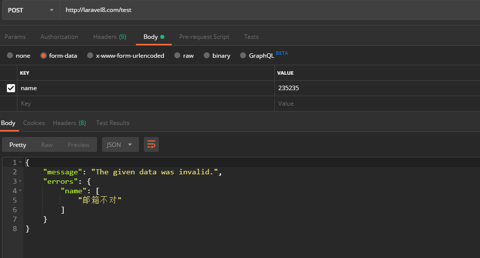

### validate验证  
[首页](../readme.md) [下一页：](view.md)  [上一页：模板引擎实现流程](view.md)  

- 验证  
 下面是测试代码，我们使用的表单验证，手动验证【这个简单没有看的价值】，我们只想知道我创建一个验证器以后，在控制器里注入 
 它是怎么就给我完成了验证的，我们要搞清楚的就是这个【难道你不觉得神奇吗，一请求就能给我验证了，这真吊】  
 
 ```php  
 <?php
 
 namespace App\Http\Controllers\Admin;
 
 use App\Http\Requests\Admin\validateTestPost;
 use App\Http\Controllers\Controller;
 
 class TestController extends Controller
 {
     //
     function index(validateTestPost $validateTestPost)
     {
 
         $data = $validateTestPost->all();
         return response()->json($data);
 
     }
 }

 ```  
 
 路由 
 `Route::post('/test', "Admin\TestController@index");`  
 
 验证器 
 ```php  
 <?php
 
 namespace App\Http\Requests\Admin;
 
 use Illuminate\Foundation\Http\FormRequest;
 
 class validateTestPost extends FormRequest
 {
     /**
      * Determine if the user is authorized to make this request.
      *
      * @return bool
      */
     public function authorize()
     {
         //return false;
         return true;
     }
 
     /**
      * Get the validation rules that apply to the request.
      *
      * @return array
      */
     public function rules()
     {
         return [
             //
             'name'=>'required|email'
 
         ];
     }
 
     public function messages()
     {
         //return parent::messages(); // TODO: Change the autogenerated stub
         return [
           'name.required'=>'填个名字吧，老头',
           'name.email'=>'邮箱不对'
         ];
     }
 }

 ```  
 
 验证结果  
   
 
 控制器是怎么完成依赖注入的啊【前面说过了】  
 不再解释，现在我们来看这个验证类的结构    
 
 ```php  
namespace App\Http\Requests\Admin;
use Illuminate\Foundation\Http\FormRequest;
class validateTestPost extends FormRequest{}
 
[
namespace Illuminate\Foundation\Http;
use Illuminate\Http\Request;
use Illuminate\Contracts\Validation\Factory as ValidationFactory;
class FormRequest extends Request implements ValidatesWhenResolved{
 use ValidatesWhenResolvedTrait;
}
]

[
namespace Illuminate\Http;
use Symfony\Component\HttpFoundation\Request as SymfonyRequest;

class Request extends SymfonyRequest implements Arrayable, ArrayAccess{

    use Concerns\InteractsWithContentTypes,
        Concerns\InteractsWithFlashData,
        Concerns\InteractsWithInput,
        Macroable;
}
]

 ```  
 
 这是它的继承状态   
 我们知道控制器的方法参数会被实例化【控制器依赖处理请看前面的路由调度过程】   
 所以当前实例化的是validateTestPost类   
 
 现在我们去看一下一个服务提供类 FoundationServiceProvider   
 ```php  
 namespace Illuminate\Foundation\Providers;
 
 use Illuminate\Http\Request;
 use Illuminate\Support\Facades\URL;
 use Illuminate\Support\AggregateServiceProvider;
 
 class FoundationServiceProvider extends AggregateServiceProvider{}
 
 namespace Illuminate\Support;
 
 class AggregateServiceProvider extends ServiceProvider{}
 ```   
 
 它的register注册方法  
 ```php  
 Illuminate\Foundation\Providers->register()
     {
     //先运行父类
         parent::register();
 
         $this->registerRequestValidation();
         $this->registerRequestSignatureValidation();
     }
     
 AggregateServiceProvider->register()
     {
         $this->instances = [];
            /**
          $providers = [
                    FormRequestServiceProvider::class,
                ];
            **/
         foreach ($this->providers as $provider) {
         //运行FormRequestServiceProvider::class
         //存储起来
             $this->instances[] = $this->app->register($provider);
         }
     }
     
 class FormRequestServiceProvider extends ServiceProvider
 {
     /**
      * Register the service provider.
      *
      * @return void
      */
     public function register()
     {
         //
     }
     
 FoundationServiceProvider->registerRequestValidation()
     {
     //注册匿名函数【宏扩展】   
     //这样Request->validate()这样调用了
         Request::macro('validate', function (array $rules, ...$params) {
             return validator()->validate($this->all(), $rules, ...$params);
         });
     }
     
 FoundationServiceProvider->registerRequestSignatureValidation()
     {
     //添加宏
         Request::macro('hasValidSignature', function ($absolute = true) {
             return URL::hasValidSignature($this, $absolute);
         });
     }
 ```  
 FormRequestServiceProvider->boot()运行   
 ```php  
  public function boot()
     {
         $this->app->afterResolving(ValidatesWhenResolved::class, function ($resolved) {
             $resolved->validateResolved();
         });
 
         $this->app->resolving(FormRequest::class, function ($request, $app) {
             $request = FormRequest::createFrom($app['request'], $request);
 
             $request->setContainer($app)->setRedirector($app->make(Redirector::class));
         });
     }  
     
  Application->afterResolving($abstract, Closure $callback = null)
      {
          if (is_string($abstract)) {
              $abstract = $this->getAlias($abstract);
          }
  
          if ($abstract instanceof Closure && is_null($callback)) {
              $this->globalAfterResolvingCallbacks[] = $abstract;
          } else {
          //存在此
              $this->afterResolvingCallbacks[$abstract][] = $callback;
          }
      }  
      
  Application->resolving($abstract, Closure $callback = null)
   {
       if (is_string($abstract)) {
           $abstract = $this->getAlias($abstract);
       }

       if (is_null($callback) && $abstract instanceof Closure) {
           $this->globalResolvingCallbacks[] = $abstract;
       } else {
           $this->resolvingCallbacks[$abstract][] = $callback;
       }
   }
 ```
 
 
 
