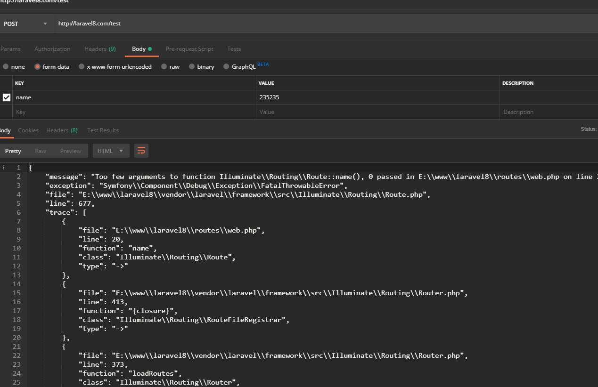
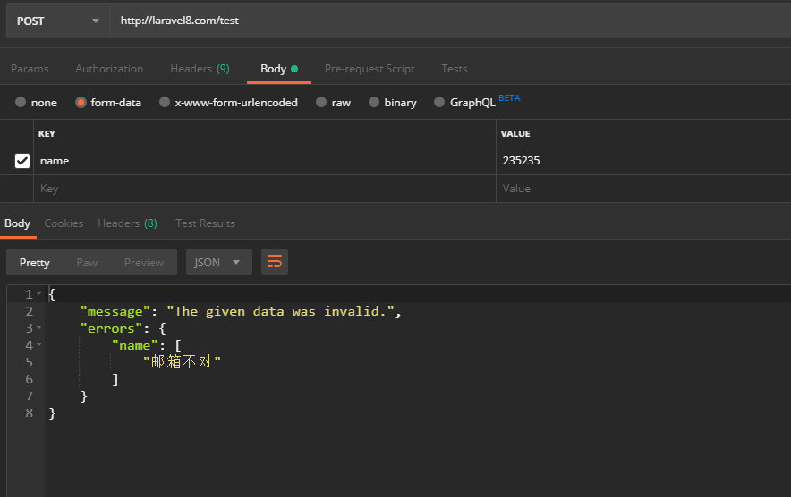

### validate验证  
[首页](../readme.md) [下一页：](view.md)  [上一页：模板引擎实现流程](view.md)  

- 验证  
 下面是测试代码，我们使用的表单验证，手动验证【这个简单没有看的价值】，我们只想知道我创建一个验证器以后，在控制器里注入 
 它是怎么就给我完成了验证的，我们要搞清楚的就是这个【难道你不觉得神奇吗，一请求就能给我验证了，这真吊】  
 
 ```php  
 <?php
 
 namespace App\Http\Controllers\Admin;
 
 use App\Http\Requests\Admin\validateTestPost;
 use App\Http\Controllers\Controller;
 
 class TestController extends Controller
 {
     //
     function index(validateTestPost $validateTestPost)
     {
 
         $data = $validateTestPost->all();
         return response()->json($data);
 
     }
 }

 ```  
 
 路由 
 `Route::post('/test', "Admin\TestController@index");`  
 
 验证器 
 ```php  
 <?php
 
 namespace App\Http\Requests\Admin;
 
 use Illuminate\Foundation\Http\FormRequest;
 
 class validateTestPost extends FormRequest
 {
     /**
      * Determine if the user is authorized to make this request.
      *
      * @return bool
      */
     public function authorize()
     {
         //return false;
         return true;
     }
 
     /**
      * Get the validation rules that apply to the request.
      *
      * @return array
      */
     public function rules()
     {
         return [
             //
             'name'=>'required|email'
 
         ];
     }
 
     public function messages()
     {
         //return parent::messages(); // TODO: Change the autogenerated stub
         return [
           'name.required'=>'填个名字吧，老头',
           'name.email'=>'邮箱不对'
         ];
     }
 }

 ```  
 
 验证结果  
   
 
 控制器是怎么完成依赖注入的啊【前面说过了】  
 不再解释，现在我们来看这个验证类的结构    
 
 ```php  
namespace App\Http\Requests\Admin;
use Illuminate\Foundation\Http\FormRequest;
class validateTestPost extends FormRequest{}
 
[
namespace Illuminate\Foundation\Http;
use Illuminate\Http\Request;
use Illuminate\Contracts\Validation\Factory as ValidationFactory;
class FormRequest extends Request implements ValidatesWhenResolved{
 use ValidatesWhenResolvedTrait;
}
]

[
namespace Illuminate\Http;
use Symfony\Component\HttpFoundation\Request as SymfonyRequest;

class Request extends SymfonyRequest implements Arrayable, ArrayAccess{

    use Concerns\InteractsWithContentTypes,
        Concerns\InteractsWithFlashData,
        Concerns\InteractsWithInput,
        Macroable;
}
]

 ```  
 
 这是它的继承状态   
 我们知道控制器的方法参数会被实例化【控制器依赖处理请看前面的路由调度过程】   
 所以当前实例化的是validateTestPost类   
 
 现在我们去看一下一个服务提供类 FoundationServiceProvider   
 ```php  
 namespace Illuminate\Foundation\Providers;
 
 use Illuminate\Http\Request;
 use Illuminate\Support\Facades\URL;
 use Illuminate\Support\AggregateServiceProvider;
 
 class FoundationServiceProvider extends AggregateServiceProvider{}
 
 namespace Illuminate\Support;
 
 class AggregateServiceProvider extends ServiceProvider{}
 ```   
 
 它的register注册方法  
 ```php  
 Illuminate\Foundation\Providers->register()
     {
     //先运行父类
         parent::register();
 
         $this->registerRequestValidation();
         $this->registerRequestSignatureValidation();
     }
     
 AggregateServiceProvider->register()
     {
         $this->instances = [];
            /**
          $providers = [
                    FormRequestServiceProvider::class,
                ];
            **/
         foreach ($this->providers as $provider) {
         //运行FormRequestServiceProvider::class
         //存储起来
             $this->instances[] = $this->app->register($provider);
         }
     }
     
 class FormRequestServiceProvider extends ServiceProvider
 {
     /**
      * Register the service provider.
      *
      * @return void
      */
     public function register()
     {
         //
     }
     
 FoundationServiceProvider->registerRequestValidation()
     {
     //注册匿名函数【宏扩展】【请求验证方法宏扩展】   
     //这样Request->validate()这样调用了 【手册所说的快速验证】   
         Request::macro('validate', function (array $rules, ...$params) {
             return validator()->validate($this->all(), $rules, ...$params);
         });
     }
     
 FoundationServiceProvider->registerRequestSignatureValidation()
     {
     //添加宏
         Request::macro('hasValidSignature', function ($absolute = true) {
             return URL::hasValidSignature($this, $absolute);
         });
     }
 ```  
 FormRequestServiceProvider->boot()运行   
 ```php  
  public function boot()
     {
         $this->app->afterResolving(ValidatesWhenResolved::class, function ($resolved) {
             $resolved->validateResolved();
         });
 
         $this->app->resolving(FormRequest::class, function ($request, $app) {
             $request = FormRequest::createFrom($app['request'], $request);
 
             $request->setContainer($app)->setRedirector($app->make(Redirector::class));
         });
     }  
     
  Application->afterResolving($abstract, Closure $callback = null)
      {
          if (is_string($abstract)) {
              $abstract = $this->getAlias($abstract);
          }
  
          if ($abstract instanceof Closure && is_null($callback)) {
              $this->globalAfterResolvingCallbacks[] = $abstract;
          } else {
          //存在此
              $this->afterResolvingCallbacks[$abstract][] = $callback;
          }
      }  
      
  Application->resolving($abstract, Closure $callback = null)
   {
       if (is_string($abstract)) {
           $abstract = $this->getAlias($abstract);
       }

       if (is_null($callback) && $abstract instanceof Closure) {
           $this->globalResolvingCallbacks[] = $abstract;
       } else {
           $this->resolvingCallbacks[$abstract][] = $callback;
       }
   }
 ```  
    
 建议看一下Application运行时的数据存储情况  
 
 前面说过，当实例化某个类【控制器的依赖注入】时，会运行Application->make()->resolve()->build()这样的一个流程实例化某个类  
 返回，现在我们再来重新看一下它的resolve方法  
 ```php  
 Application->resolve($abstract, $parameters = [], $raiseEvents = true)
     {
     //此时$abstract=App\Http\Requests\Admin\validateTestPost::class
         $abstract = $this->getAlias($abstract);
 
         $needsContextualBuild = ! empty($parameters) || ! is_null(
             $this->getContextualConcrete($abstract)
         );
 
         if (isset($this->instances[$abstract]) && ! $needsContextualBuild) {
             return $this->instances[$abstract];
         }
 
         $this->with[] = $parameters;
         //直接是自己不变
         $concrete = $this->getConcrete($abstract);
 
         if ($this->isBuildable($concrete, $abstract)) {
         //实例化自己返回
             $object = $this->build($concrete);
         } else {
             $object = $this->make($concrete);
         }
 
         foreach ($this->getExtenders($abstract) as $extender) {
             $object = $extender($object, $this);
         }
 
         if ($this->isShared($abstract) && ! $needsContextualBuild) {
             $this->instances[$abstract] = $object;
         }
         //此处是关键【运行这里】
         if ($raiseEvents) {
             $this->fireResolvingCallbacks($abstract, $object);
         }
 
         $this->resolved[$abstract] = true;
 
         array_pop($this->with);
 
         return $object;
     }  
     
 Application->fireResolvingCallbacks($abstract, $object)
     {
     //这句不用看
         $this->fireCallbackArray($object, $this->globalResolvingCallbacks);
 
         $this->fireCallbackArray(
         //$abstract=App\Http\Requests\Admin\validateTestPost::class
         //$object=validateTestPost::class类的实例对象
         /**
         resolvingCallbacks = [
             Illuminate\Foundation\Http\FormRequest=>function ($request, $app) {
                                                                 $request = FormRequest::createFrom($app['request'], $request);
                                                     
                                                                 $request->setContainer($app)->setRedirector($app->make(Redirector::class));
                                                             }     
         ]
         **/
             $object, $this->getCallbacksForType($abstract, $object, $this->resolvingCallbacks)
         );
 
         $this->fireAfterResolvingCallbacks($abstract, $object);
     }
 //$abstract=App\Http\Requests\Admin\validateTestPost::class
 Application->getCallbacksForType($abstract, $object, array $callbacksPerType)
     {
         $results = [];
         //$type=Illuminate\Foundation\Http\FormRequest
         /**
         $callbacks = function ($request, $app) {
              $request = FormRequest::createFrom($app['request'], $request);
  
              $request->setContainer($app)->setRedirector($app->make(Redirector::class));
          } 
         **/
         foreach ($callbacksPerType as $type => $callbacks) {
         //是否相等||或是该对象即validateTestPost类实例是否属于Illuminate\Foundation\Http\FormRequest 
         //当然属于了，看上面的继承关系【这就是我为什么要说继承的问题了】  
             if ($type === $abstract || $object instanceof $type) {
                //合并成数组返回
                 $results = array_merge($results, $callbacks);
             }
         }
 
         return $results;
     }  
 //$object=validateTestPost类实例对象
 /**
 $callbacks=function ($request, $app) {
               $request = FormRequest::createFrom($app['request'], $request);
   
               $request->setContainer($app)->setRedirector($app->make(Redirector::class));
           } 
 **/
 Application->fireCallbackArray($object, array $callbacks)
     {
         foreach ($callbacks as $callback) {
         //运行匿名函数
             $callback($object, $this);
         }
     }  
     
 Application->fireAfterResolvingCallbacks($abstract, $object)
     {
         $this->fireCallbackArray($object, $this->globalAfterResolvingCallbacks);
         /**
          Illuminate\Contracts\Validation\ValidatesWhenResolved=>function ($resolved) {
                                                                                $resolved->validateResolved();
                                                                            },
         **/
         $this->fireCallbackArray(
         //同样封装成数组,$object,[function(){}]
             $object, $this->getCallbacksForType($abstract, $object, $this->afterResolvingCallbacks)
         );
         //然后套路一样的
     }
 ```  
 
 运行resolvingCallbacks匿名函数  
 ```php  
 //$request=validateTestPost类实例对象
 //$app = Application实例对象
  function ($request, $app) {
    $request = FormRequest::createFrom($app['request'], $request);
    
    $request->setContainer($app)->setRedirector($app->make(Redirector::class));
  } 
 ```  
 Illuminate\Http\Request类->createFrom()方法  
 ```php  
 //$to=validateTestPost类实例对象
  //$from = 当前请求实例对象Request
 public static function createFrom(self $from, $to = null)
     {
         
         $request = $to ?: new static;
         //当前请求对象的文件
         $files = $from->files->all();
 
         $files = is_array($files) ? array_filter($files) : $files;
        //把当前请求的数据复制到validateTestPost类实例对象对象上保存
         $request->initialize(
             $from->query->all(),
             $from->request->all(),
             $from->attributes->all(),
             $from->cookies->all(),
             $files,
             $from->server->all(),
             $from->getContent()
         );
          //头部替换
         $request->headers->replace($from->headers->all());
         //json替换
         $request->setJson($from->json());
         //sesion替换
         if ($session = $from->getSession()) {
             $request->setLaravelSession($session);
         }
         //替换
         $request->setUserResolver($from->getUserResolver());
 
         $request->setRouteResolver($from->getRouteResolver());
         //返回validateTestPost类实例对象
         return $request;
     }
 ```  
 
 运行afterResolvingCallbacks匿名函数开始进入验证阶段   
 ```php  
 //$resolved=validateTestPost类实例对象
 function ($resolved) {
     $resolved->validateResolved();
 },
 ```  
 
 为什么是执行这个类呢【看上面的继承关系】ok?
 ```php  
 <?php
 
 namespace Illuminate\Validation;
 
 /**
  * Provides default implementation of ValidatesWhenResolved contract.
  */
 trait ValidatesWhenResolvedTrait
 {
     
     public function validateResolved()
     {
        //什么都没有干
         $this->prepareForValidation();
 
         if (! $this->passesAuthorization()) {
             $this->failedAuthorization();
         }
        //Illuminate\Validation\Validator实例  
        //得到验证器
         $instance = $this->getValidatorInstance();
         //进行验证  
         //会循环验证提交的每个字段
         if ($instance->fails()) {
             $this->failedValidation($instance);
         }
     }
 
     //啥 也不干，不知道写在这里搞什么，好玩吧
     protected function prepareForValidation()
     {
         // no default action
     }
 
     
     protected function getValidatorInstance()
     {
         return $this->validator();
     }
 
    
     protected function failedValidation(Validator $validator)
     {
         throw new ValidationException($validator);
     }
 
    
     protected function passesAuthorization()
     {
         if (method_exists($this, 'authorize')) {
             return $this->authorize();
         }
 
         return true;
     }
 
   
     protected function failedAuthorization()
     {
         throw new UnauthorizedException;
     }
 }
 
 protected function passesAuthorization()
     {
     //检测是否存在【子类】的方法authorize方法
     //所以你在子类里的返回只能是布尔值
         if (method_exists($this, 'authorize')) {
             return $this->authorize();
         }
 
         return true;
     }
 //authorize方法不返回true立马给你扔出一个垃圾【异常】
 protected function failedAuthorization()
     {
         throw new UnauthorizedException;
     }  
     
 protected function getValidatorInstance()
     {
         if ($this->validator) {
             return $this->validator;
         }
           //实例化验证工厂Illuminate\Validation\Factory
         $factory = $this->container->make(ValidationFactory::class);
         //这句没有【现在是废物一个】
         if (method_exists($this, 'validator')) {
             $validator = $this->container->call([$this, 'validator'], compact('factory'));
         } else {
         //创建默认验证器
             $validator = $this->createDefaultValidator($factory);
         }
        //不听
         if (method_exists($this, 'withValidator')) {
             $this->withValidator($validator);
         }
         Illuminate\Foundation\Http\FormRequest->validator=Illuminate\Validation\Validator实例
         $this->setValidator($validator);
 
         return $this->validator;
     }
     
 protected function createDefaultValidator(ValidationFactory $factory)
     {
         return $factory->make(
         //$this->validationData() 获取所有的请求数据文件，get,post数据  
         //$this->container->call([$this, 'rules']调用子的rules方法，返回数组【心里没有数吗】？
         //$this->messages()返回用户定义的message数组
         //$this->attributes()同样的道理 
             $this->validationData(), $this->container->call([$this, 'rules']),
             $this->messages(), $this->attributes()
         );
     }
 ```  
 
 UnauthorizedException异常捕获流程   
 记得看看handle方法【前面提过】  
 ```php  
 Illuminate\Foundation\Http\Kernel->handle($request)
     {
         try {
             $request->enableHttpMethodParameterOverride();
 
             $response = $this->sendRequestThroughRouter($request);
         } catch (Exception $e) {
             $this->reportException($e);
              //没有错，异常就在这里被抓了【抓住你扔的垃圾了】  
             $response = $this->renderException($request, $e);
         } catch (Throwable $e) {
             $this->reportException($e = new FatalThrowableError($e));
 
             $response = $this->renderException($request, $e);
         }
 
         $this->app['events']->dispatch(
             new Events\RequestHandled($request, $response)
         );
 
         return $response;
     }  
     
 protected function renderException($request, Exception $e)
     {
     //记得前面说过了哦，它到底实例化哪个类心里没有逼数吗^_^
         return $this->app[ExceptionHandler::class]->render($request, $e);
     }
 ```  
 
 App\Exceptions\Handler extends Illuminate\Foundation\Exceptions\Handler 异常处理  
 ```php  
 public function render($request, Exception $exception)
     {
         return parent::render($request, $exception);
     }
     
 public function render($request, Exception $e)
     {
         if (method_exists($e, 'render') && $response = $e->render($request)) {
             return Router::toResponse($request, $response);
         } elseif ($e instanceof Responsable) {
             return $e->toResponse($request);
         }
 
         $e = $this->prepareException($e);
 
         if ($e instanceof HttpResponseException) {
             return $e->getResponse();
         } elseif ($e instanceof AuthenticationException) {//呐，就这个垃圾
             return $this->unauthenticated($request, $e);
         } elseif ($e instanceof ValidationException) {
             return $this->convertValidationExceptionToResponse($e, $request);
         }
 
         return $request->expectsJson()
                         ? $this->prepareJsonResponse($request, $e)
                         : $this->prepareResponse($request, $e);
     }
     
 protected function unauthenticated($request, AuthenticationException $exception)
     {
         return $request->expectsJson()
                     ? response()->json(['message' => $exception->getMessage()], 401)
                     : redirect()->guest($exception->redirectTo() ?? route('login'));
     }
 ```  
 
 然后它返回的结果就是这样的【没有打码你应该看得清楚吧】     
     
 
 
 Illuminate\Validation\Factory工厂类  
 ```php  
 //$data当前请求的数据
 //$rules验证数组规则
 //$messages错误消息规则
 //$customAttributes属性名称规则
 public function make(array $data, array $rules, array $messages = [], array $customAttributes = [])
     { 
      
      //Illuminate\Validation\Validator实例
         $validator = $this->resolve(
             $data, $rules, $messages, $customAttributes
         );
 
         if (! is_null($this->verifier)) {
             $validator->setPresenceVerifier($this->verifier);
         }
 
         if (! is_null($this->container)) {
             $validator->setContainer($this->container);
         }
         //添加验证扩展【现在它真没有什么用，我们要的不是这个】
         $this->addExtensions($validator);
        //对就这个家伙返回
         return $validator;
     }  
     
 protected function resolve(array $data, array $rules, array $messages, array $customAttributes)
     {
         if (is_null($this->resolver)) {
         //实例化验证器
         //$this->translator=Illuminate\Translation\Translator实例
         //Illuminate\Validation\Validator
             return new Validator($this->translator, $data, $rules, $messages, $customAttributes);
         }
 
         return call_user_func($this->resolver, $this->translator, $data, $rules, $messages, $customAttributes);
     }
 ```  
 
 验证器构造Illuminate\Validation\Validator   
 ```php  
 public function __construct(Translator $translator, array $data, array $rules,
                                 array $messages = [], array $customAttributes = [])
     {
         $this->initialRules = $rules;//规则
         $this->translator = $translator;//翻译器
         $this->customMessages = $messages;//错误消息
         $this->data = $this->parseData($data);//请求的数据
         $this->customAttributes = $customAttributes;//自定义属性
 
         $this->setRules($rules);
     }
 public function setRules(array $rules)
     {
         $this->initialRules = $rules;
 
         $this->rules = [];
         //把规则【数组】映射为对象存储起来
         $this->addRules($rules);
 
         return $this;
     }
     
 public function addRules($rules)
     {
        //Illuminate\Validation\ValidationRuleParser验证规则解析器
        /**
        $response={stdClass}
        [
            rules=>[
                'name'=>[
                    0>='required',
                    1=>'email',
                ]
            ],
            implicitAttributes=>[]
        ]
        **/
         $response = (new ValidationRuleParser($this->data))
                             ->explode($rules);
                             
         //规则合并
         $this->rules = array_merge_recursive(
             $this->rules, $response->rules
         );
        //现在它真没有什么吊用
         $this->implicitAttributes = array_merge(
             $this->implicitAttributes, $response->implicitAttributes
         );
     }
 ```  
 
 验证规则解析器  Illuminate\Validation\ValidationRuleParser    
 ```php  
 public function __construct(array $data)
     {
         $this->data = $data;//请求的数据
     }

     public function explode($rules)
     {
         $this->implicitAttributes = [];
         /**
         返回的结果
         $rules=[
            name=>[
                0=>'required',
                1=>'email'
            ]
         ]
         就是你在子类填写的验证规则
         **/
         $rules = $this->explodeRules($rules);
        
         return (object) [
             'rules' => $rules,
             'implicitAttributes' => $this->implicitAttributes,
         ];
     }
 ```
 
 验证器验证  Illuminate\Validation\Validator      
 ```php  
 public function fails()
     {
     //有错误消息时返回false !false就是true了
         return ! $this->passes();
     }
     
     
 public function passes()
     {
     //Illuminate\Support\MessageBag消息包实例
         $this->messages = new MessageBag;
        //初始化数组
         [$this->distinctValues, $this->failedRules] = [[], []];
         /**
         循环验证规则如
         [
            'name'=>['required','email']
         ]
         **/
         foreach ($this->rules as $attribute => $rules) {
             //得到规则字段名称
             $attribute = str_replace('\.', '->', $attribute);
              //规则
             foreach ($rules as $rule) {
                 $this->validateAttribute($attribute, $rule);
                 //检测是否有错误规则，错误字段，错误消息
                 //验证出错时立刻停止当前的验证
                 if ($this->shouldStopValidating($attribute)) {
                     break;
                 }
             }
         }
         foreach ($this->after as $after) {
             call_user_func($after);
         }
          //没有错误内容就是true，有错误内容就是false
         return $this->messages->isEmpty();
     }  
     
  protected function validateAttribute($attribute, $rule)
     {
         //当前规则名称required
         $this->currentRule = $rule;
         //$rule规则名称值不变还是required,$parameters是空的
         [$rule, $parameters] = ValidationRuleParser::parse($rule);
 
         if ($rule == '') {
             return;
         }

         if (($keys = $this->getExplicitKeys($attribute)) &&
             $this->dependsOnOtherFields($rule)) {
             $parameters = $this->replaceAsterisksInParameters($parameters, $keys);
         }
         //获取name字段的内容
         $value = $this->getValue($attribute);
         //文件的验证
         if ($value instanceof UploadedFile && ! $value->isValid() &&
             $this->hasRule($attribute, array_merge($this->fileRules, $this->implicitRules))
         ) {
             return $this->addFailure($attribute, 'uploaded', []);
         }
        
         $validatable = $this->isValidatable($rule, $attribute, $value);
 
         if ($rule instanceof RuleContract) {
             return $validatable
                     ? $this->validateUsingCustomRule($attribute, $value, $rule)
                     : null;
         }
         //拼装验证方法
         $method = "validate{$rule}";
         //$validatable 可验证的情况运行后面的方法
         //$attribute字段名称
         //$value字段的内容 
         //$parameters 规则参数
         //如这样的验证规则
         /**
         [
            name=>'required|min:2'
         ]
         字段就是name,规则就是[required,min],规则参数就是['min'=>2']
         **/
         //此处是validateRequired()方法【假设】
         if ($validatable && ! $this->$method($attribute, $value, $parameters, $this)) {
         //验证出错之后的处理
             $this->addFailure($attribute, $rule, $parameters);
         }
     }
 //规则名称required,字段名name 字段的值xxx
 protected function isValidatable($rule, $attribute, $value)
     {
     //验证是否可以验证【具体代码自己看】
         return $this->presentOrRuleIsImplicit($rule, $attribute, $value) &&
                $this->passesOptionalCheck($attribute) &&
                $this->isNotNullIfMarkedAsNullable($rule, $attribute) &&
                $this->hasNotFailedPreviousRuleIfPresenceRule($rule, $attribute);
     }  
 public function validateRequired($attribute, $value)验证数据内容是否为空值
     {  
     //验证填写的参数内容是否是空的
         if (is_null($value)) {
             return false;
             //是字符串且没有内容
         } elseif (is_string($value) && trim($value) === '') {
             return false;
             //是数组且数据元素为空的情况
         } elseif ((is_array($value) || $value instanceof Countable) && count($value) < 1) {
             return false;
         } elseif ($value instanceof File) { 
         //是文件的情况，则判断文件路径是否是空的
             return (string) $value->getPath() !== '';
         }
 
         return true;
     }
 ```    
 
 [验证规则类ValidateAttributes](ValidateAttributes.md)   
 
 验证消息包  Illuminate\Support\MessageBag
 ```php  
 class MessageBag implements Arrayable, Countable, Jsonable, JsonSerializable, MessageBagContract, MessageProvider
 {
     
     protected $messages = [];
 
     protected $format = ':message';
 
     public function __construct(array $messages = [])
     {
         foreach ($messages as $key => $value) {
             $value = $value instanceof Arrayable ? $value->toArray() : (array) $value;
 
             $this->messages[$key] = array_unique($value);
         }
     }
     
 public function add($key, $message)
     {
         if ($this->isUnique($key, $message)) {
         //  $this->messages[name][]=错误消息内容
             $this->messages[$key][] = $message;
         }
 
         return $this;
     }
     
 public function has($key)
     {
     //错误消息数组里是否没有错误内容
         if ($this->isEmpty()) {
             return false;
         }
 
         if (is_null($key)) {
             return $this->any();
         }
 
         $keys = is_array($key) ? $key : func_get_args();
 
         foreach ($keys as $key) {
             if ($this->first($key) === '') {
                 return false;
             }
         }
 
         return true;
     }
 public function isEmpty()
    {
        return ! $this->any();
    }
 public function any()
     {
         return $this->count() > 0;
     }
     
 public function count()
     {
         return count($this->messages, COUNT_RECURSIVE) - count($this->messages);
     }
 ```  
 
 验证不通过的处理Illuminate\Validation\Validator  
 ```php  
 //$attribute字段
 //$rule当前验证的规则名称 
 //$parameters规则参数
 public function addFailure($attribute, $rule, $parameters = [])
     {
         if (! $this->messages) {
             $this->passes();
         }
         //Illuminate\Support\MessageBag实例
         //$attribute=name 
         //makeReplacements处理后得到错误消息内容xxxx
         $this->messages->add($attribute, $this->makeReplacements(
         //$this->getMessage($attribute, $rule)返回错误消息内容
             $this->getMessage($attribute, $rule), $attribute, $rule, $parameters
         ));
         //添加字段，规则对应的规则参数放在失败规则数组里
         $this->failedRules[$attribute][$rule] = $parameters;
     }  
     
 protected function getMessage($attribute, $rule)【返回字段和规则对应的错误消息内容】
     {
     //规则字段名称和规则名返回错误消息
         $inlineMessage = $this->getInlineMessage($attribute, $rule);

         if (! is_null($inlineMessage)) {
             return $inlineMessage;
         }
 
         $lowerRule = Str::snake($rule);
 
         $customMessage = $this->getCustomMessageFromTranslator(
             $customKey = "validation.custom.{$attribute}.{$lowerRule}"
         );
 
         if ($customMessage !== $customKey) {
             return $customMessage;
         }
 
        
         elseif (in_array($rule, $this->sizeRules)) {
             return $this->getSizeMessage($attribute, $rule);
         }
 
        
         $key = "validation.{$lowerRule}";
 
         if ($key != ($value = $this->translator->trans($key))) {
             return $value;
         }
 
         return $this->getFromLocalArray(
             $attribute, $lowerRule, $this->fallbackMessages
         ) ?: $key;
     }
 protected function getInlineMessage($attribute, $rule)【根据字段名称和规则名称返回错误消息内容】
     {
     //字段名称和规则名称拼接返回错误规则内容
         $inlineEntry = $this->getFromLocalArray($attribute, Str::snake($rule));
 
         return is_array($inlineEntry) && in_array($rule, $this->sizeRules)
                     ? $inlineEntry[$this->getAttributeType($attribute)]
                     : $inlineEntry;
     }
 //规则拼接获取对应的错误消息如name.required=xxxx返回xxx内容
 protected function getFromLocalArray($attribute, $lowerRule, $source = null)
     {
        /**
        customMessages=[
            'name.required'=>'错误消息内容'
        ]
        **/
         $source = $source ?: $this->customMessages;
 
         $keys = ["{$attribute}.{$lowerRule}", $lowerRule];
 
         foreach ($keys as $key) {
             foreach (array_keys($source) as $sourceKey) {
                 if (Str::is($sourceKey, $key)) {
                     return $source[$sourceKey];
                 }
             }
         }
     }

 ```  
 
 //每验证一个字段一个规则时都会运行
 是否要停止验证 Illuminate\Validation\Validator  
 ```php  
 protected function shouldStopValidating($attribute)【检测是否有错误消息或错误规则】
     {
         if ($this->hasRule($attribute, ['Bail'])) {
         //检测错误消息包里是否有错误消息有错误消息返回true
             return $this->messages->has($attribute);
         }
         //或是有错误规则
         if (isset($this->failedRules[$attribute]) &&
             array_key_exists('uploaded', $this->failedRules[$attribute])) {
             return true;
         }
 
         return $this->hasRule($attribute, $this->implicitRules) &&
                isset($this->failedRules[$attribute]) &&
                array_intersect(array_keys($this->failedRules[$attribute]), $this->implicitRules);
     }
 ```  
 
 验证错误异常抛出 Illuminate\Validation\ValidatesWhenResolvedTrait extends FromRequest 
 ```php  
 protected function failedValidation(Validator $validator)
     {
         throw new ValidationException($validator);
     }
 ```  
 验证异常类构造  
 ```php  
 <?php
 
 namespace Illuminate\Validation;
 
 use Exception;
 use Illuminate\Support\Arr;
 use Illuminate\Support\Facades\Validator as ValidatorFacade;
 
 class ValidationException extends Exception
 {
     /**
      * The validator instance.
      *
      * @var \Illuminate\Contracts\Validation\Validator
      */
     public $validator;
 
     /**
      * The recommended response to send to the client.
      *
      * @var \Symfony\Component\HttpFoundation\Response|null
      */
     public $response;
 
     /**
      * The status code to use for the response.
      *
      * @var int
      */
     public $status = 422;
 
     /**
      * The name of the error bag.
      *
      * @var string
      */
     public $errorBag;
 
     /**
      * The path the client should be redirected to.
      *
      * @var string
      */
     public $redirectTo;
 
     /**
      * Create a new exception instance.
      *
      * @param  \Illuminate\Contracts\Validation\Validator  $validator
      * @param  \Symfony\Component\HttpFoundation\Response|null  $response
      * @param  string  $errorBag
      * @return void
      */
     public function __construct($validator, $response = null, $errorBag = 'default')
     {
         parent::__construct('The given data was invalid.');
 
         $this->response = $response;
         $this->errorBag = $errorBag;
         $this->validator = $validator;
     }
 ```  
 
 和上面的Auth异常抛出捕获流程一样，我直接贴代码了【不清楚自己去看上面】 
 Illuminate\Foundation\Exceptions\Handler  
 ```php  
 protected function convertValidationExceptionToResponse(ValidationException $e, $request)
     {
         if ($e->response) {
             return $e->response;
         }
 
         return $request->expectsJson()
                     ? $this->invalidJson($request, $e)
                     : $this->invalid($request, $e);
     }
     
 protected function invalidJson($request, ValidationException $exception)
     {
         return response()->json([
             'message' => $exception->getMessage(),
             'errors' => $exception->errors(),
         ], $exception->status);
     }
     
 public function errors()
     {
         return $this->validator->errors()->messages();
     }
     
 Illuminate\Validation\Validator->errors()
     {
         return $this->messages();
     }
     
 public function messages()
     {
         if (! $this->messages) {
             $this->passes();
         }
 //Illuminate\Support\MessageBag
         return $this->messages;
     }
     
 Illuminate\Support\MessageBag __toString()
     {
         return $this->toJson();
     }
     
 Illuminate\Support\MessageBag->toJson($options = 0)
     {
         return json_encode($this->jsonSerialize(), $options);
     }
     
 Illuminate\Support\MessageBag->jsonSerialize()
     {
         return $this->toArray();
     }
     
 Illuminate\Support\MessageBag->toArray()
     {
         return $this->getMessages();
     }
     
 Illuminate\Support\MessageBag->getMessages()
     {
         return $this->messages();
     }
     
 Illuminate\Support\MessageBag->messages()
     {
         return $this->messages;
     }
 ```  
 
 错误输出如下  
   
 
 验证流程概括     
 第一步：执行ValidatesWhenResolved::class类指定的匿名函数         
 ```php  
 //$resolved就是你定义的表单验证类即表单请求类【laravel文档的叫法】 
 function ($resolved) {
              $resolved->validateResolved();
 }
 ```  
 当然这一步的流程【前面大量的流程已经说过了，主要是从控制器方法反射开始的】    
 具体不清楚的可以看路由调度    
 
 第二步： 执行【你的表单验证类名称 extends Illuminate\Foundation\Http\FormRequest use ValidatesWhenResolvedTrait 
 的validateResolved方法     
 
 ```php  
 public function validateResolved()
     {
         $this->prepareForValidation();
 
         if (! $this->passesAuthorization()) {
             $this->failedAuthorization();
         }
 
         $instance = $this->getValidatorInstance();
 
         if ($instance->fails()) {
             $this->failedValidation($instance);
         }
     }
 ```  
 
 第三步：authorize验证       
 ```php  
 if (! $this->passesAuthorization()) {
              $this->failedAuthorization();
 }
 ```  
 
 第四步：内容【你提交的数据包含GET,POST,FILE】验证    
 1、得到Illuminate\Validation\Validator验证器
 ```php  
 function getValidatorInstance()
     {
         $factory = $this->container->make(ValidationFactory::class);
         $validator = $this->createDefaultValidator($factory);
         return $this->validator;
     }
 function createDefaultValidator(ValidationFactory $factory)
     {
         return $factory->make(
             $this->validationData(), $this->container->call([$this, 'rules']),
             $this->messages(), $this->attributes()
         );
     }
 function make(array $data, array $rules, array $messages = [], array $customAttributes = [])
     {
         $validator = $this->resolve(
             $data, $rules, $messages, $customAttributes
         );
         return $validator;
     }
     
 function resolve(array $data, array $rules, array $messages, array $customAttributes)
     {
        return new Validator($this->translator, $data, $rules, $messages, $customAttributes);
     }
 ```  
 
 2、开始验证【Illuminate\Validation\Validator验证器】  
 ```php  
 public function fails()
     {
         return ! $this->passes();
     } 
     
 public function passes()
     {
         $this->messages = new MessageBag;//存放错误消息的实例
         //循环验证规则
         /**
         [
            'name'=>[
                'required',
                'email',
                'min'=>[
                    0=>3
                ]
            ]
         ]
         **/
         foreach ($this->rules as $attribute => $rules) {
             $attribute = str_replace('\.', '->', $attribute);
             //循环规则
             foreach ($rules as $rule) {
                 $this->validateAttribute($attribute, $rule);
                 //检测错误规则数组里是否有指定的字段，有就跳出继续循环下一个字段
                 if ($this->shouldStopValidating($attribute)) {
                     break;
                 }
             }
         }
         //
         return $this->messages->isEmpty();
     }
     
 protected function validateAttribute($attribute, $rule)
     {
         $this->currentRule = $rule;
         //得到规则名称，规则参数
         [$rule, $parameters] = ValidationRuleParser::parse($rule);
 
         if ($rule == '') {
             return;
         }
         //得到字段内容
         $value = $this->getValue($attribute);

         if ($value instanceof UploadedFile && ! $value->isValid() &&
             $this->hasRule($attribute, array_merge($this->fileRules, $this->implicitRules))
         ) {
             return $this->addFailure($attribute, 'uploaded', []);
         }
         //验证能验证否
         $validatable = $this->isValidatable($rule, $attribute, $value);
 
         if ($rule instanceof RuleContract) {
             return $validatable
                     ? $this->validateUsingCustomRule($attribute, $value, $rule)
                     : null;
         }
         //根据规则半拉规则方法名
         $method = "validate{$rule}";
         //调用规则方法进行验证
         if ($validatable && ! $this->$method($attribute, $value, $parameters, $this)) {
             $this->addFailure($attribute, $rule, $parameters);
         }
     }  
     
 假设是validateRequired【即验证是否要填写内容的验证规则】  
 public function validateRequired($attribute, $value)
     {
         if (is_null($value)) {
             return false;
         } elseif (is_string($value) && trim($value) === '') {
             return false;
         } elseif ((is_array($value) || $value instanceof Countable) && count($value) < 1) {
             return false;
         } elseif ($value instanceof File) {
             return (string) $value->getPath() !== '';
         }
 
         return true;
     }  
     
 错误消息处理  
 public function addFailure($attribute, $rule, $parameters = [])
     {
     //存储错误消息
         $this->messages->add($attribute, $this->makeReplacements(
             $this->getMessage($attribute, $rule), $attribute, $rule, $parameters
         ));
         //存储错误规则
         $this->failedRules[$attribute][$rule] = $parameters;
     }
     
 public function add($key, $message)
     {
     $this->messages[$key][] = $message;
     return $this;
     }
 ```  
 
 3、验证错误的流程处理    
 3.1判断是否有错误消息
 ```php  
 public function isEmpty()
     {
         return ! $this->any();
     }
     
 public function any()
     {
         return $this->count() > 0;
     }
     
 public function count()
     {
         return count($this->messages, COUNT_RECURSIVE) - count($this->messages);
     }
 ```    
 
 3.2抛出异常  
 ```php  
  protected function failedValidation(Validator $validator)
     {
         throw new ValidationException($validator);
     }
 ```  
 3.3异常捕获  Illuminate\Foundation\Exceptions\Handler
 ```php  
 function render($request, Exception $e)
     {
         if ($e instanceof HttpResponseException) {
             return $e->getResponse();
         } elseif ($e instanceof AuthenticationException) {
             return $this->unauthenticated($request, $e);
         } elseif ($e instanceof ValidationException) {
             return $this->convertValidationExceptionToResponse($e, $request);
         }
     }
     
 function convertValidationExceptionToResponse(ValidationException $e, $request)
     {
         if ($e->response) {
             return $e->response;
         }
 
         return $request->expectsJson()
                     ? $this->invalidJson($request, $e)
                     : $this->invalid($request, $e);
     }
     
 function invalidJson($request, ValidationException $exception)
     {
         return response()->json([
             'message' => $exception->getMessage(),
             'errors' => $exception->errors(),
         ], $exception->status);
     }
     
 
 ```  
 
 3.4展示异常【验证错误消息】Illuminate\Validation\Validator  
 ```php  
 
 public function errors()
 {
     return $this->messages();
 }
 
 public function messages()
     {
         return $this->messages;
     }
     
 Illuminate\Support\MessageBag->__toString  
 public function __toString()
     {
         return $this->toJson();
     }
     
 public function toJson($options = 0)
     {
         return json_encode($this->jsonSerialize(), $options);
     }
     
 public function jsonSerialize()
     {
         return $this->toArray();
     }
     
 public function toArray()
     {
         return $this->getMessages();
     }
     
 public function getMessages()
     {
         return $this->messages();
     }
     
 public function messages()
     {
         return $this->messages;
     }
 ```  
 
 
 针对异常的处理，你可以修改它的子类【因为它是先执行子类，再执行父类的】   
 所以你可以修改app/Exceptions/Handler的方法可以定制你自己的出错消息     
 
 
 
 额外内容  
 快速验证的流程    
 前面说过了请求验证宏扩展【PHP宏不清楚的请看我LTS5.5版本的注解或是自己百度】  
 ```php  
 Request::macro('validate', function (array $rules, ...$params) {
 
              return validator()->validate($this->all(), $rules, ...$params);
 });
 
 validator()  
 function validator(array $data = [], array $rules = [], array $messages = [], array $customAttributes = [])
     {
         $factory = app(ValidationFactory::class);
         return $factory->make($data, $rules, $messages, $customAttributes);
     }
 ```  
 所以呢你调用request->validate()就行，记得传递验证规则和一些参数即可  
 ```php  
 public function validate()
     {
     //一样的道理
         if ($this->fails()) {
             throw new ValidationException($this);
         }
 
         return $this->validated();
     }
 ```  
 
 得到验证通过的数据 【这方法这么简单不用说了吧】    
 ```php  
 public function validated()
     {
         if ($this->invalid()) {
             throw new ValidationException($this);
         }
 
         $results = [];
 
         $missingValue = Str::random(10);
 
         foreach (array_keys($this->getRules()) as $key) {
             $value = data_get($this->getData(), $key, $missingValue);
 
             if ($value !== $missingValue) {
                 Arr::set($results, $key, $value);
             }
         }
 
         return $results;
     }
 ```  
 
 
 表单验证：框架自动获取数据，自动创建验证器，自动验证，验证出错自动抛出异常，自动捕获异常【你只需要定义验证规则，错误消息】 
 快速验证：给Request请求类添加宏扩展，用户自己去调用宏扩展【已经帮你创建了验证器，并传递了请求的数据，就等你给他验证规则】  
 手动模式：你自己动手创建验证器，自己验证，自己处理     
 
 
 
 
 
 
 
 
 
