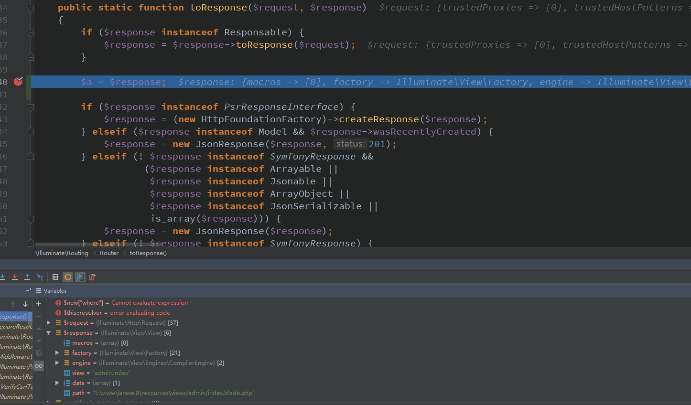

### view层  
[首页](../readme.md) [下一页：验证实现流程](validate.md)  [上一页：数据库DB和模型类实现流程](db.md)  

- view服务提供类注册  
    这个不用了吧，前面已经说过了，所有的服务类会自动注册到Application里保存，就是为了方便你下次用时取出来  
      
    
    使用  
    `return view("admin.index",compact('data'));`  
    
    view函数  
    ```php  
    function view($view = null, $data = [], $mergeData = [])
        {
        //这个怎么来的，自己去看前面的说明
            $factory = app(ViewFactory::class);
    
            if (func_num_args() === 0) {
                return $factory;
            }
    
            return $factory->make($view, $data, $mergeData);
        }
    ```  
    
    app(ViewFactory::class)取得的函数返回如下【怎么知道的？就是View服务提供类运行时自动注册进来的】    
    ```php  
    function ($app) {
           //Illuminate\View\EngineResolver;
    
         $resolver = $app['view.engine.resolver'];
         //Illuminate\View\FileViewFinder
         $finder = $app['view.finder'];
         /**
          protected function createFactory($resolver, $finder, $events)
             {
             //Illuminate\View\Factory
                 return new Factory($resolver, $finder, $events);
             }
         **/
         $factory = $this->createFactory($resolver, $finder, $app['events']);
         $factory->setContainer($app);
         $factory->share('app', $app);
         return $factory;
     }
    ```  
    ` $resolver = $app['view.engine.resolver'];`返回的匿名函数  
    ```php  
    function () {
         \\Illuminate\View
         $resolver = new EngineResolver;
         //实例引擎
         foreach (['file', 'php', 'blade'] as $engine) {
         //运行下面指定的方法
             $this->{'register'.ucfirst($engine).'Engine'}($resolver);
         }
         
         /**
             function registerFileEngine($resolver)
             {  
             //保存文件引擎 
                 $resolver->register('file', function () {
                     return new FileEngine;
                 });
             }
                
             //保存php引擎
             function registerPhpEngine($resolver)
             {
                 $resolver->register('php', function () {
                     return new PhpEngine;
                 });
             }
             //保存blade引擎【Application也保存了一份】
             function registerBladeEngine($resolver)
             {
                
                 $this->app->singleton('blade.compiler', function () {
                     return new BladeCompiler(
                         $this->app['files'], $this->app['config']['view.compiled']
                     );
                 });
         
                 $resolver->register('blade', function () {
                     return new CompilerEngine($this->app['blade.compiler']);
                 });
             }
         **/

         return $resolver;
     }
    ```  
    
    EngineResolver类  
    ```php  
     public function register($engine, Closure $resolver)
        {
            unset($this->resolved[$engine]);
    
            $this->resolvers[$engine] = $resolver;
        }  
    ```  
    
    `$finder = $app['view.finder'];`返回的匿名函数  
    ```php  
    function ($app) {
            \\Illuminate\View 
            //文件系统对象，视图文件路径
            return new FileViewFinder($app['files'], $app['config']['view.paths']);
        }
    ```  
    
    视图工厂类  
    ```php  
    
    namespace Illuminate\View;
    
    use Illuminate\Support\Arr;
    use Illuminate\Support\Str;
    use InvalidArgumentException;
    use Illuminate\Support\Traits\Macroable;
    use Illuminate\Contracts\Events\Dispatcher;
    use Illuminate\Contracts\Support\Arrayable;
    use Illuminate\View\Engines\EngineResolver;
    use Illuminate\Contracts\Container\Container;
    use Illuminate\Contracts\View\Factory as FactoryContract;
    
    class Factory implements FactoryContract
    {
        use Macroable,
            Concerns\ManagesComponents,
            Concerns\ManagesEvents,
            Concerns\ManagesLayouts,
            Concerns\ManagesLoops,
            Concerns\ManagesStacks,
            Concerns\ManagesTranslations;
    
        /**
         * The engine implementation.
         *
         * @var \Illuminate\View\Engines\EngineResolver
         */
        protected $engines;
    
        /**
         * The view finder implementation.
         *
         * @var \Illuminate\View\ViewFinderInterface
         */
        protected $finder;
    
        /**
         * The event dispatcher instance.
         *
         * @var \Illuminate\Contracts\Events\Dispatcher
         */
        protected $events;
    
        /**
         * The IoC container instance.
         *
         * @var \Illuminate\Contracts\Container\Container
         */
        protected $container;
    
        /**
         * Data that should be available to all templates.
         *
         * @var array
         */
        protected $shared = [];
    
        /**
         * The extension to engine bindings.
         *
         * @var array
         */
        protected $extensions = [
            'blade.php' => 'blade',
            'php' => 'php',
            'css' => 'file',
            'html' => 'file',
        ];
    
        /**
         * The view composer events.
         *
         * @var array
         */
        protected $composers = [];
    
        /**
         * The number of active rendering operations.
         *
         * @var int
         */
        protected $renderCount = 0;
    
        /**
         * Create a new view factory instance.
         *
         * @param  \Illuminate\View\Engines\EngineResolver  $engines
         * @param  \Illuminate\View\ViewFinderInterface  $finder
         * @param  \Illuminate\Contracts\Events\Dispatcher  $events
         * @return void
         */
        public function __construct(EngineResolver $engines, ViewFinderInterface $finder, Dispatcher $events)
        {

            $this->finder = $finder;//Illuminate\View\FileViewFinder
            $this->events = $events;
            $this->engines = $engines;//Illuminate\View\EngineResolver;
    
            $this->share('__env', $this);
        }

    ```  
    所以$factory = app(ViewFactory::class);返回的是Illuminate\View\Factory类的实例对象  
    
    下一句`return $factory->make($view, $data, $mergeData);`的流程  
    ```php  
    //$view=视图文件路径 admin.view 
    $data=数据【数据可能是Collection集合对象】
    public function make($view, $data = [], $mergeData = [])
        {
        //得到模板文件的完整地址
            $path = $this->finder->find(
                $view = $this->normalizeName($view)
            );
            //数据处理
            $data = array_merge($mergeData, $this->parseData($data));
            //$this->viewInstance($view, $path, $data)
            return tap($this->viewInstance($view, $path, $data), function ($view) {
                $this->callCreator($view);
            });
        }
    ```     
    
    ```php  
    
        $path = $this->finder->find(
            $view = $this->normalizeName($view)
        );  
        
    Illuminate\View\FileViewFinder->find()方法
    public function find($name)
        {
            if (isset($this->views[$name])) {
                return $this->views[$name];
            }
    
            if ($this->hasHintInformation($name = trim($name))) {
                return $this->views[$name] = $this->findNamespacedView($name);
            }
            //得到admin.index=模板文件的完整路径地址
            return $this->views[$name] = $this->findInPaths($name, $this->paths);
        }
    ```    
    
    ```php  
    protected function viewInstance($view, $path, $data)
        {
        //$this 视图工厂实例  
        //$this->getEngineFromPath($path) 引擎处理器【根据模板后缀取得】CompilerEngine($this->app['blade.compiler'])blade.php引擎
        //$view 视图参数如admin.index  //admin/index.blade.php
        //$path 模板文件index.blade.php的绝对路径
        //$data 数据
            return new View($this, $this->getEngineFromPath($path), $view, $path, $data);
        }
    
    
    public function getEngineFromPath($path)【根据模板文件的后缀名称取得对应的引擎处理器】
        {
        //根据模板文件后缀判断是否存在
            if (! $extension = $this->getExtension($path)) {
                throw new InvalidArgumentException("Unrecognized extension in file: {$path}");
            }
            //得到php如果定义的index.blade.php
            $engine = $this->extensions[$extension];
    
            return $this->engines->resolve($engine);
        }
        
    public function resolve($engine)
        {
            if (isset($this->resolved[$engine])) {
                return $this->resolved[$engine];
            }
    
            if (isset($this->resolvers[$engine])) {
                return $this->resolved[$engine] = call_user_func($this->resolvers[$engine]);
            }
    
            throw new InvalidArgumentException("Engine [{$engine}] not found.");
        }
        
    
    protected function getExtension($path)
        {
        //得到数组
        /**
        $extensions = [
                'blade.php' => 'blade',
                'php' => 'php',
                'css' => 'file',
                'html' => 'file',
            ];
        **/
            $extensions = array_keys($this->extensions);
            
            return Arr::first($extensions, function ($value) use ($path) {
                return Str::endsWith($path, '.'.$value);
            });
        }
    ```  
    
    视图类 Illuminate\View\View   
    ```php  
    namespace Illuminate\View;
    
    use Exception;
    use Throwable;
    use ArrayAccess;
    use BadMethodCallException;
    use Illuminate\Support\Str;
    use Illuminate\Support\MessageBag;
    use Illuminate\Contracts\View\Engine;
    use Illuminate\Support\Traits\Macroable;
    use Illuminate\Contracts\Support\Arrayable;
    use Illuminate\Contracts\Support\Renderable;
    use Illuminate\Contracts\Support\MessageProvider;
    use Illuminate\Contracts\View\View as ViewContract;
    
    class View implements ArrayAccess, ViewContract {interface View extends Renderable}
    {
        use Macroable {
            __call as macroCall;
        }
        protected $factory;
        protected $engine;
        protected $view;
        protected $data;
        protected $path;
    
        /**
         * Create a new view instance.
         *
         * @param  \Illuminate\View\Factory  $factory
         * @param  \Illuminate\Contracts\View\Engine  $engine
         * @param  string  $view
         * @param  string  $path
         * @param  mixed  $data
         * @return void
         */
        public function __construct(Factory $factory, Engine $engine, $view, $path, $data = [])
        {
            $this->view = $view;//视图名称如admin.index  即index.blade.php
            $this->path = $path;//模板文件绝对路径
            $this->engine = $engine;//blade.php引擎【是个匿名函数】
            $this->factory = $factory;//视图工厂实例 
            //数据 像使用查询构建器查找的数据返回的是Collection实例，此类继承了ArrayAccess,Arrayble【自己去看】，懒得写一堆了  
            
            $this->data = $data instanceof Arrayable ? $data->toArray() : (array) $data;
        }
    ```  
    
    ```php  
    //$this->viewInstance($view, $path, $data) 返回视图类View实例对象，并运行【传递参数】此匿名函数
    //tap函数自己去看helpers.php文件，简单没必要再说了
    return tap($this->viewInstance($view, $path, $data), function ($view) {
                    $this->callCreator($view);
                    /**
                    public function callCreator(ViewContract $view)
                        {
                        //从事件池里取出对应的匿名函数然后运行【放心这里是废话】
                            $this->events->dispatch('creating: '.$view->name(), [$view]);
                        }
                    **/
                });
    ```  
    
    `return view("admin.index",compact('data'));`    
    这句话它的流程就是这些，先从Application里取出它对应的【view服务提供注册的】东西运行，从而运行ViewFactory工厂  
    并执行make()方法返回Illuminate\View\View实例对象返回  
    
    怎么返回的【在控制器调度运行后】可以看前面说的路由调度【寻址】流程，它是怎么运行的。  
    
    现在我们去看一下它的响应处理【前面有提过，但没有仔细说】     
    
    响应时它返回的数据类型  
      
    ```php  
    public static function toResponse($request, $response)
        {
        //目前它不属于此类
            if ($response instanceof Responsable) {
                $response = $response->toResponse($request);
            }
    
            
            
            if ($response instanceof PsrResponseInterface) {
                $response = (new HttpFoundationFactory)->createResponse($response);
            } elseif ($response instanceof Model && $response->wasRecentlyCreated) {
                $response = new JsonResponse($response, 201);
            } elseif (! $response instanceof SymfonyResponse &&不属于此类且属于下面的几类【目前不也符合】
                       ($response instanceof Arrayable ||
                        $response instanceof Jsonable ||
                        $response instanceof ArrayObject ||
                        $response instanceof JsonSerializable ||
                        is_array($response))) {
                $response = new JsonResponse($response);
            } elseif (! $response instanceof SymfonyResponse) {//不属于此类【条件符合】
                $response = new Response($response);//实例化此类
            }
    
            if ($response->getStatusCode() === Response::HTTP_NOT_MODIFIED) {
                $response->setNotModified();
            }
            //准备响应
            return $response->prepare($request);
        }
    ```  
    
    响应Response  
    ```php 
    namespace Illuminate\Http;
    
    use ArrayObject;
    use JsonSerializable;
    use Illuminate\Support\Traits\Macroable;
    use Illuminate\Contracts\Support\Jsonable;
    use Illuminate\Contracts\Support\Arrayable;
    use Illuminate\Contracts\Support\Renderable;
    use Symfony\Component\HttpFoundation\Response as BaseResponse;
    
    class Response extends BaseResponse
    {
        use ResponseTrait, Macroable {
            Macroable::__call as macroCall;
        }
    }
    基类  
    /*
     * This file is part of the Symfony package.
     *
     * (c) Fabien Potencier <fabien@symfony.com>
     *
     * For the full copyright and license information, please view the LICENSE
     * file that was distributed with this source code.
     */
    
    namespace Symfony\Component\HttpFoundation;
    
    /**
     * Response represents an HTTP response.
     *
     * @author Fabien Potencier <fabien@symfony.com>
     */
    class Response
    {
        const HTTP_CONTINUE = 100;
        const HTTP_SWITCHING_PROTOCOLS = 101;
        const HTTP_PROCESSING = 102;            // RFC2518
        const HTTP_EARLY_HINTS = 103;           // RFC8297
        const HTTP_OK = 200;
        const HTTP_CREATED = 201;
        const HTTP_ACCEPTED = 202;
        const HTTP_NON_AUTHORITATIVE_INFORMATION = 203;
        const HTTP_NO_CONTENT = 204;
        const HTTP_RESET_CONTENT = 205;
        const HTTP_PARTIAL_CONTENT = 206;
        const HTTP_MULTI_STATUS = 207;          // RFC4918
        const HTTP_ALREADY_REPORTED = 208;      // RFC5842
        const HTTP_IM_USED = 226;               // RFC3229
        const HTTP_MULTIPLE_CHOICES = 300;
        const HTTP_MOVED_PERMANENTLY = 301;
        const HTTP_FOUND = 302;
        const HTTP_SEE_OTHER = 303;
        const HTTP_NOT_MODIFIED = 304;
        const HTTP_USE_PROXY = 305;
        const HTTP_RESERVED = 306;
        const HTTP_TEMPORARY_REDIRECT = 307;
        const HTTP_PERMANENTLY_REDIRECT = 308;  // RFC7238
        const HTTP_BAD_REQUEST = 400;
        const HTTP_UNAUTHORIZED = 401;
        const HTTP_PAYMENT_REQUIRED = 402;
        const HTTP_FORBIDDEN = 403;
        const HTTP_NOT_FOUND = 404;
        const HTTP_METHOD_NOT_ALLOWED = 405;
        const HTTP_NOT_ACCEPTABLE = 406;
        const HTTP_PROXY_AUTHENTICATION_REQUIRED = 407;
        const HTTP_REQUEST_TIMEOUT = 408;
        const HTTP_CONFLICT = 409;
        const HTTP_GONE = 410;
        const HTTP_LENGTH_REQUIRED = 411;
        const HTTP_PRECONDITION_FAILED = 412;
        const HTTP_REQUEST_ENTITY_TOO_LARGE = 413;
        const HTTP_REQUEST_URI_TOO_LONG = 414;
        const HTTP_UNSUPPORTED_MEDIA_TYPE = 415;
        const HTTP_REQUESTED_RANGE_NOT_SATISFIABLE = 416;
        const HTTP_EXPECTATION_FAILED = 417;
        const HTTP_I_AM_A_TEAPOT = 418;                                               // RFC2324
        const HTTP_MISDIRECTED_REQUEST = 421;                                         // RFC7540
        const HTTP_UNPROCESSABLE_ENTITY = 422;                                        // RFC4918
        const HTTP_LOCKED = 423;                                                      // RFC4918
        const HTTP_FAILED_DEPENDENCY = 424;                                           // RFC4918
    
        /**
         * @deprecated
         */
        const HTTP_RESERVED_FOR_WEBDAV_ADVANCED_COLLECTIONS_EXPIRED_PROPOSAL = 425;   // RFC2817
        const HTTP_TOO_EARLY = 425;                                                   // RFC-ietf-httpbis-replay-04
        const HTTP_UPGRADE_REQUIRED = 426;                                            // RFC2817
        const HTTP_PRECONDITION_REQUIRED = 428;                                       // RFC6585
        const HTTP_TOO_MANY_REQUESTS = 429;                                           // RFC6585
        const HTTP_REQUEST_HEADER_FIELDS_TOO_LARGE = 431;                             // RFC6585
        const HTTP_UNAVAILABLE_FOR_LEGAL_REASONS = 451;
        const HTTP_INTERNAL_SERVER_ERROR = 500;
        const HTTP_NOT_IMPLEMENTED = 501;
        const HTTP_BAD_GATEWAY = 502;
        const HTTP_SERVICE_UNAVAILABLE = 503;
        const HTTP_GATEWAY_TIMEOUT = 504;
        const HTTP_VERSION_NOT_SUPPORTED = 505;
        const HTTP_VARIANT_ALSO_NEGOTIATES_EXPERIMENTAL = 506;                        // RFC2295
        const HTTP_INSUFFICIENT_STORAGE = 507;                                        // RFC4918
        const HTTP_LOOP_DETECTED = 508;                                               // RFC5842
        const HTTP_NOT_EXTENDED = 510;                                                // RFC2774
        const HTTP_NETWORK_AUTHENTICATION_REQUIRED = 511;                             // RFC6585
    
        /**
         * @var \Symfony\Component\HttpFoundation\ResponseHeaderBag
         */
        public $headers;
    
        /**
         * @var string
         */
        protected $content;
    
        /**
         * @var string
         */
        protected $version;
    
        /**
         * @var int
         */
        protected $statusCode;
    
        /**
         * @var string
         */
        protected $statusText;
    
        /**
         * @var string
         */
        protected $charset;
    
        /**
         * Status codes translation table.
         *
         * The list of codes is complete according to the
         * {@link http://www.iana.org/assignments/http-status-codes/ Hypertext Transfer Protocol (HTTP) Status Code Registry}
         * (last updated 2016-03-01).
         *
         * Unless otherwise noted, the status code is defined in RFC2616.
         *
         * @var array
         */
        public static $statusTexts = [
            100 => 'Continue',
            101 => 'Switching Protocols',
            102 => 'Processing',            // RFC2518
            103 => 'Early Hints',
            200 => 'OK',
            201 => 'Created',
            202 => 'Accepted',
            203 => 'Non-Authoritative Information',
            204 => 'No Content',
            205 => 'Reset Content',
            206 => 'Partial Content',
            207 => 'Multi-Status',          // RFC4918
            208 => 'Already Reported',      // RFC5842
            226 => 'IM Used',               // RFC3229
            300 => 'Multiple Choices',
            301 => 'Moved Permanently',
            302 => 'Found',
            303 => 'See Other',
            304 => 'Not Modified',
            305 => 'Use Proxy',
            307 => 'Temporary Redirect',
            308 => 'Permanent Redirect',    // RFC7238
            400 => 'Bad Request',
            401 => 'Unauthorized',
            402 => 'Payment Required',
            403 => 'Forbidden',
            404 => 'Not Found',
            405 => 'Method Not Allowed',
            406 => 'Not Acceptable',
            407 => 'Proxy Authentication Required',
            408 => 'Request Timeout',
            409 => 'Conflict',
            410 => 'Gone',
            411 => 'Length Required',
            412 => 'Precondition Failed',
            413 => 'Payload Too Large',
            414 => 'URI Too Long',
            415 => 'Unsupported Media Type',
            416 => 'Range Not Satisfiable',
            417 => 'Expectation Failed',
            418 => 'I\'m a teapot',                                               // RFC2324
            421 => 'Misdirected Request',                                         // RFC7540
            422 => 'Unprocessable Entity',                                        // RFC4918
            423 => 'Locked',                                                      // RFC4918
            424 => 'Failed Dependency',                                           // RFC4918
            425 => 'Too Early',                                                   // RFC-ietf-httpbis-replay-04
            426 => 'Upgrade Required',                                            // RFC2817
            428 => 'Precondition Required',                                       // RFC6585
            429 => 'Too Many Requests',                                           // RFC6585
            431 => 'Request Header Fields Too Large',                             // RFC6585
            451 => 'Unavailable For Legal Reasons',                               // RFC7725
            500 => 'Internal Server Error',
            501 => 'Not Implemented',
            502 => 'Bad Gateway',
            503 => 'Service Unavailable',
            504 => 'Gateway Timeout',
            505 => 'HTTP Version Not Supported',
            506 => 'Variant Also Negotiates',                                     // RFC2295
            507 => 'Insufficient Storage',                                        // RFC4918
            508 => 'Loop Detected',                                               // RFC5842
            510 => 'Not Extended',                                                // RFC2774
            511 => 'Network Authentication Required',                             // RFC6585
        ];
    
        /**
         * @throws \InvalidArgumentException When the HTTP status code is not valid
         */
         //$content 此时为View实例对象即Illuminate\View\View实例
        public function __construct($content = '', int $status = 200, array $headers = [])
        {
            $this->headers = new ResponseHeaderBag($headers);
            $this->setContent($content);
            $this->setStatusCode($status);
            $this->setProtocolVersion('1.0');
        }
    ```   
    
    内容保存  
    ```php  
     public function setContent($content)
        {
            $this->original = $content;
    
            //是否可json处理
            if ($this->shouldBeJson($content)) {
                $this->header('Content-Type', 'application/json');
    
                $content = $this->morphToJson($content);
            }
    
            elseif ($content instanceof Renderable) {
            //模板处理，得到编译文件运行后返回的HTML内容
                $content = $content->render();
            }
            //模板编译后输出的内容保存
            parent::setContent($content);
    
            return $this;
        }
        
     protected function shouldBeJson($content)
         {
             return $content instanceof Arrayable ||
                    $content instanceof Jsonable ||
                    $content instanceof ArrayObject ||
                    $content instanceof JsonSerializable ||
                    is_array($content);
         }

    ```  
    
    模板处理 【Illuminate\View\View类】
    ```php  
     public function render(callable $callback = null)
        {
            try {
            //得到编译文件运行后的内容
                $contents = $this->renderContents();
    
                $response = isset($callback) ? call_user_func($callback, $this, $contents) : null;
    
                $this->factory->flushStateIfDoneRendering();
    
                return ! is_null($response) ? $response : $contents;
            } catch (Exception $e) {
                $this->factory->flushState();
    
                throw $e;
            } catch (Throwable $e) {
                $this->factory->flushState();
    
                throw $e;
            }
        }
        
     protected function renderContents()
         {
            //Illuminate\View\Facoty->$this->renderCount++;
             $this->factory->incrementRender();
     
             $this->factory->callComposer($this);
               //得到编译后的模板文件内容【编译文件运行时输出的内容】   
             $contents = $this->getContents();
     
             $this->factory->decrementRender();
             //返回内容
             return $contents;
         }

     public function callComposer(ViewContract $view)
         {
         //废话【不用看】事件池里根本不存在【你要不信，可以自己调试下代码就知道了，这家伙简直是是吃饱了】
             $this->events->dispatch('composing: '.$view->name(), [$view]);
         }
         
     protected function getContents()获取内容
         {
         //$this->gatherData() 返回传递给模板的数据
         //$this->path 模板路径地址 
         //得到编译好的模板文件【运行后返回的内容】   
             return $this->engine->get($this->path, $this->gatherData());
         }  
         
     
    ```  
    Illuminate\View\Engines\CompilerEngine编译引擎     
    1、检测模板文件是否更新了      
    2、检测当前模板是否有对应的编译文件    
    3、生成编译文件名称    
    4、读取模板内容并替换模板内容标签并生成php所谓的编译文件     
    5、运行编译文件并输出到缓冲区      
    6、获取缓冲区的内容并返回     
    注意：输出的内容已经是HTML代码了!!!     
    
    ```php  
    public function get($path, array $data = [])
        {
        //模板路径地址
            $this->lastCompiled[] = $path;
            /**
            $this->compiler=Illuminate\View\Compilers\BladeCompiler blade编译器
            BladeCompiler(
            //文件系统对象，编译路径目录 
                            $this->app['files'], $this->app['config']['view.compiled']
            );
            **/
            /**
            模板文件未编译【即开始加载时】或是模板文件更新了【就是你手贱了修改了】
            **/
            if ($this->compiler->isExpired($path)) { 
            //生成编译文件
            //读取模板内容，并替换那些特殊标签，然后生成php文件【叫编译文件】
                $this->compiler->compile($path);
            }
            //编译文件即php文件
            $compiled = $this->compiler->getCompiledPath($path);
            //运行编译的php文件并从缓冲区获取内容返回
            $results = $this->evaluatePath($compiled, $data);
    
            array_pop($this->lastCompiled);
    
            return $results;
        }
    //运行编译文件
    protected function evaluatePath($__path, $__data)
        {
            $obLevel = ob_get_level();
            //打开缓冲区
            ob_start();
    
            extract($__data, EXTR_SKIP);
    
            // We'll evaluate the contents of the view inside a try/catch block so we can
            // flush out any stray output that might get out before an error occurs or
            // an exception is thrown. This prevents any partial views from leaking.
            try {
                include $__path;//运行编译文件【这编译文件就是模板替换成php代码后后成的】
            } catch (Exception $e) {
                $this->handleViewException($e, $obLevel);
            } catch (Throwable $e) {
                $this->handleViewException(new FatalThrowableError($e), $obLevel);
            }
            //得到当前编译文件输出到缓冲区的内容并删除
            return ltrim(ob_get_clean());
        }
        
    Illuminate\View\Compilers\BladeCompiler->function getCompiledPath($path)
        {
        //拼装编译目录得到编译文件名称
            return $this->cachePath.'/'.sha1($path).'.php';
        }
    
        /**
         * Determine if the view at the given path is expired.
         *
         * @param  string  $path
         * @return bool
         */
    Illuminate\View\Compilers\BladeCompiler->function isExpired($path)
        {
        //编译文件名称
            $compiled = $this->getCompiledPath($path);
            //编译文件不存在【表示未编译的情况下】
            if (! $this->files->exists($compiled)) {
                return true;
            }
            //文件对象 
            //当前模板文件的修改时间是否超过编译文件的修改时间
            //表示模板修改后，立即返回true
            return $this->files->lastModified($path) >=
                   $this->files->lastModified($compiled);
        }
        
    模板文件编译  
    Illuminate\View\Compilers\BladeCompiler->function compile($path = null)【模板文件解析（标签替换）然后替换好的内容生成PHP文件并写入sha1加密处理的模板文件名称里】
        {
            if ($path) {
            //保存模板文件路径
                $this->setPath($path);
            }
            //判断编译目录存在
            if (! is_null($this->cachePath)) { 
            //把模板文件的内容全部替换【标签解析】如@php xx @endphp @if xxx @endif @foreach XXX @endforeach  
            //这些玩意全替换成PHP代码【这一过程就叫标签解析】  
                $contents = $this->compileString(
                //获取模板文件的内容
                //FileSystem对象不用了【自己去git上面看看就懂了】
                    $this->files->get($this->getPath())
                );
                //模板文件存在
                if (! empty($this->getPath())) {
                    $tokens = $this->getOpenAndClosingPhpTokens($contents);
                    if ($tokens->isNotEmpty() && $tokens->last() !== T_CLOSE_TAG) {
                        $contents .= ' ?>';
                    }
                    //替换好之后的内容
                    $contents .= "<?php /**PATH {$this->getPath()} ENDPATH**/ ?>";
                }
                //生成编译文件的内容【编译文件是php文件】   
                $this->files->put(
                //返回编译文件名称return $this->cachePath.'/'.sha1($path).'.php';
                    $this->getCompiledPath($this->getPath()), $contents
                );
            }
        } 
    //编译内容
    $value是模板文件内容
    Illuminate\View\Compilers\BladeCompiler->function compileString($value)
        {
            if (strpos($value, '@verbatim') !== false) {
                $value = $this->storeVerbatimBlocks($value);
            }
    
            $this->footer = [];
    
            if (strpos($value, '@php') !== false) {
            //@php xxx @endphp标签解析【就是替换】
                $value = $this->storePhpBlocks($value);
            }
    
            $result = '';
    
            foreach (token_get_all($value) as $token) {
                $result .= is_array($token) ? $this->parseToken($token) : $token;
            }
    
            if (! empty($this->rawBlocks)) {
                $result = $this->restoreRawContent($result);
            }
    
            if (count($this->footer) > 0) {
                $result = $this->addFooters($result);
            }
    
            return $result;
        }  
        
    @php符号编译【替换】  
    //$value=模板文件内容
    Illuminate\View\Compilers\BladeCompiler->function storePhpBlocks($value)
        {
        //把模板里的内容@php xxxx @endphp 的内容替换成<?php xxx ?>
        //具体怎么替换【不想说了，写过模板引擎的老司机应该清楚】【最少应该写过MVC原生框架】 
        //或许有的人从来没有撸过原生框架，上来就操框架了，哦你真牛逼【^_^】 
        //替换内容过程本人不再解释了【希望自己去写一个模板引擎就清楚了】
            return preg_replace_callback('/(?<!@)@php(.*?)@endphp/s', function ($matches) {
                return $this->storeRawBlock("<?php{$matches[1]}?>");
            }, $value);
        }
    ```  
    
    ` return $response->prepare($request);`  
    
    ```php  
    public function prepare(Request $request)【响应头部的处理】
        {
        //头部信息
            $headers = $this->headers;
    
            if ($this->isInformational() || $this->isEmpty()) {
                $this->setContent(null);
                $headers->remove('Content-Type');
                $headers->remove('Content-Length');
            } else {
                // Content-type based on the Request
                if (!$headers->has('Content-Type')) {
                    $format = $request->getRequestFormat();
                    if (null !== $format && $mimeType = $request->getMimeType($format)) {
                        $headers->set('Content-Type', $mimeType);
                    }
                }
    
                // Fix Content-Type
                $charset = $this->charset ?: 'UTF-8';
                if (!$headers->has('Content-Type')) {
                    $headers->set('Content-Type', 'text/html; charset='.$charset);
                } elseif (0 === stripos($headers->get('Content-Type'), 'text/') && false === stripos($headers->get('Content-Type'), 'charset')) {
                    // add the charset
                    $headers->set('Content-Type', $headers->get('Content-Type').'; charset='.$charset);
                }
    
                // Fix Content-Length
                if ($headers->has('Transfer-Encoding')) {
                    $headers->remove('Content-Length');
                }
    
                if ($request->isMethod('HEAD')) {
                    // cf. RFC2616 14.13
                    $length = $headers->get('Content-Length');
                    $this->setContent(null);
                    if ($length) {
                        $headers->set('Content-Length', $length);
                    }
                }
            }
    
            // Fix protocol
            if ('HTTP/1.0' != $request->server->get('SERVER_PROTOCOL')) {
                $this->setProtocolVersion('1.1');
            }
    
            // Check if we need to send extra expire info headers
            if ('1.0' == $this->getProtocolVersion() && false !== strpos($headers->get('Cache-Control'), 'no-cache')) {
                $headers->set('pragma', 'no-cache');
                $headers->set('expires', -1);
            }
    
            $this->ensureIEOverSSLCompatibility($request);
    
            if ($request->isSecure()) {
                foreach ($headers->getCookies() as $cookie) {
                    $cookie->setSecureDefault(true);
                }
            }
    
            return $this;
        }
    ```  
    
    内容响应输出`$response->send()`  
    ```php  
     public function send()
        {
            $this->sendHeaders();
            $this->sendContent();
    
            if (\function_exists('fastcgi_finish_request')) {
                fastcgi_finish_request();
            } elseif (!\in_array(\PHP_SAPI, ['cli', 'phpdbg'], true)) {
                static::closeOutputBuffers(0, true);
            }
    
            return $this;
        }  
        
     public function sendHeaders()
         {
             // headers have already been sent by the developer
             if (headers_sent()) {
                 return $this;
             }
     
             // headers
             foreach ($this->headers->allPreserveCaseWithoutCookies() as $name => $values) {
                 $replace = 0 === strcasecmp($name, 'Content-Type');
                 foreach ($values as $value) {
                     header($name.': '.$value, $replace, $this->statusCode);
                 }
             }
     
             // cookies
             foreach ($this->headers->getCookies() as $cookie) {
                 header('Set-Cookie: '.$cookie->getName().strstr($cookie, '='), false, $this->statusCode);
             }
     
             // status
             header(sprintf('HTTP/%s %s %s', $this->version, $this->statusCode, $this->statusText), true, $this->statusCode);
     
             return $this;
         }
         
     public function sendContent()【内容输出到浏览器】   
         {
             echo $this->content;
     
             return $this;
         }
    ```  
    
    模板引擎的流程概括：  
    第一步：return view("admin.index",compact('data'));
    它会返回Illuminate\View\View实例  
    第二步：$response = new Response($View);//实例化此类  
    return $response->prepare($request);  
    
    第三步：编译模板Illuminate\View\View->render()   
    1、模板文件更新了或是对应的编译文件不存在则重新生成编译文件   
    重新生成编译的原理：读取模板文件的内容并替换特殊标签生成php文件  
    2、运行编译好的编译文件并输出到缓冲区  
    3、获取输出到缓冲区的HTML代码返回   
    第四：编译文件运行后输出的HTML代码保存到Response对象里    
    Response->setContent($content);  
    
    第五步：输出 response->getContent()  
    
    //代码流程     
    ```php  
    //Symfony\Component\HttpFoundation\Response
    $response = new Response($response);  //$response=Illuminate\View\View
    Illuminate\Http->setContent($content); 
    $content = Illuminate\View\View->render();
    $contents = Illuminate\View\View->renderContents();
    $contents = Illuminate\View\View->getContents();
    Illuminate\View\View->Illuminate\View\Engines\CompilerEngine->get($this->path=模板文件路径地址, $this->gatherData()=模板注入的数据)
    function get($path, array $data = [])
        {
            $this->lastCompiled[] = $path;
    
            if ($this->compiler->isExpired($path)) {
                $this->compiler->compile($path);
            }
            //得到模板的编译文件
            $compiled = $this->compiler->getCompiledPath($path);
            //运行编译文件并获取输出的HTML内容
            $results = $this->evaluatePath($compiled, $data);
    
            array_pop($this->lastCompiled);
    
            return $results;
        }
    public function isExpired($path)
        {   //模板对应的编译文件
            $compiled = $this->getCompiledPath($path);
            //编译文件还没有生成
            if (! $this->files->exists($compiled)) {
                return true;
            }
            //模板文件更新了
            return $this->files->lastModified($path) >=
                   $this->files->lastModified($compiled);
    } 
    if ($this->compiler->isExpired($path)) {
    //生成编译文件
                $this->compiler->compile($path);
    } 
    
    public function compile($path = null)
        {
            if ($path) {
                $this->setPath($path);
            }
    
            if (! is_null($this->cachePath)) {
            //模板内容替换
                $contents = $this->compileString(
                //读取模板文件内容
                    $this->files->get($this->getPath())
                );
    
                if (! empty($this->getPath())) {
                    $tokens = $this->getOpenAndClosingPhpTokens($contents);

                    if ($tokens->isNotEmpty() && $tokens->last() !== T_CLOSE_TAG) {
                        $contents .= ' ?>';
                    }
    
                    $contents .= "<?php /**PATH {$this->getPath()} ENDPATH**/ ?>";
                }
                //生成编译文件
                $this->files->put(
                    $this->getCompiledPath($this->getPath()), $contents
                );
            }
        }
    
    Symfony\Component\HttpFoundation::setContent($content); //保存输出的HTML内容
    public function setContent($content)
        {
            $this->content = (string) $content;
  
        }
        
    【index.php里的$response->send()】public function sendContent()【内容输出到浏览器】   
             {
                 echo $this->content;//输出到浏览器   
         
                 return $this;
             }
    ```  
    
    以上就是laravel模板引擎的工作流程【本人不再具体去解释模板文件的解析过程了，实在没有必要了】   
    
    
    